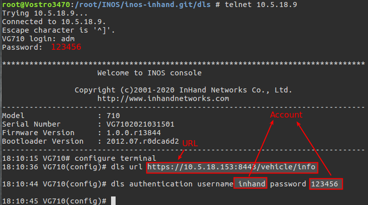
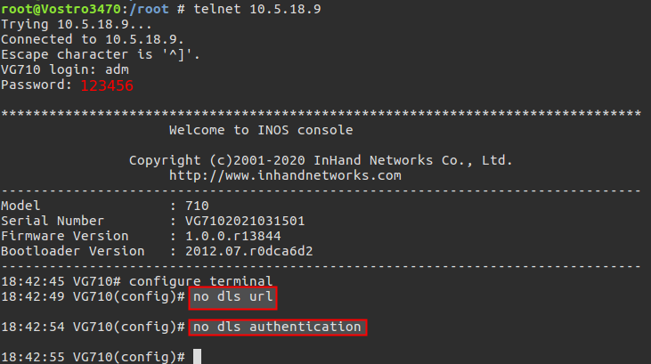

# DLS Server 搭建使用文档

## 1. 安装软件

### 1.1 安装 luagit apache2-utils

```sh
$ sudo apt update
$ sudo apt install luajit apache2-utils
```

### 1.2 安装 openresty

```sh
$ sudo apt-get -y install --no-install-recommends wget gnupg ca-certificates
$ wget -O - https://openresty.org/package/pubkey.gpg | sudo apt-key add -
$ echo "deb http://openresty.org/package/ubuntu $(lsb_release -sc) main" | sudo tee /etc/apt/sources.list.d/openresty.list
$ sudo apt-get update
$ sudo apt-get -y install openresty
```

详细内容请参考: [https://openresty.org/en/linux-packages.html#ubuntu](https://openresty.org/en/linux-packages.html#ubuntu)

### 1.2.1 安装认证模块

```sh
$ git clone https://github.com/duhoobo/lua-resty-auth.git
$ sudo cp -fpR lua-resty-auth/lib/resty/* /usr/local/openresty/lualib/resty
```

## 2. 配置Server

- 用附件中的conf文件夹替换`/usr/local/openresty/nginx/conf`文件夹
- 请求URL: https://<domain>:<port>/vehicle/info, 例如：https://10.5.18.153:8443/vehicle/info

### 2.1 htdigest文件生成

DLS Server采用digest认证方式， htdigest文件生成方式如下(示例中使用 inhand/123456, realm为AuthNeed):

```sh
$ cd /usr/local/openresty/nginx/conf
$ htdigest -c htdigest AuthNeed inhand
Adding password for inhand in realm AuthNeed.
New password: 
Re-type new password: 
```

### 2.2 服务器自签证书生成

使用附件中提供的`gencert.sh`脚本

```sh
$ cd /root/test/gencert
$ ./gencert.sh
$ mkdir -p /usr/local/openresty/nginx/conf/ssl
$ cp server/* /usr/local/openresty/nginx/conf/ssl
```

### 2.3 上传固件

```sh
$ cp -fpR download /usr/local/openresty/nginx #固件放在download目录
```

## 3. 测试

### 3.1 openresty 操作

```sh
$ sudo systemctl start|stop|restart openresty.service
```

### 3.2 设备请求操作

以Curl命令为例：

```sh
$ curl -g -v -u inhand:123456 --digest --insecure --data 'Serial=RF9151632340198&Firmware=1.0.0.r10406&Model=TK815LEX0&CellID=1E13103&RSRP=-99&IMEI=358709050705635&IMSI=262011406930204&
RouterUptime=1day,2:34:21&OperatorCode=26202&Band=20&Cellular1_IP=37.12.49.2&Cellular1_uptime=1day,1:2:3&Cellular2_IP=2a02:d20:e8:3a01::199&Cellular2_uptime=1day,2:55:32' https://10.5.18.153:8443/vehicle/info
*   Trying 10.5.18.153...
* TCP_NODELAY set
* Connected to 10.5.18.153 (10.5.18.153) port 8443 (#0)
* ALPN, offering h2
* ALPN, offering http/1.1
* successfully set certificate verify locations:
*   CAfile: /etc/ssl/certs/ca-certificates.crt
  CApath: /etc/ssl/certs
* TLSv1.3 (OUT), TLS handshake, Client hello (1):
* TLSv1.3 (IN), TLS handshake, Server hello (2):
* TLSv1.2 (IN), TLS handshake, Certificate (11):
* TLSv1.2 (IN), TLS handshake, Server key exchange (12):
* TLSv1.2 (IN), TLS handshake, Server finished (14):
* TLSv1.2 (OUT), TLS handshake, Client key exchange (16):
* TLSv1.2 (OUT), TLS change cipher, Client hello (1):
* TLSv1.2 (OUT), TLS handshake, Finished (20):
* TLSv1.2 (IN), TLS handshake, Finished (20):
* SSL connection using TLSv1.2 / ECDHE-RSA-AES256-GCM-SHA384
* ALPN, server accepted to use http/1.1
* Server certificate:
*  subject: O=DLS Server; CN=10.5.18.153
*  start date: Jun 18 01:17:43 2021 GMT
*  expire date: Feb 25 01:17:43 2035 GMT
*  issuer: O=DLS Server Certificate Authority; CN=0.0.0.0
*  SSL certificate verify result: unable to get local issuer certificate (20), continuing anyway.
* Server auth using Digest with user 'inhand'
> POST /vehicle/info HTTP/1.1
> Host: 10.5.18.153:8443
> User-Agent: curl/7.58.0
> Accept: */*
> Content-Length: 0
> Content-Type: application/x-www-form-urlencoded
>
< HTTP/1.1 200 OK
< Server: openresty/1.19.3.2
< Date: Fri, 18 Jun 2021 10:08:08 GMT
< Content-Type: text/html
< Transfer-Encoding: chunked
< Connection: keep-alive
<
* Ignoring the response-body
* Connection #0 to host 10.5.18.153 left intact
* Issue another request to this URL: 'https://10.5.18.153:8443/vehicle/info'
* Found bundle for host 10.5.18.153: 0x555a3b08f700 [can pipeline]
* Re-using existing connection! (#0) with host 10.5.18.153
* Connected to 10.5.18.153 (10.5.18.153) port 8443 (#0)
> POST /vehicle/info HTTP/1.1
> Host: 10.5.18.153:8443
> User-Agent: curl/7.58.0
> Accept: */*
> Content-Length: 296
> Content-Type: application/x-www-form-urlencoded
>
* upload completely sent off: 296 out of 296 bytes
< HTTP/1.1 200 OK
< Server: openresty/1.19.3.2
< Date: Fri, 18 Jun 2021 10:08:08 GMT
< Content-Type: configuration/firmwareupdate
< Transfer-Encoding: chunked
< Connection: keep-alive
<
URL="https://10.5.18.153:8443/download/VG7-V1.0.0.r13844.bin"
Bootloader=Ture
MD5=f5a06d7c30c6d3a2e4498be4824cff53
* Connection #0 to host 10.5.18.153 left intact
```

**响应**：

- 需要更新固件时`Content-Type`为`configuration/firmwareupdate`， 响应消息提如下：

  ```sh
  URL="http://10.5.18.153:8080/download/VG7-V1.0.0.r13844.bin"
  Bootloader=Ture
  MD5=f5a06d7c30c6d3a2e4498be4824cff53
  ```

- 不需要更新固件时`Content-Type`为`configuration/NoChange`， 响应消息提如下：

  ```sh
  Do Nothing
  ```

  

## 4. 设备配置

请求URL和用户账号如前面例子， 示例如下：



取消配置



## 5. 注意事项

- 此文档用于把不支持FlexAPI管理功能的固件升级到13844固件
- 升级前请验证通过平台使用FlexAPI升级固件，导入Docker SDK和导入设备配置等功能在13844固件工作正常