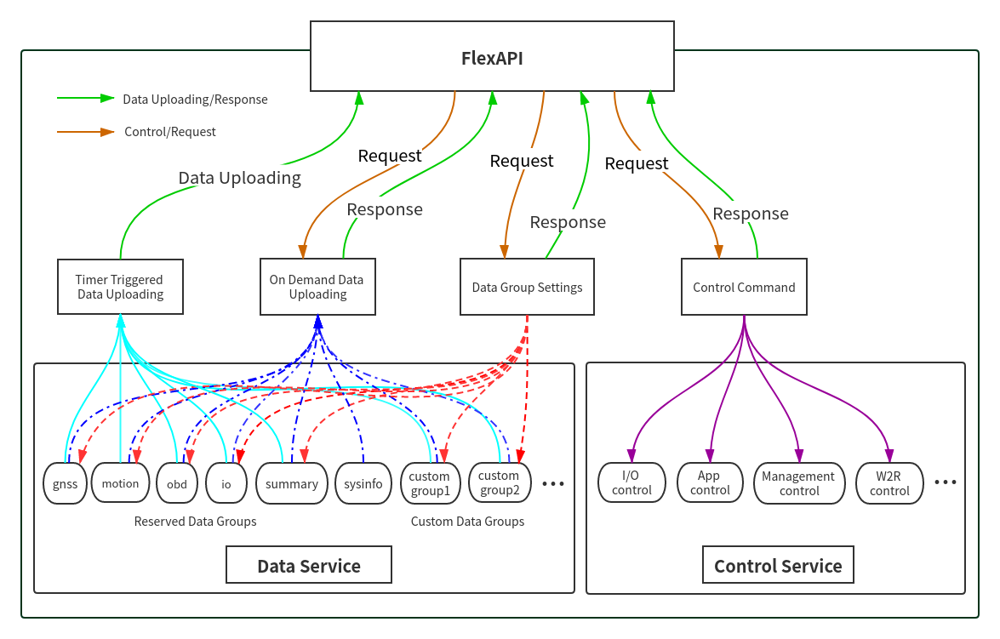
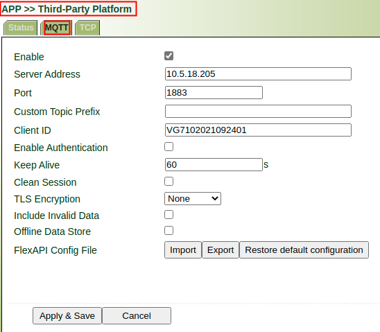
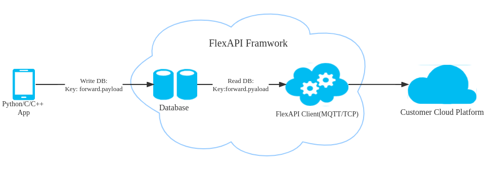

#  FlexAPI Reference


### *For 3rd Party Platform*

<div style="page-break-after: always;"></div>

## Revision History

| Revision | Date | Author | Item(s) changed | Note |
| :------- | :--- | :--- | :-------------- | :--- |
| 1.0.0    | 15/5/2020 | ganjx, wucl, dengzt | Create document. |      |
| 1.0.1    | 28/5/2020 | ganjx, wucl, dengzt | Added support: create/update/remove multiple custom groups via single request.<br> - modified **Create/Update Custom Group** request&response payload.<br> - modified **Remove Custom Group** request&response payload. |      |
| 1.0.2    | 9/6/2020  | ganjx | Removed the leading forward slash of the topics per Chapter 4.7.1.1 of mqtt-v3.1.1. |      |
| 1.0.3    | 22/6/2020 | ganjx | Added 2.3 FlexAPI Limits. Renamed ts to \<group\>.ts. Updated note for result field. |      |
| 1.0.4    | 6/8/2020  | ganjx, wucl, dengzt | Added Cellular and System info group.<br> GNSS group added `gnss.num_sv`.  |      |
| 1.0.5    | 23/10/2020 | wangzy | Added Userdata group.  |      |
| 1.0.6    | 26/10/2020 | dengzt | sysinfo group added `sysinfo.lan_mac`, `sysinfo.wlan_mac` and `sysinfo.wlan_5g_mac` |      |
| 1.0.7    | 9/11/2020 | dengzt | Added APP group | |
| 1.0.8 | 27/1/2021 | wangzy | Added 1-wire group | |
| 1.0.9 | 2/12/2022 | dengzt, yangming | Added forward group.<br>Add modem1.submode key<br>Add gnss.type gnss.acc_heading key<br>Add sysinfo.power_management_version key<br>Add VG814 support<br>Update General Error Codes<br>Introduce event service, add DI_CHG event<br>Add io.power_input, io.igt_status and io.DOX_pullup key<br>Add PGN:SPN & SID:PID for OBD  parameters  | |

<div style="page-break-after: always;"></div>

## 1. Introduction

We introduced FlexAPI for the fast evolving IoT applications, which highly value easy integration, openness, flexibility, extensibility and programmability.

FlexAPI is designed to be efficient, clean and ready to use. It's network oriented and programming language independent, and is ideal for cloud platform integration.

FlexAPI provides unified data and control services via MQTT topics for 3rd party platforms.

For data service, each MQTT topic corresponds to a group of data, and we have ready to use reserved groups such as: GNSS, OBD, Motion, IO and Summary.

Note that the Summary group is the all in one data group which includes all the data from our reserved OBD, GNSS, Motion and IO groups.

Besides, user can use sysinfo group to obtain device basic information.

In general, reserved groups are enough for user's need. 

Users can subscribe to these topics to get the latest data, and they can also set the data uploading intervals.

FlexAPI also provides MQTT topics for users to apply control, such as turn on/off the digital output and notify Python APP to do something.

FlexAPI specially provides MQTT topics for users to actively get data on demand.

For advanced users, they can even define their interested groups and set their uploading intervals.

We employ a request & response scheme for user initiated service requests. 

Request & response scheme means users need to subscribe to the response topics, and they request service by publishing a message to the request topics.

<div style="page-break-after: always;"></div>

### 1.1 Architecture



<div style="page-break-after: always;"></div>

### 1.2 MQTT Intro

MQTT is a widely adopted, lightweight messaging protocol designed for constrained devices. 

Our MQTT implementation is based on MQTT version 3.1.1, and supports QoS 0 and 1.

For more information, see [MQTT](http://docs.oasis-open.org/mqtt/mqtt/v3.1.1/os/mqtt-v3.1.1-os.html).

### 1.3 MQTT Topics Rules

* Topics are `UTF-8` encoded hierarchical strings. The forward slash (/) is used to separate levels in the topic hierarchy.
  
* Topic Wildcards:

| Wildcard | Description                                                  |
| :------- | :----------------------------------------------------------- |
| #        | Must be the last character in the topic to which you are subscribing.<br>Works as a wildcard by matching the current tree and all subtrees.<br>For example, a subscription to Sensor/# receives messages published to Sensor/,<br>Sensor/temp,Sensor/temp/room1, but not the messages published to Sensor. |
| +        | Matches exactly one item in the topic hierarchy.<br>For example, a subscription to Sensor/+/room1 receives messages published to <br>Sensor/temp/room1,Sensor/moisture/room1, but not the messages published to Sensor/room1. |

### 1.4 MQTT Server Settings

#### 1.4.1 MQTT Server Address and Port.

FlexAPI needs remote MQTT broker address and port to connect to.

#### 1.4.2 MQTT Authentication

##### 1.4.2.1 Username/Password(Default)

FlexAPI needs username and password for authentication.

After network connection is established, FlexAPI will send MQTT CONNECT Control Packet to remote MQTT broker.

The payload must contain Username, Password and `unique` Client Identifier fields. see [MQTT CONNECT](http://docs.oasis-open.org/mqtt/mqtt/v3.1.1/os/mqtt-v3.1.1-os.html#_Toc398718028).

FlexAPI will use `unique` Client Identifier`{client_id}` as part of MQTT topics. see [FlexAPI supported Topics](#22-flexapi-supported-topics).

##### 1.4.2.2 Certificate

Certificate authentication is Non Normative. However, it is strongly recommended that Server implementations that offer [TLS](https://www.ietf.org/rfc/rfc5246.txt) should use TCP port 8883. see [Security](http://docs.oasis-open.org/mqtt/mqtt/v3.1.1/os/mqtt-v3.1.1-os.html#_Toc398718111).

### 1.5 Third-Party Platform Settings

According to the MQTT server settings, do the corresponding configuration on the device web page.



<div style="page-break-after: always;"></div>

## 2 FlexAPI Overview

FlexAPI organizes data as groups and provides ready to use reserved groups for users to develop their applications.

FlexAPI allow users to change reserved and custom group settings.

Users can get timer triggered group data periodically. Besides, FlexAPI also allow users to actively get group data on demand.

For user initiated service requests we employ a request & response scheme.

Request & response scheme means users need to subscribe to the response topics, and they request service by publishing a message to the request topics.


This overview part gives summary on: FlexAPI general information, error codes and supported topics.

For Basic Usage, see [3. Basic usage](#3-basic-usage).

For Advanced Usage, see [4. Advanced usage](#4-advanced-usage).

For FlexAPI supported Parameters, see [Appendix A. FlexAPI supported Parameters](#appendix-a-flexapi-supported-parameters).

<div style="page-break-after: always;"></div>

### 2.1 FlexAPI Return Information and Errors

#### 2.1.1 General Information

| Parameter Name | Description       | Type    | Note                                                         |
| :------------- | :---------------- | :----- | :----------------------------------------------------------- |
| client_token   | client token      | string | A unique string for users to match responses with the corresponding requests. |
| result         | result            | object | When the request succeeds, there will be result field in response message body.<br>API callers should check the content of the result field to <br>determine whether the request has been successfully processed. |
| error          | error code        | string | When the request fails, it is added to the response message body.<br>For more information, see [General Error Codes](#212-general-error-codes) |
| error_desc     | error description | string | When the request fails, it is added to the response message body.<br>For more information, see [General Error Codes](#212-general-error-codes) |
| ts             | time stamp        | number | UNIX timestamp since Epoch. Indicates when the message was transmitted by device.        |


#### 2.1.2 General Error Codes

| Error Code        | Description                   | Error Handling                                   |
| :---------------- | :---------------------------- | :----------------------------------------------- |
| auth_failed       | authentication failed         | check username and password                      |
| invalid_parameter | invalid parameter             | check request parameter                          |
| not_found         | resource not exist            | make sure related service is enabled and running |
| device_busy       | device busy                   | retry request                                    |
| device_error      | device internal error         | retry request                                    |
| invalid_token     | token non-existent or expired | retry request                                    |
| data_invalid      | resource invalid              | retry request                                    |
| data_empty        | request resource is empty     | retry request                                    |
| over_group_num    | group number exceeds limit    | check request parameter                          |
| over_data_num    | keys of interest number exceeds limit    | check request parameter                          |
| find_same_key     | can not insert same key       | check request parameter                          |
| interval_invalid  | interval range is invalid     | check request parameter                          |
| not_support       | operation is not support      | check request parameter                          |

<div style="page-break-after: always;"></div>

### 2.2 FlexAPI Supported Topics

#### 2.2.1 Data Service

##### 2.2.1.1 Timer Triggered Reserved Group Data Get

Users can subscribe to the following topics to get the latest data. 

| Topic                        | Allowed Operations | Description                                                  |
| :--------------------------- | :----------------- | :----------------------------------------------------------- |
| v1/{client_id}/summary/info | Subscribe          | Timer triggered Summary data uploading.<br>see [Summary Data](#311-summary-data). |
| v1/{client_id}/obd/info     | Subscribe          | Timer triggered OBD data uploading.  <br>See [OBD data](#312-obd-data). |
| v1/{client_id}/gnss/info    | Subscribe          | Timer triggered GNSS data uploading.<br>see [GNSS Data](#313-gnss-data). |
| v1/{client_id}/motion/info  | Subscribe          | Timer triggered Motion data uploading.<br>see [Motion Data](#314-motion-data). |
| v1/{client_id}/io/info      | Subscribe          | Timer triggered IO data uploading.<br>see [IO Data](#315-io-data). |
| v1/{client_id}/cellular1/info      | Subscribe          | Timer triggered Cellular1 data uploading.<br>see [Cellular1 Data](#316-cellular1-data). |
| v1/{client_id}/userdata/info | Subscribe | Timer triggered User data uploading.<br/>see [User Data](#317-user-data). |
| v1/{client_id}/1-wire/info | Subscribe | Timer triggered 1-wire data uploading.<br/>see [1-wire Data](#318-1-wire-data). |
| v1/{client_id}/forward/info | Subscribe | Timer triggered Forward data uploading.<br/>see [Forward Data](#319-forward-data). |

<div style="page-break-after: always;"></div>

##### 2.2.1.2 Reserved Group Settings

Users can use the following topics to set the data uploading intervals and define their interested data.

| Topic                            | Allowed Operations | Description                                                  |
| :------------------------------- | :----------------- | :----------------------------------------------------------- |
| v1/{client_id}/summary/set      | Publish            | Set Summary group request.<br>see [Summary settings](#322-summary-settings). |
| v1/{client_id}/summary/set/resp | Subscribe          | Set Summary group response.                |
| v1/{client_id}/obd/set          | Publish            | Set OBD group request.<br>see [OBD settings](#323-obd-settings). |
| v1/{client_id}/obd/set/resp     | Subscribe          | Set OBD group response.                    |
| v1/{client_id}/gnss/set         | Publish            | Set GNSS group request.<br>see [GNSS settings](#324-gnss-settings). |
| v1/{client_id}/gnss/set/resp    | Subscribe          | Set GNSS group response.                   |
| v1/{client_id}/motion/set       | Publish            | Set Motion group request.<br>see [Motion settings](#325-motion-settings). |
| v1/{client_id}/motion/set/resp  | Subscribe          | Set Motion group response.                 |
| v1/{client_id}/io/set           | Publish            | Set IO group request.<br>see [IO settings](#326-io-settings). |
| v1/{client_id}/io/set/resp      | Subscribe          | Set IO group response.                     |
| v1/{client_id}/cellular1/set      | Publish          | Set Celluar1 group request.<br>see [Cellular1 settings](#327-cellular1-settings). |
| v1/{client_id}/cellular1/set/resp | Subscribe        | Set Celluar1 group response.                     |
| v1/{client_id}/userdata/set | Publish | Set User data group request.<br/>see [User data settings](#328-user-data-settings). |
| v1/{client_id}/userdata/set/resp | Subscribe | Set User data group response. |
| v1/{client_id}/1-wire/set | Publish | Set 1-wire group request.<br/>see [1-wire settings](#329-1-wire-data-settings). |
| v1/{client_id}/1-wire/set/resp | Subscribe | Set 1-wire group response. |

<div style="page-break-after: always;"></div>

##### 2.2.1.3 On Demand Reserved Group Data Get

Users can use the following topics to actively get data on demand.

| Topic                                | Allowed Operations | Description                                                  |
| :----------------------------------- | :----------------- | :----------------------------------------------------------- |
| v1/{client_id}/summary/refresh     | Publish            | Refresh Summary data request.<br>see [Summary Data](#331-summary-data). |
| v1/{client_id}/summary/refresh/resp | Subscribe          | Refresh Summary data response.                           |
| v1/{client_id}/obd/refresh         | Publish            | Refresh OBD data request. <br>see [OBD data](#332-obd-data).   |
| v1/{client_id}/obd/refresh/resp     | Subscribe          | Refresh OBD data response.                               |
| v1/{client_id}/gnss/refresh        | Publish            | Refresh GNSS data request.<br>see [GNSS Data](#333-gnss-data).  |
| v1/{client_id}/gnss/refresh/resp    | Subscribe          | Refresh GNSS data response.                              |
| v1/{client_id}/motion/refresh      | Publish            | Refresh Motion data request.<br>see [Motion Data](#334-motion-data). |
| v1/{client_id}/motion/refresh/resp  | Subscribe          | Refresh Motion data response.                            |
| v1/{client_id}/io/refresh          | Publish            | Refresh IO data request.<br>see [IO Data](#335-io-data).      |
| v1/{client_id}/io/refresh/resp      | Subscribe          | Refresh IO data response.                                |
| v1/{client_id}/cellular1/refresh      | Publish            | Refresh Cellular1 data request.<br>see [Cellular1 Data](#336-cellular1-data).      |
| v1/{client_id}/cellular1/refresh/resp | Subscribe          | Refresh Cellular1 data response.                                |
| v1/{client_id}/sysinfo/refresh      | Publish            | Refresh system info request.<br>see [System Info](#337-system-info).      |
| v1/{client_id}/sysinfo/refresh/resp | Subscribe          | Refresh system info response.                                |
| v1/{client_id}/userdata/refresh | Publish | Refresh User data request.<br/>see [User data](#338-user-data). |
| v1/{client_id}/userdata/refresh/resp | Subscribe | Refresh user data info response. |

| Topic                                | Allowed Operations | Description                                                  |
| :----------------------------------- | :----------------- | :----------------------------------------------------------- |
| v1/{client_id}/app/refresh | Publish | Refresh APP data request.<br/>see [APP settings](#339-app-settings). |
| v1/{client_id}/app/refresh/resp | Subscribe | Refresh APP data info response. |
| v1/{client_id}/1-wire/refresh | Publish | Refresh 1-wire data request.<br/>see [1-wire data](#3310-1-wire-data). |
| v1/{client_id}/1-wire/refresh/resp | Subscribe | Refresh 1-wire data info response. |

<div style="page-break-after: always;"></div>

#### 2.2.2 Control Service

##### 2.2.2.1 IO Control

 Users can use the following topics to turn on/off the digital output.

| Topic                           | Allowed Operations | Description                                                  |
| :------------------------------ | :----------------- | :----------------------------------------------------------- |
| v1/{client_id}/io/control     | Publish            | IO control request. <br>see [IO Control](#341-io-control). |
| v1/{client_id}/io/control/resp | Subscribe          | IO control response.                                 |

##### 2.2.2.2 APP Control

 Users can use the following topics to notify APP to do something.

| Topic                           | Allowed Operations | Description                                                  |
| :------------------------------ | :----------------- | :----------------------------------------------------------- |
| v1/{client_id}/app/control      | Publish            | APP control request. <br>see [APP Control](#342-app-control). |
| v1/{client_id}/app/control/resp | Subscribe          | APP control response.                                        |

<div style="page-break-after: always;"></div>

#### 2.2.3 Advanced Usage

Advanced users can use the following topics to define their interested groups and set their uploading intervals.

##### 2.2.3.1 Custom Group Settings

###### 2.2.3.1.1 Create/Update Custom Group

| Topic                          | Allowed Operations | Description                                                  |
| :----------------------------- | :----------------- | :----------------------------------------------------------- |
| v1/{client_id}/group/set      | Publish            | Create/Update group request.<br>see [Create/Update custom group](#411-createupdate-custom-group). |
| v1/{client_id}/group/set/resp | Subscribe          | Create/Update group response.                  |

###### 2.2.3.1.2 Get Custom Group Settings

| Topic                          | Allowed Operations | Description                                                  |
| :----------------------------- | :----------------- | :----------------------------------------------------------- |
| v1/{client_id}/group/get      | Publish            | Get group settings request.<br>see [Get custom group settings](#412-get-custom-group-settings). |
| v1/{client_id}/group/get/resp | Subscribe          | Get group settings response.                  |

###### 2.2.3.1.3 Remove Custom Group

| Topic                          | Allowed Operations | Description                                             |
| :----------------------------- | :----------------- | :------------------------------------------------------ |
| v1/{client_id}/group/set      | Publish            | Remove group request.<br>see [Remove custom group](#413-remove-custom-group). |
| v1/{client_id}/group/set/resp | Subscribe          | Remove group response.                          |

<div style="page-break-after: always;"></div>

##### 2.2.3.2 Timer Triggered Custom Group Data Get

| Topic                             | Allowed Operations | Description                                                  |
| :-------------------------------- | :----------------- | :----------------------------------------------------------- |
| v1/{client_id}/{group_name}/info | Subscribe          | Timer triggered custom group data uploading.<br>see [Timer triggered custom group data get](#42-timer-triggered-custom-group-data-get). |

##### 2.2.3.3 On Demand Custom Group Data Get

| Topic                                     | Allowed Operations | Description                                                  |
| :---------------------------------------- | :----------------- | :----------------------------------------------------------- |
| v1/{client_id}/{group_name}/refresh      | Publish            | Refresh group data request.<br>see [On demand custom group data get](#43-on-demand-custom-group-data-get). |
| v1/{client_id}/{group_name}/refresh/resp | Subscribe          | Refresh group data response.                             |

### 2.3 FlexAPI Limits

| Resource                                  | Limit |
| :---------------------------------------- | :---- |
| Minimum retry interval of `settings`, `refresh`, `get` requests | 1 s |
| Minimum retry interval of `io control` request | 5 s |
| `client_id` size | up to 128 bytes of `UTF-8` encoded characters |
| `client_token` size | up to 256 bytes of arbitrary string |
| Available custom groups | up to 16 |
| Maximum data items per group | 256 |

<div style="page-break-after: always;"></div>

## 3. Basic Usage

### 3.1 Timer Triggered Reserved Group Data Get

#### 3.1.1 Summary Data

Once you have subscribed to this topic, you will periodically receive the related data.

**Topic**：`v1/{client_id}/summary/info`

**Payload**：

```json
{
    "summary.ul_ts" : 1592820540,
    "gnss.ts" : 1592820539,
    "gnss.latitude": 40.232213,
    "gnss.longitude": 116.34366,
    "gnss.altitude": 346.0,
    "gnss.speed": 87.6,
    "gnss.heading": 234.0,
    "gnss.hdop": 1.2,
    "gnss.pdop": 2.1,
    "gnss.hacc": 1.0,
    "gnss.fix": 3,
    "gnss.num_sv": 7,
    "gnss.date": "2020-4-17",
    "gnss.time": "10:16:21",
    "obd.ts" : 1592820539,
    "obd.rpm" : 1234, 
    "obd.speed" : 20,
    "obd.odo": 1400,
    "obd.up_time": 3600,
    "io.ts" : 1592820539,
    "io.AI1": 0.0,
    "io.AI2": 0.0,
    "io.AI3": 0.0,
    "io.AI4": 0.0,
    "io.AI5": 0.0,
    "io.AI6": 0.0,
    "io.DI1": 0,
    "io.DI1_pullup": 0,
    "io.DI2": 0,
    "io.DI2_pullup": 0,
    "io.DI3": 0,
    "io.DI3_pullup": 0,
    "io.DI4": 0,
    "io.DI4_pullup": 0,
    "io.DI5": 0,
    "io.DI5_pullup": 0,
    "io.DI6": 0,
    "io.DI6_pullup": 0,
    "io.DO1": 0,
    "io.DO1_pullup": 0,
    "io.DO2": 0,
    "io.DO2_pullup": 0,
    "io.DO3": 0,
    "io.DO3_pullup": 0,
    "io.DO4": 0,
    "io.DO4_pullup": 0
}
```

Parameter description, See [General Information](#211-general-information) & [FlexAPI supported Parameters](#appendix-a-flexapi-supported-parameters).

Use [Summary settings](#322-summary-settings) to modify group setting(`interval` & `interest`).

#### 3.1.2 OBD Data

Once you have subscribed to this topic, you will periodically receive the related data.

**Topic**：`v1/{client_id}/obd/info`

**Payload**：

```json
{
    "obd.ul_ts" : 1592820540,
    "obd.ts" : 1592820539,
    "obd.rpm" : 1234, 
    "obd.speed" : 20
}
```

Parameter description, See [General Information](#211-general-information) & [OBD Parameters](#a4-obd-parameters).

Use [OBD settings](#323-obd-settings) to modify group setting(`interval` & `interest`).

#### 3.1.3 GNSS Data

Once you have subscribed to this topic, you will periodically receive the related data.

**Topic**：`v1/{client_id}/gnss/info`

**Payload**：

```json
{
    "gnss.ul_ts" : 1592820540,
    "gnss.ts" : 1592820539,
    "gnss.type" : "GPS+Glonass",
    "gnss.latitude": 40.232213,
    "gnss.longitude": 116.34366,
    "gnss.altitude": 346.0,
    "gnss.speed": 87.6,
    "gnss.heading": 234.0,
    "gnss.acc_heading": 3.0,
    "gnss.hdop": 1.2,
    "gnss.pdop": 2.1,
    "gnss.hacc": 1.0,
    "gnss.fix": 3,
    "gnss.num_sv": 7,
    "gnss.date": "2020-4-17",
    "gnss.time": "10:16:21"
}
```

Parameter description, See [General Information](#211-general-information) & [GNSS Parameters](#a1-gnss-parameters).

Use [GNSS settings](#324-gnss-settings) to modify group setting(`interval` & `interest`).

<div style="page-break-after: always;"></div>

#### 3.1.4 Motion Data

Once you have subscribed to this topic, you will periodically receive the related data.

**Topic**：`v1/{client_id}/motion/info`

**Payload**：

```json
{
    "motion.ul_ts" : 1592820540,
    "motion.ts": 1592820539,
    "motion.ax": 0.08,
    "motion.ay": 0.0,
    "motion.az": 0.0,
    "motion.gx": 0.15,
    "motion.gy": 0.03,
    "motion.gz": -0.47,
    "motion.roll": -0.65,
    "motion.pitch": 1.03,
    "motion.yaw": 302.49
}
```

Parameter description, See [General Information](#211-general-information) & [Motion Parameters](#a2-motion-parameters).

Use [Motion settings](#325-motion-settings) to modify group setting(`interval` & `interest`).

<div style="page-break-after: always;"></div>

#### 3.1.5 IO Data

Once you have subscribed to this topic, you will periodically receive the related data.

**Topic**：`v1/{client_id}/io/info`

**Payload**：

```json
{
    "io.ul_ts": 1592820540,
    "io.ts": 1592820539,
    "io.AI1": 0.0,
    "io.AI2": 0.0,
    "io.AI3": 0.0,
    "io.AI4": 0.0,
    "io.AI5": 0.0,
    "io.AI6": 0.0,
    "io.DI1": 0,
    "io.DI1_pullup": 0,
    "io.DI2": 0,
    "io.DI2_pullup": 0,
    "io.DI3": 0,
    "io.DI3_pullup": 0,
    "io.DI4": 0,
    "io.DI4_pullup": 0,
    "io.DI5": 0,
    "io.DI5_pullup": 0,
    "io.DI6": 0,
    "io.DI6_pullup": 0,
    "io.DO1": 0,
    "io.DO1_pullup": 0,
    "io.DO2": 0,
    "io.DO2_pullup": 0,
    "io.DO3": 0,
    "io.DO3_pullup": 0,
    "io.DO4": 0,
    "io.DO4_pullup": 0,
    "io.power_input": 11.22,
    "io.igt_status": 1
}
```

Parameter description, See [General Information](#211-general-information) & [IO Parameters](#a3-io-parameters).

Use [IO settings](#326-io-settings) to modify group setting(`interval` & `interest`).

<div style="page-break-after: always;"></div>

#### 3.1.6 Cellular1 Data

Once you have subscribed to this topic, you will periodically receive the related data.

**Topic**：`v1/{client_id}/cellular1/info`

**Payload**：

```json
{
    "cellular1.ul_ts": 1598425380,
    "modem1.ts": 1598425365,
    "modem1.active_sim": 1,
    "modem1.imei": "862104021247207",
    "modem1.imsi": "460013231603009",
    "modem1.iccid": "89860118802836799717",
    "modem1.signal_lvl": 28,
    "modem1.reg_status": 1,
    "modem1.operator": "46001",
    "modem1.network": 3,
    "modem1.submode": "SA",
    "modem1.lac": "EA00",
    "modem1.cell_id": "71CF520",
    "cellular1.ts": 1598425501,
    "cellular1.status": 3,
    "cellular1.ip": "10.210.255.168",
    "cellular1.netmask": "255.255.255.255",
    "cellular1.gateway": "1.1.1.3",
    "cellular1.dns1": "119.7.7.7",
    "cellular1.dns2": "119.6.6.6",
    "cellular1.up_at": 1598424985,
    "cellular1.down_at": 0,
    "cellular1.traffic_ts": 1598425501,
    "cellular1.tx_bytes": 120488,
    "cellular1.rx_bytes": 34098
}
```

Parameter description, See [General Information](#211-general-information) & [Cellular Parameters](#a5-cellular-parameters).

Use [Cellular settings](#327-cellular1-settings) to modify group setting(`interval` & `interest`).

<div style="page-break-after: always;"></div>

#### 3.1.7 User Data

Once you have subscribed to this topic, you will periodically receive the related data.

**Topic**：`v1/{client_id}/userdata/info`

**Payload**：

```json
{
    "userdata.ul_ts": 1598425380,
    "userdata.custom_key": "custom_value",
    "userdata.serial_number":"SN0125"
}
```

Parameter description, See [General Information](#211-general-information).

Use [User data settings](#328-user-data-settings) to modify group setting(`interval` & `interest`).

<div style="page-break-after: always;"></div>

#### 3.1.8 1-Wire Data

Once you have subscribed to this topic, you will periodically receive the related data.

**Topic**：`v1/{client_id}/1-wire/info`

**Payload**：

```json
{	
    "1-wire.ul_ts" : 1592820540,
    "1-wire.ts": 1644560984,
    "1-wire.status" : "Connected",
    "1-wire.type" : "Temperature & ROM Code",
    "1-wire.temp_num" : 2,
    "1-wire.rom_num" : 1,
    "1-wire.temp1_data" : 24.56,
    "1-wire.temp1_id" : "aa012029901e7928",
    "1-wire.temp1_name" : "Inside",
    "1-wire.temp2_data" : 24.75,
    "1-wire.temp2_id" : "27012029cf6a8328",
    "1-wire.temp2_name" : "Outside",
    "1-wire.rom_code1" : "cc00001b559ae001"
}
```

Parameter description, See [General Information](#211-general-information)  & [1-Wire Parameters](#a8-1-wire-parameters).

Use [1-Wire data settings](#329-1-wire-data-settings) to modify group setting(`interval` & `interest`).

<div style="page-break-after: always;"></div>

#### 3.1.9 Forward Data

Once you have subscribed to this topic, you will periodically receive the related data.

**Topic**：`v1/{client_id}/forward/info`

**Payload**：

```json
# Payload is customized by the customer, usually written by the APP
```

**Note**:

APP can set any collected data to berkeley db with predefined key (database home: `/tmp/dbhome/daq.env`, database file: [Forward Parameters](#a9-forward-parameters)) , then use the FlexAPI client(MQTT/TCP) to send the data out. APP does not need to implement an independent client, so that it can focus on the specific business.



Parameter description, See [Forward Parameters](#a9-forward-parameters).

<div style="page-break-after: always;"></div>

### 3.2 Reserved Group Settings

#### 3.2.1 General Settings

| Parameter Name | Description                                                  | Type   | Range    | Units | Optional | Note                                                         |
| :--------- | :----------------------------------------------------------- | :----- | :------- | :---- | :------- | :----------------------------------------------------------- |
| client_token | A unique string for users to match responses with the corresponding requests. | string |  |  | mandatory |  |
| interval   | uploading interval                                           | int    | [0,3600] | s     | optional | 0: disable timer upload                                      |
| interest   | interest parameter<br>List of interested item, each item is represented as key: alias.<br>alias is used in reported messages to rewrite key,<br>a value of "" means no alias.<br>For example,<br>set interest with alias: {"obd.mil": "MIL", "obd.dtcs": "dtcNum"}<br>reported data: {"MIL": "1", "dtcNum": "3"}<br><br>set interest without alias: {"obd.mil": "", "obd.dtcs": ""}<br/>reported data: {"obd.mil": "1", "obd.dtcs": "3"}<br/> | object |          |       | optional | 'key': FlexAPI Supported parameters<br> 'alias': parameter alias <br>OBD group, see [OBD Parameters](#a4-obd-parameters)<br>GNSS group, see [GNSS Parameters](#a1-gnss-parameters)<br/>Motion group, see [Motion Parameters](#a2-motion-parameters)<br/>IO group, see [IO Parameters](#a3-io-parameters)<br/> |

<div style="page-break-after: always;"></div>

**For `interval` and `interest` parameters, there are four use cases which apply to both reserved and custom groups.**

**Case 1. Disable Group Data Uploading**

   Specify only `interval` field and set its value to 0 in message body.

   **Request Topic**：`v1/{client_id}/{group_name}/set`

   **Note**: `group_name` is obd, gnss, motion, io, summary, or custom group name.

   **Request Payload**：

   ```json
   { 
      "client_token": "3bzJQ200UkLS606lMhW3muUv73ycUT7J",
      "interval": 0
   }
   ```

   **Response Topic**： `v1/{client_id}/{group_name}/set/resp`

   **Response Payload**：

   Success：

   ```json
   {
      "client_token": "3bzJQ200UkLS606lMhW3muUv73ycUT7J",
      "result": {
         "interval": 0
      }
   }
   ```

   Failure：

   ```json
   {
       "client_token": "3bzJQ200UkLS606lMhW3muUv73ycUT7J",
       "error": "invalid_parameter",
       "error_desc": "Invalid request parameter"
   }
   ```

   Parameter description, see [General Information](#211-general-information). 

**Case 2. Change Only Group Data Uploading Interval**

   Specify only `interval` field in message body.

   **Request Topic**：`v1/{client_id}/{group_name}/set`

   **Request Payload**：

   ```json
   { 
       "client_token": "3bzJQ200UkLS606lMhW3muUv73ycUT7J",
       "interval": 60
   }
   ```

   **Response Topic**： `v1/{client_id}/{group_name}/set/resp` 

   **Response Payload**：

   Success：

   ```json
   {
       "client_token": "3bzJQ200UkLS606lMhW3muUv73ycUT7J",
       "result": {
    	   "interval": 60
       }
   }
   ```

   Failure：

   ```json
   {
       "client_token": "3bzJQ200UkLS606lMhW3muUv73ycUT7J",
       "error": "invalid_parameter",
       "error_desc": "Invalid request parameter"
   }
   ```

   Parameter description, see [General Information](#211-general-information).

**Case 3. Change only group data interest**

   Specify only `interest` field in message body.

   **Request Topic**：`v1/{client_id}/{group_name}/set`

   **Request Payload**：

   ```json
   { 
       "client_token": "3bzJQ200UkLS606lMhW3muUv73ycUT7J",
       "interest": {"gnss.latitude": "lat", "gnss.longitude": "lon", "obd.speed": "speed", "obd.odo": ""}
   }
   ```

   **Response Topic**： `v1/{client_id}/{group_name}/set/resp` 

   **Response Payload**：

   Success：

   ```json
   {
       "client_token": "3bzJQ200UkLS606lMhW3muUv73ycUT7J",
       "result": {
    	   "interest": {"gnss.latitude": "lat", "gnss.longitude": "lon", "obd.speed": "speed", "obd.odo": ""}
       }
   }
   ```

   Failure：

   ```json
   {
       "client_token": "3bzJQ200UkLS606lMhW3muUv73ycUT7J",
       "error": "invalid_parameter",
       "error_desc": "Invalid request parameter"
   }
   ```

   Parameter description, see [General Information](#211-general-information).

**Case 4. Change Both Interest and Uploading Interval**

   Specify both `interest` and `interval` fields in message body.

   **Request Topic**：`v1/{client_id}/{group_name}/set`

   **Request Payload**：

   ```json
   { 
       "client_token": "3bzJQ200UkLS606lMhW3muUv73ycUT7J",
       "interval": 60,
       "interest": {"gnss.latitude": "lat", "gnss.longitude": "lon", "obd.speed": "speed", "obd.odo": ""}
   }
   ```

   **Response Topic**： `v1/{client_id}/{group_name}/set/resp` 

   **Response Payload**：

   Success：

   ```json
   {
       "client_token": "3bzJQ200UkLS606lMhW3muUv73ycUT7J",
       "result": {
          "interval": 60,
          "interest": {"gnss.latitude": "lat", "gnss.longitude": "lon", "obd.speed": "speed", "obd.odo": ""}
       }
   }
   ```

   Failure：

   ```json
   {
       "client_token": "3bzJQ200UkLS606lMhW3muUv73ycUT7J",
       "error": "invalid_parameter",
       "error_desc": "Invalid request parameter"
   }
   ```

   Parameter description, see [General Information](#211-general-information).

<div style="page-break-after: always;"></div>

#### 3.2.2 Summary Settings

Publish a message to this topic to set your interested data and uploading interval.

Default interval is 10s. Default interest is available parameters from the [FlexAPI supported Parameters](#appendix-a-flexapi-supported-parameters).


**Request Topic**：`v1/{client_id}/summary/set`

**Request payload**：

```json
{ 
    "client_token": "3bzJQ200UkLS606lMhW3muUv73ycUT7J",
    "interval": 60,
    "interest": {"gnss.latitude": "lat", "gnss.longitude": "lon", "obd.speed": "speed", "obd.odo": ""}
}
```

**Response Topic**： `v1/{client_id}/summary/set/resp` 

**Response Payload**：

Success：

```json
{
    "client_token": "3bzJQ200UkLS606lMhW3muUv73ycUT7J",
    "result": {
    	"interval": 60,
    	"interest": {"gnss.latitude": "lat", "gnss.longitude": "lon", "obd.speed": "speed", "obd.odo": ""}
    }
}
```

Failure：

```json
{
    "client_token": "3bzJQ200UkLS606lMhW3muUv73ycUT7J",
    "error": "invalid_parameter",
    "error_desc": "Invalid request parameter"
}
```

Parameter description, see [General Information](#211-general-information). 

<div style="page-break-after: always;"></div>

#### 3.2.3 OBD Settings

Publish a message to this topic to set your interested data and uploading interval.

Default interval is 10s. Default interest is available parameters from the [OBD Parameters](#a4-obd-parameters).

**Request Topic**：`v1/{client_id}/obd/set`

**Request Payload**：

```json
{ 
    "client_token": "3bzJQ200UkLS606lMhW3muUv73ycUT7J",
    "interval": 60,
    "interest": {"obd.mil": "MIL", "obd.dtcs": "dtcNum", "obd.rpm": "engineSpeed"}
}
```

**Response Topic**： `v1/{client_id}/obd/set/resp` 

**Response Payload**：

Success：

```json
{
    "client_token": "3bzJQ200UkLS606lMhW3muUv73ycUT7J",
    "result": {
    	"interval": 60,
    	"interest": {"obd.mil": "MIL", "obd.dtcs": "dtcNum", "obd.rpm": "engineSpeed"}
    }
}
```

Failure：

```json
{
    "client_token": "3bzJQ200UkLS606lMhW3muUv73ycUT7J",
    "error": "invalid_parameter",
    "error_desc": "Invalid request parameter"
}
```

Parameter description,  see [General Information](#211-general-information). 

<div style="page-break-after: always;"></div>

#### 3.2.4 GNSS Settings

Publish a message to this topic to set your interested data and uploading interval.

default interval is 10s. default interest is available parameters from the [GNSS Parameters](#A1-gnss-parameters).

**Request Topic**：`v1/{client_id}/gnss/set`

**Request Payload**：

```json
{ 
    "client_token": "3bzJQ200UkLS606lMhW3muUv73ycUT7J",
    "interval": 60,
    "interest": {"gnss.latitude": "lat", "gnss.longitude": "lon", "gnss.altitude": "alt"}
}
```

**Response Topic**： `v1/{client_id}/gnss/set/resp` 

**Response Payload**：

Success：

```json
{
    "client_token": "3bzJQ200UkLS606lMhW3muUv73ycUT7J",
    "result": {
    	"interval": 60,
    	"interest": {"gnss.latitude": "lat", "gnss.longitude": "lon", "gnss.altitude": "alt"}
    }
}
```

Failure：

```json
{
    "client_token": "3bzJQ200UkLS606lMhW3muUv73ycUT7J",
    "error": "invalid_parameter",
    "error_desc": "Invalid request parameter"
}
```

Parameter description,  see [General Information](#211-general-information). 

<div style="page-break-after: always;"></div>

#### 3.2.5 Motion Settings

Publish a message to this topic to set your interested data and uploading interval.

default interval is 10s. default interest is available parameters from the [Motion Parameters](#a2-motion-parameters).

**Request Topic**：`v1/{client_id}/motion/set`

**Request Payload**：

```json
{ 
    "client_token": "3bzJQ200UkLS606lMhW3muUv73ycUT7J",
    "interval": 60,
    "interest": {"motion.ax": "acceleration_x", "motion.ay": "acceleration_y", "motion.az": "acceleration_z"}
}
```

**Response Topic**： `v1/{client_id}/motion/set/resp` 

**Response Payload**：

Success：

```json
{
    "client_token": "3bzJQ200UkLS606lMhW3muUv73ycUT7J",
    "result": {
    	"interval": 60,
    	"interest": {"motion.ax": "acceleration_x", "motion.ay": "acceleration_y", "motion.az": "acceleration_z"}
    }
}
```

Failure：

```json
{
    "client_token": "3bzJQ200UkLS606lMhW3muUv73ycUT7J",
    "error": "invalid_parameter",
    "error_desc": "Invalid request parameter"
}
```

Parameter description,  see [General Information](#211-general-information). 

<div style="page-break-after: always;"></div>

#### 3.2.6 IO Settings

Publish a message to this topic to set your interested data and uploading interval.

default interval is 10s. default interest is available parameters from the [IO Parameters](#a3-io-parameters).

**Request Topic**：`v1/{client_id}/io/set`

**Request Payload**：

```json
{ 
    "client_token": "3bzJQ200UkLS606lMhW3muUv73ycUT7J",
    "interval": 60,
    "interest": {"io.AI1": "ai1", "io.AI2": "ai2", "io.AI3": "ai3"}
}
```

**Response Topic**： `v1/{client_id}/io/set/resp` 

**Response Payload**：

Success：

```json
{
    "client_token": "3bzJQ200UkLS606lMhW3muUv73ycUT7J",
    "result": {
    	"interval": 60,
    	"interest": {"io.AI1": "ai1", "io.AI2": "ai2", "io.AI3": "ai3"}
    }
}
```

Failure：

```json
{
    "client_token": "3bzJQ200UkLS606lMhW3muUv73ycUT7J",
    "error": "invalid_parameter",
    "error_desc": "Invalid request parameter"
}
```

Parameter description, see [General Information](#211-general-information). 

<div style="page-break-after: always;"></div>

#### 3.2.7 Cellular1 Settings

Publish a message to this topic to set your interested data and uploading interval.

default interval is 30s. default interest is available parameters from the [Cellular Parameters](#a5-cellular-parameters).

**Request Topic**：`v1/{client_id}/cellular1/set`

**Request Payload**：

```json
{ 
    "client_token": "3bzJQ200UkLS606lMhW3muUv73ycUT7J",
    "interval": 60,
    "interest": {"modem1.active_sim": "active_sim", "modem1.signal_lvl": "signal_lvl", "cellular1.status": "status"}
}
```

**Response Topic**： `v1/{client_id}/cellular1/set/resp` 

**Response Payload**：

Success：

```json
{
    "client_token": "3bzJQ200UkLS606lMhW3muUv73ycUT7J",
    "result": {
    	"interval": 60,
    	"interest": {"modem1.active_sim": "active_sim", "modem1.signal_lvl": "signal_lvl", "cellular1.status": "status"}
    }
}
```

Failure：

```json
{
    "client_token": "3bzJQ200UkLS606lMhW3muUv73ycUT7J",
    "error": "invalid_parameter",
    "error_desc": "Invalid request parameter"
}
```

Parameter description, see [General Information](#211-general-information). 

<div style="page-break-after: always;"></div>

#### 3.2.8 User Data Settings

##### 3.2.8.1 Insert User Data

Publish a message to this topic to insert new user data.

**Request Topic**：`v1/{client_id}/userdata/set`

**Request Payload**：

```json
{ 
    "client_token": "3bzJQ200UkLS606lMhW3muUv73ycUT7J",
    "insert": {
        "userdata.custom_key": "custom_value",
    	"userdata.serial_number": "SN0125"
	}
}
```

**Response Topic**： `v1/{client_id}/userdata/set/resp` 

**Response Payload**：

Success：

```json
{
    "client_token": "3bzJQ200UkLS606lMhW3muUv73ycUT7J",
    "result": {
        "inserted": {
            "userdata.custom_key": "custom_value",
    	    "userdata.serial_number": "SN0125"
        }
    }
}
```

Failure：

```json
{
    "client_token": "3bzJQ200UkLS606lMhW3muUv73ycUT7J",
    "error": "invalid_parameter",
    "error_desc": "Invalid request parameter"
}
```

Parameter description, see [General Information](#211-general-information). 

##### 3.2.8.2 Update User Data

Publish a message to this topic to update your user data.

Note: The data to be updated must be data that has already been created.

**Request Topic**：`v1/{client_id}/userdata/set`

**Request Payload**：

```json
{ 
    "client_token": "3bzJQ200UkLS606lMhW3muUv73ycUT7J",
    "update": {
    	"userdata.serial_number": "SN0232"
	}
}
```

**Response Topic**： `v1/{client_id}/userdata/set/resp` 

**Response Payload**：

Success：

```json
{
    "client_token": "3bzJQ200UkLS606lMhW3muUv73ycUT7J",
    "result": {
        "updated": {
    	    "userdata.serial_number": "SN0232"
        }
    }
}
```

Failure：

```json
{
    "client_token": "3bzJQ200UkLS606lMhW3muUv73ycUT7J",
    "error": "invalid_parameter",
    "error_desc": "Invalid request parameter"
}
```

##### 3.2.8.3 Set User Data report interval

Publish a message to this topic to set your uploading interval.

default interval is 10s.

**Request Topic**：`v1/{client_id}/userdata/set`

**Request Payload**：

```json
{ 
    "client_token": "3bzJQ200UkLS606lMhW3muUv73ycUT7J",
    "interval": 60
}
```

**Response Topic**： `v1/{client_id}/userdata/set/resp` 

**Response Payload**：

Success：

```json
{
    "client_token": "3bzJQ200UkLS606lMhW3muUv73ycUT7J",
    "result": {
    	"interval": 60
    }
}
```

Failure：

```json
{
    "client_token": "3bzJQ200UkLS606lMhW3muUv73ycUT7J",
    "error": "invalid_parameter",
    "error_desc": "Invalid request parameter"
}
```

Parameter description, see [General Information](#211-general-information). 

##### 3.2.8.4 Delete User Data

Publish a message to this topic to delete your user data.

Note: The data to be deleted must be data that has already been created.

**Request Topic**：`v1/{client_id}/userdata/set`

**Request Payload**：

```json
{ 
    "client_token": "3bzJQ200UkLS606lMhW3muUv73ycUT7J",
    "delete": {
        "userdata.serial_number":"serial_number"
	}
}
```

**Response Topic**： `v1/{client_id}/userdata/set/resp` 

**Response Payload**：

Success：

```json
{
    "client_token": "3bzJQ200UkLS606lMhW3muUv73ycUT7J",
    "result": {
        "deleted": {
            "userdata.serial_number":"serial_number"
        }
    }
}
```

Failure：

```json
{
    "client_token": "3bzJQ200UkLS606lMhW3muUv73ycUT7J",
    "error": "invalid_parameter",
    "error_desc": "Invalid request parameter"
}
```

Parameter description, see [General Information](#211-general-information). 

<div style="page-break-after: always;"></div>

#### 3.2.9 1-Wire Data Settings

Publish a message to this topic to set your interested data and uploading interval.

default interval is 10s. default interest is available parameters from the [1-wire Parameters](#a8-1-wire-parameters).

**Request Topic**：`v1/{client_id}/1-wire/set`

**Request Payload**：

```json
{ 
    "client_token": "3bzJQ200UkLS606lMhW3muUv73ycUT7J",
    "interval": 20,
    "interest": {
        "1-wire.temp1_data" : "data1",
        "1-wire.temp1_id" : "ID1",
        "1-wire.temp1_name" : "name1"
    }
}
```

**Response Topic**： `v1/{client_id}/1-wire/set/resp` 

**Response Payload**：

Success：

```json
{
    "client_token" : "3bzJQ200UkLS606lMhW3muUv73ycUT7J",
    "result" : {
        "interval" : 20,
        "interest" : {
            "1-wire.temp1_data" : "data1",
            "1-wire.temp1_id" : "ID1",
            "1-wire.temp1_name" : "name1"
        }
    }
}
```

Failure：

```json
{
    "client_token": "3bzJQ200UkLS606lMhW3muUv73ycUT7J",
    "error": "invalid_parameter",
    "error_desc": "Invalid request parameter"
}
```

Parameter description, see [General Information](#211-general-information). 

<div style="page-break-after: always;"></div>

### 3.3 On Demand Reserved Group Information Get

#### 3.3.1 Summary Data

Publish a message to get summary data on demand.

**Request Topic**：`v1/{client_id}/summary/refresh`

**Request Payload**：

```json
{ 
    "client_token": "3bzJQ200UkLS606lMhW3muUv73ycUT7J"
}
```

**Response Topic**： `v1/{client_id}/summary/refresh/resp` 

**Response Payload**：

Success：

```json
{
    "client_token": "3bzJQ200UkLS606lMhW3muUv73ycUT7J",
    "result": {
        "summary.ul_ts" : 1592820540,
        "gnss.latitude": 40.232213,
        "gnss.longitude": 116.34366,
        "gnss.altitude": 346.0,
        "gnss.speed": 87.6,
        "gnss.heading": 234.0,
        "gnss.hdop": 1.2,
        "gnss.pdop": 2.1,
        "gnss.hacc": 1.0,
        "gnss.fix": 3,
        "gnss.num_sv": 7,
        "gnss.date": "2020-4-17",
        "gnss.time": "10:16:21",
        "obd.rpm" : 1234, 
        "obd.speed" : 20,
        "obd.odo": 1400,
        "obd.up_time": 3600,
        "io.AI1": 0.0,
        "io.AI2": 0.0,
        "io.AI3": 0.0,
        "io.AI4": 0.0,
        "io.AI5": 0.0,
        "io.AI6": 0.0,
        "io.DI1": 0,
        "io.DI1_pullup": 0,
        "io.DI2": 0,
        "io.DI2_pullup": 0,
        "io.DI3": 0,
        "io.DI3_pullup": 0,
        "io.DI4": 0,
        "io.DI4_pullup": 0,
        "io.DI5": 0,
        "io.DI5_pullup": 0,
        "io.DI6": 0,
        "io.DI6_pullup": 0,
        "io.DO1": 0,
        "io.DO1_pullup": 0,
        "io.DO2": 0,
        "io.DO2_pullup": 0,
        "io.DO3": 0,
        "io.DO3_pullup": 0,
        "io.DO4": 0,
        "io.DO4_pullup": 0
    }
}
```

Failure：

```json
{
    "client_token": "3bzJQ200UkLS606lMhW3muUv73ycUT7J",
    "error": "invalid_parameter",
    "error_desc": "Invalid request parameter"
}
```

Parameter description, see [General Information](#211-general-information) & [FlexAPI supported Parameters](#appendix-a-flexapi-supported-parameters).

<div style="page-break-after: always;"></div>

#### 3.3.2 OBD Data

Publish a message to get OBD data on demand.

**Request Topic**：`v1/{client_id}/obd/refresh`

**Request Payload**：

```json
{ 
    "client_token": "3bzJQ200UkLS606lMhW3muUv73ycUT7J"
}
```

**Response Topic**： `v1/{client_id}/obd/refresh/resp` 

**Response Payload**：

Success：

```json
{
    "client_token": "3bzJQ200UkLS606lMhW3muUv73ycUT7J",
    "result": {
    	"obd.rpm": 34245,
        "obd.speed": 53255
    }
}
```

Failure：

```json
{
    "client_token": "3bzJQ200UkLS606lMhW3muUv73ycUT7J",
    "error": "invalid_parameter",
    "error_desc": "Invalid request parameter"
}
```

Parameter description,  reference [General Information](#211-general-information) & [OBD Parameters](#a4-obd-parameters).

<div style="page-break-after: always;"></div>

#### 3.3.3 GNSS Data

Publish a message to get GNSS data on demand.

**Request Topic**：`v1/{client_id}/gnss/refresh`

**Request Payload**：

```json
{ 
    "client_token": "3bzJQ200UkLS606lMhW3muUv73ycUT7J"
}
```

**Response Topic**： `v1/{client_id}/gnss/refresh/resp` 

**Response Payload**：

Success：

```json
{
    "client_token": "3bzJQ200UkLS606lMhW3muUv73ycUT7J",
    "result": {
        "gnss.ul_ts" : 1592820540,
        "gnss.type" : "GPS+Glonass",
    	"gnss.latitude": 40.232213,
        "gnss.longitude": 116.34366,
        "gnss.altitude": 346.0,
        "gnss.speed": 87.6,
        "gnss.heading": 234.0,
        "gnss.acc_heading": 3.0,
        "gnss.hdop": 1.2,
        "gnss.pdop": 2.1,
        "gnss.hacc": 1.0,
        "gnss.fix": 3,
        "gnss.num_sv": 7,
        "gnss.date": "2020-4-17",
        "gnss.time": "10:16:21"
    }
}
```

Failure：

```json
{
    "client_token": "3bzJQ200UkLS606lMhW3muUv73ycUT7J",
    "error": "invalid_parameter",
    "error_desc": "Invalid request parameter"
}
```

Parameter description,  reference [General Information](#211-general-information) & [GNSS Parameters](#a1-gnss-parameters).

<div style="page-break-after: always;"></div>

#### 3.3.4 Motion Data

Publish a message to get motion data on demand.

**Request Topic**：`v1/{client_id}/motion/refresh`

**Request Payload**：

```json
{ 
    "client_token": "3bzJQ200UkLS606lMhW3muUv73ycUT7J"
}
```

**Response Topic**： `v1/{client_id}/motion/refresh/resp` 

**Response Payload**：

Success：

```json
{
    "client_token": "3bzJQ200UkLS606lMhW3muUv73ycUT7J",
    "result": {
        "motion.ul_ts" : 1592820540,
    	"motion.ax": 0.08,
        "motion.ay": 0.0,
        "motion.az": 0.0,
        "motion.gx": 0.15,
        "motion.gy": 0.03,
        "motion.gz": -0.47,
        "motion.roll": -0.65,
        "motion.pitch": 1.03,
        "motion.yaw": 302.49
    }
}
```

Failure：

```json
{
    "client_token": "3bzJQ200UkLS606lMhW3muUv73ycUT7J",
    "error": "invalid_parameter",
    "error_desc": "Invalid request parameter"
}
```

Parameter description,  reference [General Information](#211-general-information) & [Motion Parameters](#a2-motion-parameters).

<div style="page-break-after: always;"></div>

#### 3.3.5 IO Data

Publish a message to get IO data on demand.

**Request Topic**：`v1/{client_id}/io/refresh`

**Request Payload**：

```json
{ 
    "client_token": "3bzJQ200UkLS606lMhW3muUv73ycUT7J"
}
```

**Response Topic**： `v1/{client_id}/io/refresh/resp` 

**Response Payload**：

Success：

```json
{
    "client_token": "3bzJQ200UkLS606lMhW3muUv73ycUT7J",
    "result": {
        "io.ul_ts" : 1592820540,
    	"io.AI1": 0.0,
        "io.AI2": 0.0,
        "io.AI3": 0.0,
        "io.AI4": 0.0,
        "io.AI5": 0.0,
        "io.AI6": 0.0,
        "io.DI1": 0,
        "io.DI1_pullup": 0,
        "io.DI2": 0,
        "io.DI2_pullup": 0,
        "io.DI3": 0,
        "io.DI3_pullup": 0,
        "io.DI4": 0,
        "io.DI4_pullup": 0,
        "io.DI5": 0,
        "io.DI5_pullup": 0,
        "io.DI6": 0,
        "io.DI6_pullup": 0,
        "io.DO1": 0,
        "io.DO1_pullup": 0,
        "io.DO2": 0,
        "io.DO2_pullup": 0,
        "io.DO3": 0,
        "io.DO3_pullup": 0,
        "io.DO4": 0,
        "io.DO4_pullup": 0,
        "io.power_input": 11.22,
        "io.igt_status": 1
    }
}
```

Failure：

```json
{
    "client_token": "3bzJQ200UkLS606lMhW3muUv73ycUT7J",
    "error": "invalid_parameter",
    "error_desc": "Invalid request parameter"
}
```

Parameter description,  reference [General Information](#211-general-information) & [IO Parameters](#a3-io-parameters).

<div style="page-break-after: always;"></div>

#### 3.3.6 Cellular1 Data

Publish a message to get cellular data on demand.

**Request Topic**：`v1/{client_id}/cellular1/refresh`

**Request Payload**：

```json
{ 
    "client_token": "3bzJQ200UkLS606lMhW3muUv73ycUT7J"
}
```

**Response Topic**： `v1/{client_id}/cellular1/refresh/resp` 

**Response Payload**：

Success：

```json
{
    "client_token": "3bzJQ200UkLS606lMhW3muUv73ycUT7J",
    "result": {
        "cellular1.ul_ts" : 1592820540,
        "modem1.ts": 1598425245,
        "modem1.active_sim": 1,
        "modem1.imei": "862104021247207",
        "modem1.imsi": "460013231603009",
        "modem1.iccid": "89860118802836799717",
        "modem1.signal_lvl": 29,
        "modem1.reg_status": 1,
        "modem1.operator": "46001",
        "modem1.network": 3,
        "modem1.submode": "SA",
        "modem1.lac": "EA00",
        "modem1.cell_id": "71CF520",
        "cellular1.ts": 1598425316,
        "cellular1.status": 3,
        "cellular1.ip": "10.210.255.168",
        "cellular1.netmask": "255.255.255.255",
        "cellular1.gateway": "1.1.1.3",
        "cellular1.dns1": "119.7.7.7",
        "cellular1.dns2": "119.6.6.6",
        "cellular1.up_at": 1598424985,
        "cellular1.down_at": 0,
        "cellular1.traffic_ts": 1598425316,
        "cellular1.tx_bytes": 83777,
        "cellular1.rx_bytes": 30258
    }
}
```

Failure：

```json
{
    "client_token": "3bzJQ200UkLS606lMhW3muUv73ycUT7J",
    "error": "invalid_parameter",
    "error_desc": "Invalid request parameter"
}
```

Parameter description,  reference [General Information](#211-general-information) & [Cellular Parameters](#a5-cellular-parameters).

<div style="page-break-after: always;"></div>

#### 3.3.7 System Info

Publish a message to get system info on demand.

**Request Topic**：`v1/{client_id}/sysinfo/refresh`

**Request Payload**：

```json
{ 
    "client_token": "3bzJQ200UkLS606lMhW3muUv73ycUT7J"
}
```

**Response Topic**： `v1/{client_id}/sysinfo/refresh/resp` 

**Response Payload**：

Success：

```json
{
    "client_token": "3bzJQ200UkLS606lMhW3muUv73ycUT7J",
    "result": {
        "sysinfo.ul_ts" : 1592820540,
        "sysinfo.ts": 1598424935,
        "sysinfo.language": "Chinese",
        "sysinfo.hostname": "VG710",
        "sysinfo.timezone": "UTC-8",
        "sysinfo.model_name": "VG710",
        "sysinfo.oem_name": "inhand",
        "sysinfo.serial_number": "VG7102019052101",
        "sysinfo.firmware_version": "1.0.0.r13083",
        "sysinfo.bootloader_version": "2012.07.r235",
        "sysinfo.product_number": "TL01",
        "sysinfo.description": "www.inhand.com.cn",
        "sysinfo.lan_mac": "00:18:05:10:99:66",
        "sysinfo.wlan_mac": "00:18:05:10:99:03",
        "sysinfo.wlan_5g_mac": "00:18:05:10:99:04",
        "sysinfo.power_management_version": "VG710-5G-Ga-GD.V2.2.0"
    }
}
```

Failure：

```json
{
    "client_token": "3bzJQ200UkLS606lMhW3muUv73ycUT7J",
    "error": "invalid_parameter",
    "error_desc": "Invalid request parameter"
}
```

Parameter description,  reference [General Information](#211-general-information) & [System Parameters](#a6-system-parameters).

<div style="page-break-after: always;"></div>

#### 3.3.8 User Data

Publish a message to get user data on demand.

**Request Topic**：`v1/{client_id}/userdata/refresh`

**Request Payload**：

```json
{ 
    "client_token": "3bzJQ200UkLS606lMhW3muUv73ycUT7J"
}
```

**Response Topic**： `v1/{client_id}/userdata/refresh/resp` 

**Response Payload**：

Success：

```json
{
    "client_token": "3bzJQ200UkLS606lMhW3muUv73ycUT7J",
    "result": {
        "userdata.custom_key":"custom_value",
        "userdata.serial_number":"SN0125"
    }
}
```

Failure：

```json
{
    "client_token": "3bzJQ200UkLS606lMhW3muUv73ycUT7J",
    "error": "invalid_parameter",
    "error_desc": "Invalid request parameter"
}
```

Parameter description,  reference [General Information](#211-general-information).

<div style="page-break-after: always;"></div>

#### 3.3.9 APP Settings

Publish a message to get APP data on demand.

**Request Topic**：`v1/{client_id}/app/refresh`

**Request Payload**：

```json
{ 
    "client_token": "3bzJQ200UkLS606lMhW3muUv73ycUT7J"
}
```

**Response Topic**： `v1/{client_id}/app/refresh/resp` 

**Response Payload**：

Success：

```json
{
    "client_token": "3bzJQ200UkLS606lMhW3muUv73ycUT7J",
    "result": {
        "app.ul_ts" : 1592820540,
		"app.wifi_mode_2g": 0,
		"app.wifi_mode_5g": 0
    }
}
```

Failure：

```json
{
    "client_token": "3bzJQ200UkLS606lMhW3muUv73ycUT7J",
    "error": "invalid_parameter",
    "error_desc": "Invalid request parameter"
}
```

Parameter description,  reference [General Information](#211-general-information) & [APP Parameters](#a7-app-parameters).

**Note**:
We can use the specified key to control the behavior of APP.

<div style="page-break-after: always;"></div>

#### 3.3.10 1-Wire Data

Publish a message to get 1-wire data on demand.

**Request Topic**：`v1/{client_id}/1-wire/refresh`

**Request Payload**：

```json
{ 
    "client_token": "3bzJQ200UkLS606lMhW3muUv73ycUT7J"
}
```

**Response Topic**： `v1/{client_id}/1-wire/refresh/resp` 

**Response Payload**：

Success：

```json
{
    "1-wire.ul_ts" : 1592820540,
    "1-wire.ts": 1644560984",
    "1-wire.status" : "Connected",
    "1-wire.type" : "Temperature & ROM Code",
    "1-wire.temp_num" : 2,
    "1-wire.rom_num" : 1,
    "1-wire.temp1_data" : 24.06,
    "1-wire.temp1_id" : "aa012029901e7928",
    "1-wire.temp1_name" : "Inside",
    "1-wire.temp2_data" : 23.69,
    "1-wire.temp2_id" : "27012029cf6a8328",
    "1-wire.temp2_name" : "Outside",
    "1-wire.rom_code1" : "cc00001b559ae001"
}
```

Failure：

```json
{
    "client_token": "3bzJQ200UkLS606lMhW3muUv73ycUT7J",
    "error": "invalid_parameter",
    "error_desc": "Invalid request parameter"
}
```

Parameter description, reference [General Information](#211-general-information)  & [1-Wire Parameters](#a8-1-wire-parameters).

<div style="page-break-after: always;"></div>

### 3.4 Control Service

#### 3.4.1 IO Control

Publish a message to this topic to turn on/off digital output, and digital input pull-up.

**Request Topic**： `v1/{client_id}/io/control` 

**Request Payload**：

```json
{ 
    "client_token": "3bzJQ200UkLS606lMhW3muUv73ycUT7J",
    "io.DO1": 0,
    "io.DO1_pullup": 0,
    "io.DO2": 0,
    "io.DO2_pullup": 0,
    "io.DO3": 0,
    "io.DO3_pullup": 0,
    "io.DO4": 0,
    "io.DO4_pullup": 0,
    "io.DI1_pullup": 1,
    "io.DI2_pullup": 1,
    "io.DI3_pullup": 1,
    "io.DI4_pullup": 1,
    "io.DI5_pullup": 1,
    "io.DI6_pullup": 1
}
```

**Response Topic**： `v1/{client_id}/io/control/resp` 

**Response Payload**：

Success：

```json
{
    "client_token": "3bzJQ200UkLS606lMhW3muUv73ycUT7J",
    "result": {
        "io.DO1": 0,
        "io.DO1_pullup": 0,
        "io.DO2": 0,
        "io.DO2_pullup": 0,
        "io.DO3": 0,
        "io.DO3_pullup": 0,
        "io.DO4": 0,
        "io.DO4_pullup": 0,
        "io.DI1_pullup": 1,
        "io.DI2_pullup": 1,
        "io.DI3_pullup": 1,
        "io.DI4_pullup": 1,
        "io.DI5_pullup": 1,
        "io.DI6_pullup": 1
	}
}
```

Failure：

```json
{
    "client_token": "3bzJQ200UkLS606lMhW3muUv73ycUT7J",
    "error": "invalid_parameter",
    "error_desc": "Invalid request parameter"
}
```

Parameter description,  see [General Information](#211-general-information) & [IO Parameters](#a3-io-parameters) digital output part。

<div style="page-break-after: always;"></div>

#### 3.4.2 APP Control

Publish a message to this topic to notify APP to do something.

**Request Topic**： `v1/{client_id}/app/control` 

**Request Payload**：

```json
{ 
   	"client_token": "3bzJQ200UkLS606lMhW3muUv73ycUT7J",
	"app.wifi_mode_2g": 0,
	"app.wifi_mode_5g": 0
}
```

**Response Topic**： `v1/{client_id}/app/control/resp` 

**Response Payload**：

Success：

```json
{
    "client_token": "3bzJQ200UkLS606lMhW3muUv73ycUT7J",
    "result": {
		"app.wifi_mode_2g": 0,
		"app.wifi_mode_5g": 0
	}
}
```

Failure：

```json
{
    "client_token": "3bzJQ200UkLS606lMhW3muUv73ycUT7J",
    "error": "invalid_parameter",
    "error_desc": "Invalid request parameter"
}
```

Parameter description,  see [General Information](#211-general-information) & [APP Parameters](#a7-app-parameters) digital output part.

<div style="page-break-after: always;"></div>

## 4. Advanced Usage

### 4.1 Custom Group Settings

#### 4.1.1 Create/Update Custom Group

Use the following topics to define your interested groups and set their uploading intervals.

For `interval` and `interest` parameters, there are four use cases. See [General settings](#321-general-settings).

**Request Topic**：`v1/{client_id}/group/set`

**Request Payload**：

```json
{ 
    "client_token": "3bzJQ200UkLS606lMhW3muUv73ycUT7J",
    "settings": [{
            "group_name": "group1",
            "interval": 60,
            "interest": {"gnss.latitude": "lat","gnss.longitude": "lon","gnss.altitude": "alt","obd.speed": "speed","obd.odo": "odo","userdata.custom_key":"custom_key"}
        },{
            "group_name": "group2",
    	    "interval": 30,
    	    "interest": {"io.DI1": "DI1","io.DI2": "DI2","io.DI3": "DI3","io.DI4": "DI4","io.DO1": "DO1","io.DO2": "DO2","io.DO3": "DO3"}
        }
    ]
}
```

**Response Topic**： `v1/{client_id}/group/set/resp` 

**Response Payload**：

Success：

```json
{
    "client_token": "3bzJQ200UkLS606lMhW3muUv73ycUT7J",
    "result": [{
            "group_name": "group1",
            "interval": 60,
            "interest": {"gnss.latitude": "lat","gnss.longitude": "lon","gnss.altitude": "alt","obd.speed": "speed","obd.odo": "odo","userdata.custom_key":"custom_key"}
        },{
            "group_name": "group2",
    	    "interval": 30,
    	    "interest": {"io.DI1": "DI1","io.DI2": "DI2","io.DI3": "DI3","io.DI4": "DI4","io.DO1": "DO1","io.DO2": "DO2","io.DO3": "DO3"}
        }
    ]
}
```

Failure：

```json
{
    "client_token": "3bzJQ200UkLS606lMhW3muUv73ycUT7J",
    "error": "invalid_parameter",
    "error_desc": "Invalid request parameter"
}
```

Parameter description,  see [General Information](#211-general-information) & [General settings](#321-general-settings).

<div style="page-break-after: always;"></div>

#### 4.1.2 Get Custom Group Settings

Use the following topics to get custom group settings.

**Request Topic**：`v1/{client_id}/group/get`

**Request Payload**：

```json
{ 
    "client_token": "3bzJQ200UkLS606lMhW3muUv73ycUT7J"
}
```

**Response Topic**： `v1/{client_id}/group/get/resp` 

**Response Payload**：

Success：

```json
{
    "client_token": "3bzJQ200UkLS606lMhW3muUv73ycUT7J",
    "result": [{
        "group_name": "group1",
    	"interval": 60,
    	"interest": {"gnss.latitude": "lat","gnss.longitude": "lon","gnss.altitude": "alt","obd.speed": "speed","obd.odo": "odo","userdata.custom_key":"custom_key"}  
    },{
        "group_name": "group2",
    	"interval": 30,
    	"interest": {"io.DI1": "DI1","io.DI2": "DI2","io.DI3": "DI3","io.DI4": "DI4","io.DO1": "DO1","io.DO2": "DO2","io.DO3": "DO3"} 
    }]
}
```

Failure：

```json
{
    "client_token": "3bzJQ200UkLS606lMhW3muUv73ycUT7J",
    "error": "invalid_parameter",
    "error_desc": "Invalid request parameter"
}
```

Parameter description,  see [General Information](#211-general-information) & [General settings](#321-general-settings).

<div style="page-break-after: always;"></div>

#### 4.1.3 Remove Custom Group

Use the following topics to remove group.

**Request Topic**：`v1/{client_id}/group/set`

**Request Payload**：

```json
{ 
    "client_token": "3bzJQ200UkLS606lMhW3muUv73ycUT7J",
    "settings": [{
            "group_name": "group1",
            "interest": null
        },{
            "group_name": "group2",
    	    "interest": null
        }
    ]
}
```

**Response Topic**： `v1/{client_id}/group/set/resp` 

**Response Payload**：

Success：

```json
{
    "client_token": "3bzJQ200UkLS606lMhW3muUv73ycUT7J",
    "result": [{
            "group_name": "group1",
            "interest": null
        },{
            "group_name": "group2",
    	    "interest": null
        }
    ]
}
```

Failure：

```json
{
    "client_token": "3bzJQ200UkLS606lMhW3muUv73ycUT7J",
    "error": "invalid_parameter",
    "error_desc": "Invalid request parameter"
}
```

Parameter description,  see [General Information](#211-general-information) & [General settings](#321-general-settings).

<div style="page-break-after: always;"></div>

### 4.2 Timer Triggered Custom Group Data Get

Once you have subscribed to this topic, you will periodically receive the related data.

**Topic**：`v1/{client_id}/{group_name}/info`

**Payload**：

```json
{
    "lat": 40.232213,
    "ai1": 1.0,
    "obd.speed": 50,
    "userdata.custom_key":"custom_value"
}
```

Parameter description, see [General Information](#211-general-information) & [FlexAPI supported Parameters](#appendix-a-flexapi-supported-parameters).

### 4.3 On Demand Custom Group Data Get

Publish a message to get `group_name` data on demand.

**Request Topic**：`v1/{client_id}/{group_name}/refresh`

**Request Payload**：

```json
{ 
    "client_token": "3bzJQ200UkLS606lMhW3muUv73ycUT7J"
}
```

**Response Topic**： `v1/{client_id}/{group_name}/refresh/resp` 

**Response Payload**：

Success：

```json
{
    "client_token": "3bzJQ200UkLS606lMhW3muUv73ycUT7J",
    "result": {
        "lat": 40.232213,
        "ai1": 1.0,
        "obd.speed": 50,
        "userdata.custom_key":"custom_value"
    }
}
```

Failure：

```json
{
    "client_token": "3bzJQ200UkLS606lMhW3muUv73ycUT7J",
    "error": "invalid_parameter",
    "error_desc": "Invalid request parameter"
}
```

Parameter description, see [General Information](#211-general-information) & [FlexAPI supported Parameters](#appendix-a-flexapi-supported-parameters).

<div style="page-break-after: always;"></div>

## 5. Event Service

### 5.1 Event Level

| Level Name | Value | Description                       |
| :--------- | :---: | :-------------------------------- |
| Emergency  |   5   | System is unusable.               |
| Alert      |   4   | Action must be taken immediately. |
| Error      |   3   | Error conditions.                 |
| Warning    |   2   | Warning conditions.               |
| Notice     |   1   | Normal but significant condition. |

### 5.2 Event Types

#### 5.2.1 General event Types

| Event Name       | Event Type | Description                                                  | Level | Note |
| :--------------- | :--------- | :----------------------------------------------------------- | :---- | :--- |
| DI value changed | DI_CHG     | The value of Digital Input pin is changed.<br>On page **Services >> Power Management** , select option **Digital Input Report** to enable | 1     |      |

### 5.3 Event parameters

| Parameter Name | Description                             | Type   | Range        | Units | Optional | Note                                                         |
| :------------- | :-------------------------------------- | :----- | :----------- | :---- | :------- | :----------------------------------------------------------- |
| starts_at      | Event start time                        | number |              | s     |          | UNIX timestamp, in seconds since the epoch                   |
| ends_at        | Event end time                          | number |              | s     | Optional | UNIX timestamp, in seconds since the epoch.<br>When the event is cleared, it is added to the event message body |
| status         | Event status                            | string | raise\|clear |       |          | raise：event  occur<br>clear：event recovery                 |
| type           | Event type                              | string |              |       |          | see [Event Types](#52-event-types)                           |
| level          | Event level                             | number |              |       |          | see [Event Level](#51-event-level)                           |
| gnss.xxx       | Additional location information(if any) |        |              |       | Optional | Location information associated with the event. see [GNSS Parameters](#a1-gnss-parameters) |
| motion.xxx     | Additional motion information(if any)   |        |              |       | Optional | Motion information associated with the event. see [Motion Parameters](#a2-motion-parameters) |
| obd.xxx        | Additional obd information(if any)      |        |              |       | Optional | OBD information associated with the event. see [OBD Parameters](#a4-obd-parameters) |
| io.xxx         | Additional io information(if any)       |        |              |       | Optional | IO information associated with the event. see [IO Parameters](#A.3-io-parameters) |

### 5.4 Event examples

#### 5.4.1 General event

Once you have subscribed to this topic, you will receive the related event information.

**Topic**：`v1/{client_id}/event/notice`

**Payload**：

```json
{
	"topic": "v1/VG7102021120902/event/notice",
	"payload": {
		"starts_at": 1669774648,
		"status": "raise",
		"type": "DI_CHG",
		"level": 1,
		"gnss.latitude": 0.0,
		"gnss.longitude": 0.0,
		"gnss.altitude": 0.0,
		"gnss.speed": 0.0,
		"gnss.heading": 0.0,
		"gnss.hdop": 99.989999999999995,
		"gnss.pdop": 99.989999999999995,
		"gnss.fix": 0,
		"gnss.num_sv": 0,
		"io.ul_ts": 1669774648,
		"io.AI1": 9.1999999999999993,
		"io.AI2": 0.040000000000000001,
		"io.AI3": 0.029999999999999999,
		"io.AI4": 9.2100000000000009,
		"io.DI1": 1,
		"io.DI2": 1,
		"io.DI3": 0,
		"io.DI4": 1,
		"io.DI1_pullup": 1,
		"io.DI2_pullup": 1,
		"io.DI3_pullup": 0,
		"io.DI4_pullup": 1,
		"io.DO1": 0,
		"io.DO2": 0,
		"io.DO3": 1,
		"io.DO4": 0,
		"io.DO1_pullup": 0,
		"io.DO2_pullup": 0,
		"io.DO3_pullup": 0,
		"io.DO4_pullup": 0,
		"io.power_input": 11.15,
		"io.igt_status": 1
	}
}
```

Parameter description, See [Event parameters](#53-event-parameters) & [FlexAPI supported Parameters](#appendix-a-flexapi-supported-parameters).

<div style="page-break-after: always;"></div>

## Appendix A. FlexAPI Supported Parameters

### A.1 GNSS Parameters

| Parameter Name | Description                  | Type   | Range                                                        | Units | Optional  | Note             |
| :------------- | :--------------------------- | :----- | :----------------------------------------------------------- | :---- | :-------- | :--------------- |
| gnss.ts        | The last time the GNSS info was updated | int   |   | s |  | UNIX timestamp, in seconds since the epoch  |
| gnss.type        | Type of GNSS constellation used | string | Beidou<br>GPS+Beidou<br>GPS+Glonass<br>GPS+Galileo |  |  |   |
| gnss.latitude  | latitude                     | float  |                                                              | deg   | mandatory |                  |
| gnss.longitude | longitude                    | float  |                                                              | deg   | mandatory |                  |
| gnss.altitude  | altitude                     | float  |                                                              | deg   | mandatory |                  |
| gnss.speed     | speed                        | float  |                                                              | knots  | mandatory |                  |
| gnss.heading   | heading                      | float  | [0.0,360.0]                                                  | °     |           |                  |
| gnss.acc_heading   | heading accuracy estimate               | float  | [0.0,360.0]                                                  | °     |           |                  |
| gnss.hdop      | Horizontal DOP               | float  |                                                              |       |           |                  |
| gnss.pdop      | Position DOP                 | float  |                                                              |       |           |                  |
| gnss.hacc      | Horizontal accuracy estimate | float  |                                                              | m     |           |                  |
| gnss.fix       | GNSS fix status              | int    | 0: NoFix; 1: DR Only<br>2: 2D; 3: 3D<br>4: GNSS+DR; 5: Time Only<br> |       |           |                  |
| gnss.num_sv    | number of satellites used    | int    | [0,12] |       |           |                  |
| gnss.date      | date                         | string | format: yy-mm-dd                                             |       |           |                  |
| gnss.time      | time                         | string | format: hh:mm:ss                                             |       |           |                  |

<div style="page-break-after: always;"></div>

### A.2 Motion Parameters

| Parameter Name | Description          | Type  | Range | Units | Optional  | Note          |
| :------------- | :------------------- | :---- | :---- | :---- | :-------- | :------------ |
| motion.ts      | The last time the Motion info was updated | int   |   |   s   |  | UNIX timestamp, in seconds since the epoch  |
| motion.ax      | x-axis accelerometer | float |       | g     | mandatory | accelerometer |
| motion.ay      | y-axis accelerometer | float |       | g     | mandatory | accelerometer |
| motion.az      | z-axis accelerometer | float |       | g     | mandatory | accelerometer |
| motion.gx      | x-axis gyroscope     | float |       | deg/s | mandatory | gyroscope     |
| motion.gy      | y-axis gyroscope     | float |       | deg/s | mandatory | gyroscope     |
| motion.gz      | z-axis gyroscope     | float |       | deg/s | mandatory | gyroscope     |
| motion.roll    | roll angle           | float |       | deg   | mandatory |               |
| motion.pitch   | pitch angle          | float |       | deg   | mandatory |               |
| motion.yaw     | yaw angle            | float |       | deg   | mandatory |               |

<div style="page-break-after: always;"></div>

### A.3 IO Parameters

| Parameter Name  | Description             | Type  | Range                              | Units | Optional  | Note     |
| :-------------- | :---------------------- | :---- | :--------------------------------- | :---- | :-------- | :------- |
| io.ts           | The last time the IO info was updated | int   |   | s  |  | UNIX timestamp, in seconds since the epoch  |
| io.AI{n}        | Analog Input n          | float | [0,36.0]<br>null：invalid          | V     | mandatory | n: [1,6] |
| io.DI{n}        | Digital Input n         | int   | 0: low<br>1: high<br>null：invalid |       | mandatory | n: [1,6] |
| io.DI{n}_pullup | Digital Input pullup n  | int   | 0: down<br>1: up<br>null：invalid  |       | mandatory | n: [1,6] |
| io.DO{n}        | Digital Output n        | int   | 0: low<br>1: high<br>null：invalid |       | mandatory | n: [1,4] |
| io.DO{n}_pullup | Digital Output pullup n | int   | 0: down<br>1: up<br>null：invalid  |       | mandatory | n:[1,4]  |
| io.power_input | Supply voltage | float | [0,36.0] | V |  |  |
| io.igt_status | Ignition signal | int | 0:off<br>1:on |  |  |  |

<div style="page-break-after: always;"></div>

### A.4 OBD Parameters

| Parameter Name       | Description                                       | Type    | J1939 PGN:SPN | J1979<br>SID:PID | Range                                          | Units | Optional |
| :------------------- | ------------------------------------------------- | :------ | :--------------------------------------------- | :---- | :------- | ---- | -------------------- |
| obd.ts               | The last time the OBD info was updated            | int     | N/A  | N/A  |            | s   |          |
| obd.vin              | Vehicle Identification Number                     | string  | 65260:237 | 09h:02h |                                                |       |          |
| obd.e_load           | Engine Load                                       | double  | 61443:92 | 01h:04h | [0,250.00] 0: stopped >0: started              | %     |          |
| obd.c_temp           | Engine Coolant Temp                               | int     | 65262:110 | 01h:05h | [-40,215]                                      | ℃     |          |
| obd.rpm              | Engine Speed                                      | double  | 61444:190 | 01h:0Ch | [0,16383.75]                                   | RPM   |          |
| obd.speed            | Vehicle Speed                                     | int     | 65265:84 | 01h:0Dh | [0,255]                                        | km/h  |          |
| obd.f_lvl            | Fuel Level                                        | double  | 65276:96 | 01h:2Fh | [0,100.00]                                     | %     |          |
| obd.f_rate           | Fuel Rate                                         | double  | 65266:183 | 01h:5Eh | [0,3276.75]                                    | l/h   |          |
| obd.dtcs             | DTC Count                                         | int     | 65230:1218 | 01h:01h | [0,250]                                        |       |          |
| obd.mil              | MIL Status                                        | boolean | 65226:1213 | 01h:01h | 0:off 1:on                                     |       |          |
| obd.b_volt           | Battery Voltage                                   | double  | 65271:168 | 01h:42h | [0,3212.75]                                    | V     |          |
| obd.a_temp           | Ambient Air Temp                                  | int     | 65269:171 | 01h:46h | [-273,1734]                                    | ℃     |          |
| obd.o_temp           | Engine Oil Temp                                   | int     | 65262:175 | 01h:5Ch | [-273,1734]                                    | ℃     |          |
| obd.up_time          | Engine Start Time                                 | int     | 64952:3301 | 01h:1Fh | [0,65535]                                      | sec   |          |
| obd.m_dist           | Distance traveled while MIL is Activated          | int     | 49408:3069 | 01h:21h | [0,65535]                                      | km    |          |
| obd.d_dist           | Distance traveled since DTCs cleared              | int     | 49408:3294 | 01h:31h | [0,65535]                                      | km    |          |
| obd.m_time           | Engine run time while MIL activated               | int     | 49408:3295 | Not Supported | [0,65535]                                      | min   |          |
| obd.d_time           | Engine run time since DTCs cleared                | int     | 49408:3296 | Not Supported | [0,65535]                                      | min   |          |
| obd.f_press          | Fuel Pressure                                     | int     | 64929:3480 | 01h:0Ah | [0,6425]                                       | kPa   |          |
| obd.t_pos            | Throttle Position                                 | double  | 65266:51 | 01h:11h | [0,100.00]                                     | %     |          |
| obd.brake            | Brake Switch Status                               | boolean | 65265:597 | Not Supported | 0:brake pedal released 1:brake pedal depressed |       |          |
| obd.parking          | Parking Brake Switch Status                       | boolean | 65265:70 | Not Supported | 0:parking brake not set 1:parking brake set    |       |          |
| obd.s_w_angle        | Steering Wheel Angle                              | double  | 61449:1807 | Not Supported | [-31.374,31.374]                               | rad   |          |
| obd.f_econ           | Fuel Economy                                      | double  | 65266:185 | Not Supported | [0,125.50]                                     | km/L  |          |
| obd.odo              | Odometer                                          | double  | 65248:245 | 01h:a6h | [0,526385151.875]                              | km    |          |
| obd.a_pos            | Accelerator Pedal Position                        | double  | 61443:91 | Not Supported | [0,100.00]                                     | %     |          |
| obd.t_dist           | trip distance                                     | double  | 65248:244 | 01h:21h | [0,526385151.875]                              | km    |          |
| obd.i_temp           | Intake Manifold Temp                              | int     | 65270:105 | 01h:0Fh | [-40,215]                                      | ℃     |          |
| obd.i_press          | Intake Manifold Pressure                          | int     | 65270:102 | 01h:0Bh | [0,255]                                        | kPa   |          |
| obd.b_press          | Barometirc Pressure                               | int     | 65269:108 | 01h:33h | [0,255]                                        | kPa   |          |
| obd.f_r_press        | Fuel Rail Pressure                                | int     | 64765:5313 | 01h:23h | [0,65530]                                      | kPa   |          |
| obd.r_torque         | Engine reference Torque                           | int     | 65251:544 | 01h:63h | [0,64255]                                      | Nm    |          |
| obd.f_torque         | Engine friction Torque                            | float   | 65247:514 | 01h:8Eh | [-125.00,125.00]                               | %     |          |
| obd.max_avl_torque   | Engine Maximum Available Torque                   | float   | 61443:3357 | Not Supported | [0,100.00]                                     | %     |          |
| obd.a_torque         | Engine actual Torque                              | float   | 61444:513 | 01h:62h | [-125.00,125.00]                               | %     |          |
| obd.d_e_f_vol        | Diesel Exhaust Fluid Volume                       | float   | 65110:1761 | Not Supported | [0,100.00]                                     | %     |          |
| obd.mf_mon           | Misfire Monitor Status                            | int     | 65230:1221 | 01h:01h | 0:not completed 1:completed                    |       |          |
| obd.f_s_mon          | Fuel System Monitor Status                        | int     | 65230:1221 | 01h:01h | 0:not completed 1:completed                    |       |          |
| obd.c_c_mon          | Comprehensive Component Monitor Status            | int     | 65230:1221 | 01h:01h | 0:not completed 1:completed                    |       |          |
| obd.c_mon            | Catalyst Monitor Status                           | int     | 65230:1222 | 01h:01h | 0:not completed 1:completed                    |       |          |
| obd.h_c_mon          | Heated Catalyst Monitor Status                    | int     | 65230:1222 | 01h:01h | 0:not completed 1:completed                    |       |          |
| obd.e_s_mon          | Evaporative System Monitor Status                 | int     | 65230:1222 | 01h:01h | 0:not completed 1:completed                    |       |          |
| obd.s_a_s_mon        | Secondary Air System Monitor Status               | int     | 65230:1222 | 01h:01h | 0:not completed 1:completed                    |       |          |
| obd.a_s_r_mon        | A/C System Refrigerant Monitor Status             | int     | 65230:1222 | 01h:01h | 0:not completed 1:completed                    |       |          |
| obd.e_g_s_mon        | Exhaust Gas Sensor Monitor Status                 | int     | 65230:1222 | 01h:01h | 0:not completed 1:completed                    |       |          |
| obd.e_g_s_h_mon      | Exhaust Gas Sensor heater Monitor Status          | int     | 65230:1222 | 01h:01h | 0:not completed 1:completed                    |       |          |
| obd.e_v_s_mon        | EGR/VVT System Monitor Status | int     | 65230:1222 | 01h:01h | 0:not completed 1:completed                    |       |          |
| obd.c_s_a_s_mon      | Cold Start Aid System Monitor Status              | int     | 65230:1222 | Not Supported | 0:not completed 1:completed                    |       |          |
| obd.b_p_c_s_mon      | Boost Pressure Control System Monitor Status      | int     | 65230:1222 | 01h:01h | 0:not completed 1:completed                    |       |          |
| obd.dpf_mon          | DPF Monitor Status                                | int     | 65230:1222 | 01h:01h | 0:not completed 1:completed                    |       |          |
| obd.n_c_mon          | NOx Catalyst Monitor Status                       | int     | 65230:1222 | 01h:01h | 0:not completed 1:completed                    |       |          |
| obd.nmhc_mon         | NMHC Catalyst Monitor Status                      | int     | Not Supported | 01h:01h | 0:not completed 1:completed                    |       |          |
| obd.o_s_mon          | Oxygen Sensor Monitor Status                      | int     | Not Supported | 01h:01h | 0:not completed 1:completed                    |       |          |
| obd.o_s_h_mon        | Oxygen Sensor heater Monitor Status               | int     | Not Supported | 01h:01h | 0:not completed 1:completed                    |       |          |
| obd.pf_mon           | PF Monitor Status                                 | int     | 65230:1222 | Not Supported | 0:not completed 1:completed                    |       |          |


<div style="page-break-after: always;"></div>

### A.5 Cellular Parameters

| Parameter Name       | Description                                   | Type   | Range                              | Units | Optional  | Note     |
| :------------------- | :-------------------------------------------- | :----- | :--------------------------------- | :---- | :-------- | :------- |
| modem1.ts            | The last time the modem1 info was updated        | int     |            | s   |          | UNIX timestamp, in seconds since the epoch     |
| modem1.active_sim    | active SIM card                        | number | [1,2]  |      |          | 1: SIM1, 2: SIM2                                             |
| modem1.imei          | IMEI code                              | string |        |      |          |                                                              |
| modem1.imsi          | IMSI code                              | string |        |      |          |                                                              |
| modem1.iccid         | ICCID code                             | string |        |      |          |                                                              |
| modem1.phone_num     | phone number                                  | string |        |      |          |                                                              |
| modem1.signal_lvl    | signal level                                  | number |        | asu  |          |                                                              |
| modem1.reg_status    | register status                               | number | [0,6]  |      |          | 0: Not registered, ME is not currently searching an operator to register to<br>1: Registered, home network<br>2: Not registered, but ME is currently trying to attach or searching an operator to register to<br>3: Registration denied<br>4: Unknown, e.g. out of LTE coverage<br>5: Registered, roaming |
| modem1.operator      | operator                                      | string |        |      |          |                                                              |
| modem1.network       | network type                                  | number | [0,4]  |      |          | 0: NA, 1: 2G, 2: 3G, 3: 4G, 4:5G      |
| modem1.submode       | network subtype                               | string |   |      |          | "SA"/"NSA" |
| modem1.lac           | LAC                                           | string |        |      |          | hexadecimal                                                  |
| modem1.cell_id       | Cell ID                                       | string |        |      |          | hexadecimal                                         |
| modem1.rssi          | RSSI(Received Signal Strength Indication)     | number |        | dBm  |          |                                                  |
| modem1.rsrp          | RSRP(Reference Signal Receiving Power)        | number |        | dBm  |          |                                              |
| modem1.rsrq          | RSRQ(Reference Signal Receiving Quality)      | number |        | dB   |          |                                              |
| modem1.sinr          | SINR(Signal to Interference plus Noise Ratio) | number |        | dB   |          |                                            |
| cellular1.ts         | The last time the cellular1 network info was updated        | int     |            | s   |          | UNIX timestamp, in seconds since the epoch     |
| cellular1.status     | cellular1 network status | number | [0,3] |      |    | 0: destroy<br>1: create<br>2: down<br>3: up |
| cellular1.ip         | cellular1 ip address    | string |                      |      |  |                      |
| cellular1.netmask    | cellular1 netmask | string |                      |      |       |                      |
| cellular1.gateway    | cellular1 gateway     | string |                      |      |       |                      |
| cellular1.dns1       | cellular1 dns1     | string |                      |      |          |                      |
| cellular1.dns2       | cellular1 dns2     | string |                      |      |          |                      |
| cellular1.up_at      | cellular1 connected timestamp | number |                | s    |          | UNIX timestamp, in seconds since the epoch   |
| cellular1.down_at    | cellular1 disconnected timestamp | number |                | s    |          | UNIX timestamp, in seconds since the epoch   |
| cellular1.traffic_ts | The last time the cellular1 traffic info was updated   | int |        | s    |      |       |
| cellular1.tx_bytes | TX bytes | int |        | byte |     |      |
| cellular1.rx_bytes | RX bytes | int |        | byte |     |      |

<div style="page-break-after: always;"></div>

### A.6 System Parameters

| Parameter Name       | Description                                   | Type   | Range                              | Units | Optional  | Note     |
| :------------------- | :-------------------------------------------- | :----- | :--------------------------------- | :---- | :-------- | :------- |
| sysinfo.ts           | The last time the modem1 info was updated    | int     |            | s   |          | UNIX timestamp, in seconds since the epoch     |
| sysinfo.language | language | string |        |  |     | Chinese\|English      |
| sysinfo.hostname | hostname | string |        |  |     |       |
| sysinfo.timezone | timezone | string |        |  |     |       |
| sysinfo.model_name | model name | string |        |  |     |       |
| sysinfo.oem_name | OEM name | string |        |  |     |       |
| sysinfo.serial_number | serial number | string |        |  |     |       |
| sysinfo.firmware_version | firmware version | string |        |  |     |       |
| sysinfo.bootloader_version | bootloader version | string |        |  |     |       |
| sysinfo.product_number | product number | string |        |  |     |       |
| sysinfo.description | description | string |        |  |     |       |
| sysinfo.lan_mac | MAC address of bridge1, is the same with device label | string |        |  |     |       |
| sysinfo.wlan_mac | MAC address of 2G WiFi | string |        |  |     |       |
| sysinfo.wlan_5g_mac | MAC address of 5G WiFi | string |        |  |     |       |
| sysinfo.power_management_version | Firmware version for power manage board | string |        |  |     |       |

<div style="page-break-after: always;"></div>

### A.7 APP Parameters

| Parameter Name   | Description                                         | Type | Range                                  | Units | Optional | Note |
| :--------------- | :-------------------------------------------------- | :--- | :------------------------------------- | :---- | :------- | :--- |
| app.wifi_mode_2g | Notify `WIFIControl`  APP to change 2.4G Wi-Fi mode | int  | 0:AP<br>1:STA<br>-1:N/A(status only)   |       |          |      |
| app.wifi_mode_5g | Notify `WIFIControl`  APP to change 5G Wi-Fi mode   | int  | 0:AP<br/>1:STA<br/>-1:N/A(status only) |       |          |      |

<div style="page-break-after: always;"></div>

### A.8 1-Wire Parameters

| Parameter Name    | Description                                                  | Type   | Range                                                     | Units | Optional | Note |
| :---------------- | :----------------------------------------------------------- | :----- | :-------------------------------------------------------- | :---- | :------- | :--- |
| 1-wire.status     | The connection state of 1-wire bus                           | string | "Connected"<br/>"Disconnected"                            |       |          |      |
| 1-wire.type       | The type of device on 1-wire bus                             | string | "Temperature"<br/>"ROM Code"<br/>"Temperature & ROM Code" |       |          |      |
| 1-wire.temp_num   | The number of temperature sensor devices on 1-wire bus       | int    | [1, 4]                                                    |       |          |      |
| 1-wire.rom_num    | The number of electronic registration code devices on 1-wire bus | int    | [1, 4]                                                    |       |          |      |
| 1-wire.tempN_data | The temperature value of one of the temperature sensors on 1-wire bus | float  |                                                           | °Ｃ   |          |      |
| 1-wire.tempN_id   | The ID of one of the temperature sensors on 1-wire bus       | string |                                                           |       |          |      |
| 1-wire.tempN_name | The custom name of one of the temperature sensors on 1-wire bus | string |                                                           |       | Optional |      |
| 1-wire.rom_codeN  | The value of one of the electronic registration codes on 1-wire bus | string |                                                           |       |          |      |

Note:  The letter N in a parameter like "1-wire.tempN_data" and "1-wire.rom_codeN" represents the number of sensors on 1-wire, on a scale of 1 to 4.

<div style="page-break-after: always;"></div>

### A.9 Forward Parameters

| Parameter Name         | Description                                                  | Type   | Range | Units | Note                       |
| :--------------------- | :----------------------------------------------------------- | :----- | :---- | :---- | -------------------------- |
| forward.payload        | Content is customized by the customer, usually written by the APP | string |       |       | DB file: forward.db        |
| forward.payload_bt     | Content is customized by the customer, usually written by the APP(BT information) | string |       |       | DB file: forward_bt.db     |
| forward.payload_can    | Content is customized by the customer, usually written by the APP(CAN information) | string |       |       | DB file: forward_can.db    |
| forward.payload_obdcan | Content is customized by the customer, usually written by the APP(OBD information) | string |       |       | DB file: forward_obdcan.db |
