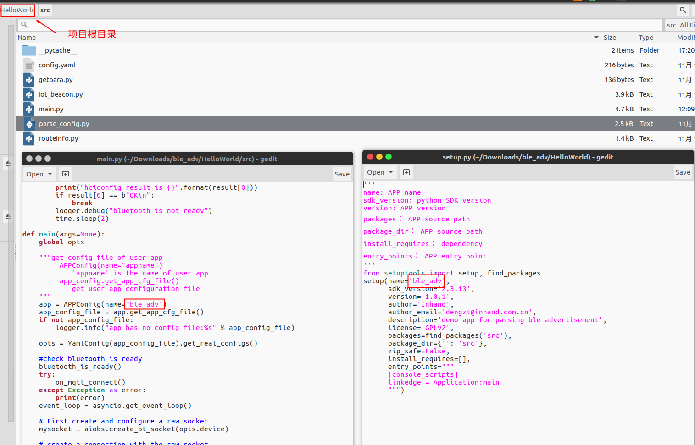
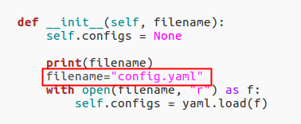

# Helloworld.zip 无法打包问题

- 如下图，几处地方命名需要一致（具体见文档VG710-Python-APP-Development-Guide.pdf 第4章）

- config.yaml 默认就在app工程根目录下，不要在复制到src中

- parse_config.py文件是提供的配置解释功能， 不需要修改，你的源文件中

  

- app 打包请参考前面发送的文档 VG710-Python-APP-Development-Guide.pdf 4.4节

- 你提供的helloworld包中没有`.vscode`目录无法和设备同步文件