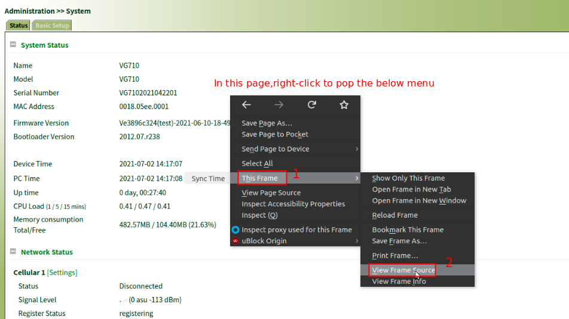
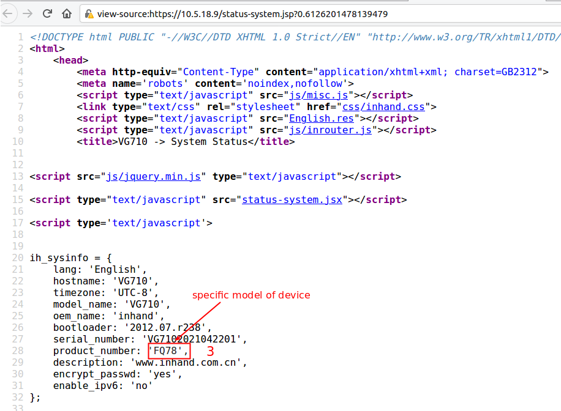

# How to check the specific model of device

In `Administration >> System` , follow the steps below to view the source code of the page .

In the source code of the page (always in a new tab), check model as below

