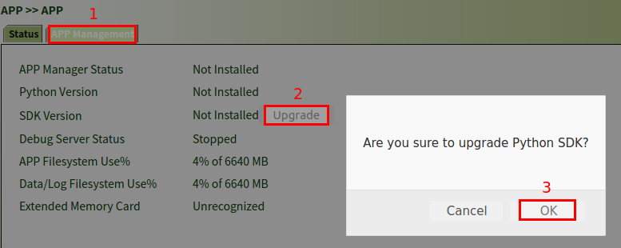
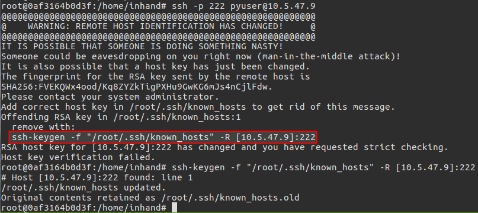
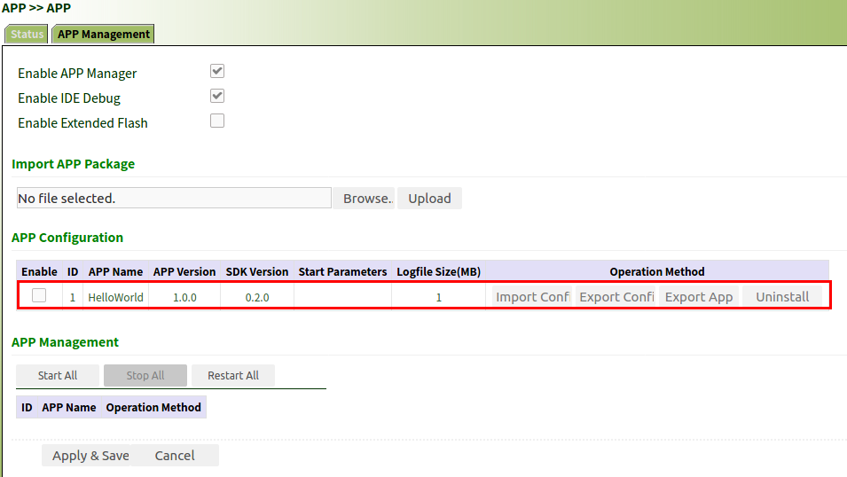
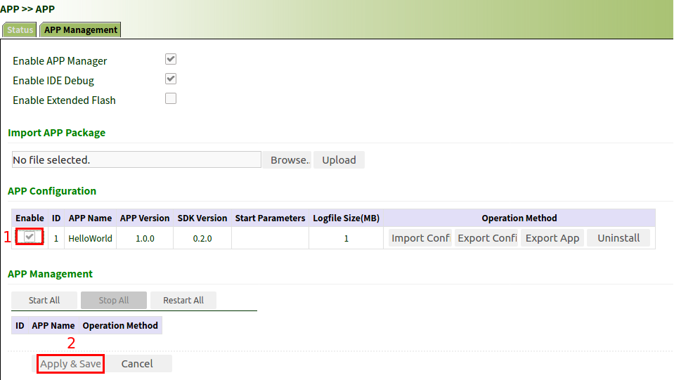
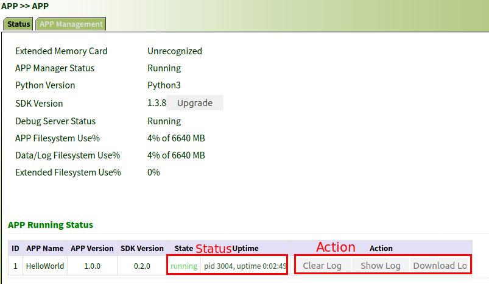

# In-Vehicle Gateway C SDK User Guide

## 1. Introduction

This document briefly explains how to develop and deploy C APPs with In-Vehicle Gateway C SDK.

**Features**:

- Support build for cmake based packages
- Support build for autotools based packages
- Support APPs packaging

**Requirements**:

- Host or virtual machine that support Linux operating system

---

APPs written in C language can have a smaller disk and memory footprint, better runtime performance, and also a higher affinity for the system. 

By using Docker container build environment which has great advantages in continuous integration, version control, portability, isolation and security,  you can edit, debug and package your APPs all within it. It just makes life much more easier than ever before.

---

After you have packaged your APPs, your could redistribute and deploy them via In-Vehicle Gateway WebUI or Device Manager. 
At this deployment stage, all you need is the packaged APPs and your favorite web browser to access In-Vehicle Gateway WebUI or our **Device Manager**.

During your development process, we recommend you first deploy via In-Vehicle Gateway WebUI to make sure your APPs work as expected.
Once you have the confidence that your APPs are OK for mass deployment, you could use our Device Manager to import and deploy them on lots of In-Vehicle Gateway devices in batch.

## 2. SDK Layout

```shell
deps: directory to hold third-party libraries required by your APPs
Makefile: master makefile of the SDK, no need to change
prebuilt: prebuilt libraries
rules: build related files
scripts: scripts for build, no need to change
src: APP source code directory(support multiple APPs)
toolchain: cross-compilation toolchain, no need to change
```

In **rules** directory:

```sh
include: SDK build rules, no need to change
*.mk: build Makefile for your APP
```

In **src** directory:

```sh
configs.mk: top level APPs targets and their dependencies definition
helloworld: APP sample directory
```

## 3. Set Up Docker Build Environment

**Note**： Please install Docker first!

```shell
tar -zxv -f inhand_vg_c_sdk_docker_1.2.1.tar.gz
cd inhand_vg_c_sdk_docker_1.2.1
./make.sh #Create a docker container build environment called appdev, mapping host directory inhand-vg-c-sdk-release-V1.2.1 to container directory /home/inhand
```

## 4. Helloworld Sample

We provide a template project **HelloWorld** to demonstrate how to develop and deploy an APP based on our In-Vehicle Gateway C SDK.

### 4.1 Helloworld Layout

`src/helloworld`  directory contains the following files. 

```sh
appinfo: APP management meta data
config.c: APP configuration parse definition
config.h: APP configuration parse definition header
config.yaml: APP configuration file
helloworld.c: APP source code
Makefile: APP master Makefile
```

The following is a detailed explanation of the relevant files

- Makefile


```makefile
#
# In-Vehicle C Sample APP Makefile
#
# Copyright 2001-2022, InHand Networks
# All Rights Reserved.
#

# set default setttings, do not modify
LDFLAGS += $(APP_BASE_LDFLAGS)
LIBS += $(APP_BASE_LIBS)
TARGET_NAME := $(APP_FIX_TARGET_NAME)


$(TARGET_NAME): helloworld.o config.o
        $(CC) -o $@ $^ $(CFLAGS) $(LDFLAGS) $(LIBS)

%.o:%.c
        $(CC) -o $@ -c $< $(CFLAGS)

#Install target
#Users can customize which files need to be installed
install: FORCE
        $(INSTALL_DIR) install
        $(INSTALL_BIN) $(TARGET_NAME) install
        $(INSTALL_BIN) config.yaml install
        $(INSTALL_DATA) appinfo install

FORCE: ;

.PHONY: distclean clean FORCE
distclean clean:
        rm -rf main *.o *.i
```

- appinfo

```json
# For APP management, you need to set name, version, author of APP and supported SDK version
{
    "name": "helloworld",
    "sdk_version": "0.1.0",
    "version": "1.0.0",
    "author": "dengzt@inhand.com.cn"
}
```

- config.yaml

**Note**: APP configuration file uses yaml format, the content of sample file is as follows:

```yaml
# For the writing and parsing of configuration files, please refer to
# https://pyyaml.org/wiki/LibYAML
# https://github.com/tlsa/libcyaml/blob/main/docs/guide.md
#
config:
   description: "hello world!"
   others:
      LOG:
        #verbose debug output
        debug: 0
```

### 4.2 Add Dependency Library (Optional)

**NOTE**: If your APP does not need to add any dependencies, you can skip this chapter.

The following guide takes adding the libyaml library as an example.

#### 4.2.1 Package download

```sh
cd deps
#download package
curl -Lk https://github.com/yaml/libyaml/releases/download/0.2.5/yaml-0.2.5.tar.gz -O
#extract package
tar -zxv -f yaml-0.2.5.tar.gz
#create soft link for package to simplify package building
ln -s yaml-0.2.5 libyaml
```

#### 4.2.2 Create Build Makefile

Create a build Makefile for the package in rules directory (same name as the previous soft link, such as **libyaml.mk**)

```makefile
#
# In-Vehicle C SDK 3rd lib Makefile
#
# Copyright 2001-2022, InHand Networks
# All Rights Reserved.
#

#Introduce environment variables such as cross-compilation
include rules/include/env.mk

#Set the package name (same as the previous soft link)
PKG_NAME := libyaml
#DEPS means its source code locates at deps directory and is an APP dependent library
DEPS := 1

#set CMAKE_PROJ for cmake based package, autotools is assumed if not set
#CMAKE_PROJ := 1 

#set DISTCLEAN_NOT_SUPPORT if package do not support distclean target
#DISTCLEAN_NOT_SUPPORT := 1

#general rules for building packages
include rules/include/package.mk

#specify compiled dynamic library binaries which needs to be packaged. please specify library binaries per your package.
#install location: $(PKG_INSTALL_DIR)/lib
$(PKG_TARGET_PREFIX): $(PKG_NAME)-install FORCE
        $(SLIENT)$(INSTALL_DIR) $(PKG_INSTALL_DIR)/lib
        $(SLIENT)$(CP) $(PKG_BUILD_DIR)/install/usr/lib/libyaml.so* $(PKG_INSTALL_DIR)/lib
        $(SLIENT)$(CP) $(PKG_BUILD_DIR)/install/usr/lib/libyaml-0* $(PKG_INSTALL_DIR)/lib
```

### 4.3 Configure Build Files

APP needs the following two files to support compiling and packaging

```sh
rules/helloworld.mk # rules for compiling and packaging helloworld and its dependencies
src/config.mk #set up the top level target of helloworld and its dependencies
```

The following explains the detail of these two files.

- helloworld.mk

Create a Makefile (helloworld.mk) with the same name as the APP directory in **src** directory. The details are as follows:

```Makefile
#
# In-Vehicle C SDK APP Makefile
#
# Copyright 2001-2022, InHand Networks
# All Rights Reserved.
#

include rules/include/env.mk

#Set the APP name (same name as the APP directory)
PKG_NAME := helloworld

include rules/include/package.mk

#specify compiled APP files which needs to be packaged. please specify related files per your package.
#executables install location: $(PKG_INSTALL_DIR)/src
#cconfig.yaml install location: $(PKG_INSTALL_DIR)
#appinfo install location: $(PKG_INSTALL_DIR)/../$(APP_NAME).info
$(PKG_TARGET_PREFIX): $(PKG_NAME)-install
        $(SILENT)$(INSTALL_DIR) $(PKG_INSTALL_DIR)/src
        $(SILENT)$(INSTALL_BIN) $(PKG_BUILD_DIR)/install/main $(PKG_INSTALL_DIR)/src/
        $(SILENT)$(INSTALL_DATA) $(PKG_BUILD_DIR)/install/config.yaml $(PKG_INSTALL_DIR)
        $(SILENT)cat $(PKG_BUILD_DIR)/install/appinfo | jq -c . > $(PKG_INSTALL_DIR)/../$(APP_NAME).info
```

- configs.mk

Modify configs.mk file in **src** directory and configure it as follows.

```makefile
# Example for app1, app2 and app3
# apps := app1 app2 app3
# app1_deps := libyaml libcyaml
# app2_deps := libevent libmosquitto
# app3_deps := libyaml libjson
apps := helloworld
helloworld_deps := libyaml libcyaml
```

### 4.4 Compile Helloworld

- compile the APP (note that `-app` suffix is required to build its dependencies)

```sh
make helloworld-app
```

### 4.5 Package Helloworld

- the appended `-app-install` suffix target will generate ready to deploy APP package in **pkg** directory.  `pkg/output/<appname>/<appname>` can be used to debug,  please refer to [4.6.3 Debug with Docker Container](#463-debug-with-docker-container) for more details.

```sh
make helloworld-app-install #<package name>-version.tar.gz will be generated in pkg directory, for example: helloworld-V1.0.0.tar.gz
```

### 4.6 Debug Helloworld

APP manager provides APP management support and SSH connection for APP debug. 

This part uses SSH connection for APP debug only.

For APP management, please refer to [5. APP management](#5-app-management).

####  4.6.1 Install APP Manager

- Step 1: Switch to APP Status page
- Step 2: Click **Upgrade** button, then choose Python SDK package you downloaded.
- Step 3: Click **OK** to confirm the operation, then wait for the upgrading process to complete



#### 4.6.2 Enable APP Manager and IDE debug

**IDE debug** is needed at development stage to synchronize files with in-Vehicle Gateway to debug and package your APPs.

Steps are as  follows:

- Step 1: switch to APP Management page
- Step 2: check **Enable IDE Debug**
- Step 3: check **Enable APP Manager**
- Step 4: click **Apply&Save** and wait for the operation to complete

**Note**: IDE Debug will be disabled after each reboot, so you need to re-enable it for your development.


#### 4.6.3 Debug with Docker Container

- login device via ssh in docker container with another terminal

```sh
docker exec -it appdev /bin/bash #enter container and run a new shell
ssh -p 222 pyuser@10.5.47.9 #password is the serial number on the device label
```

If you encounter the error in the following picture, you can execute the command in the red box in the picture below, and then try to login again.



- synchronize APP packaging directory to device via sftp in docker container with yet another terminal

```sh
docker exec -it appdev /bin/bash 
root@0af3164b0d3f:/home/inhand# lftp -u pyuser,VG7102021090201 sftp://10.5.47.9:222 
#Use the mirror -R <dir> command to synchronize local app directory to device 
#Use the mirror <dir> command to synchronize the server directory to the local
lftp pyuser@10.5.47.9:~> mirror -R pkg/output/helloworld/helloworld  # synchronize APP packaging directory to device. directory is pkg/output/<appname>/<appname>
#"mirror helloworld" command can synchronize helloworld directory from device to container.
```

- test

**Note**： The following command is based on the ssh connection above

```sh
cd helloworld/src
./main # launch the APP
```

If you need to debug again after changing the helloworld source code, please repeat sections 4.4-4.6


## 5. APP management

After you have packaged your APP, your could deploy it via in-Vehicle Gateway WebUI.

### 5.3.1 Import APP

Go to WebUI **APP Management** to import your APP package. Steps are as follows:

- Step 1: switch to APP Management
- Step 2: choose the APP package (e.g. HelloWorld-V1.0.0.tar.gz)
- Step 3: click **Upload** to finish import


The result of successful import is as follows:



### 5.3.2 Run APP

Go to **APP Management** to run your imported APP.

- Step 1: check **Enable**
- Step 2: click **Apply&Save** , then wait for operation to complete



### 5.3.3 Manage APP

In Operation area, you can do the following operations:

- import APP configuration
- export APP configuration
- export APP
- uninstall APP

In Management area, you can start, stop or restart your APP.


### 5.3.4 Check APP status

In Status area, you can find APP status, process id and uptime.
In Action area, you can check APP's log.



## 6. All Supported Targets

All supported build targets are as follows:

```shell
#build all APPs in SDK
make #compile all app programs and their dependent libraries
make clean  #clean up all apps and their dependent libraries
make distclean #distclean up all apps and their dependent libraries
make install #package all APPs

#build a single app with -app suffix target to build its dependencies as well
make helloworld-app #compile helloworld app and its dependencies
make helloworld-app V=s #compile helloworld app and its dependencies (verbose output)
make helloworld-app-clean #clean up helloworld app and its dependencies
make helloworld-app-distclean #distclean up helloworld app and its dependencies

#package a single app with -app-install suffix target
make helloworld-app-intall #<package name>-version.tar.gz will be generated in pkg directory, for example: helloworld-V1.0.0.tar.gz

#build a single package(an APP package in src or a dependency package in deps)
make helloworld # build an APP package
make libyaml    # build a dependency package
make helloworld-clean #clean an APP package
make helloworld-distclean  #distclean an APP package
make libyaml-clean #clean a dependency package
make libyaml-distclean  #distclean a dependency package
```