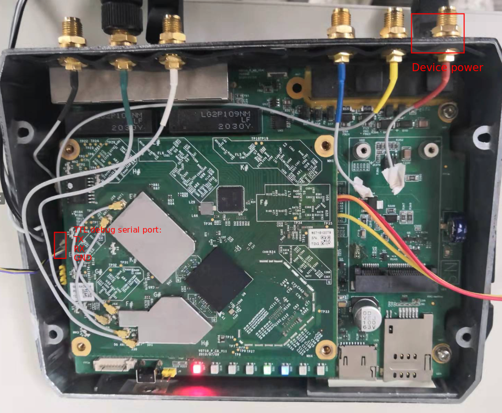
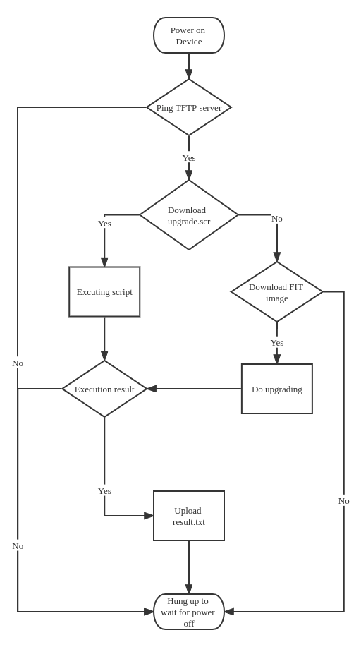

# Inhand OpenWrt SDK for Fara User Guide

## 0. Release Note

- 1.3.0
  - Support to upgrade uboot and firmware through uboot

## 1.  SDK Build

- **Download**

(1) Full download

```sh
# aws s3 cp s3://inhandnetworks-vg-sdk/FARA/qsdk_docker.tgz qsdk_docker.tgz
# tar -zxv -f qsdk_docker.tgz && cd qsdk_docker
# aws s3 cp s3://inhandnetworks-vg-sdk/FARA/qsdk-for-fara-release-20220421-V1.3.0.tar.gz qsdk-for-fara-release-20220421-V1.3.0.tar.gz
```
(2) Apply patches

Apply the below patch base to`qsdk-for-fara-release-20220415-V1.2.1`.

```sh
# cd qsdk-for-fara-release-20220415-V1.2.1
# aws s3 cp s3://inhandnetworks-vg-sdk/FARA/1.3.0-patch-base-to-1.2.1/1.3.0-patch-base-to-1.2.1 --recursive
# git init && git add . && git commit -s -m "init repo" #optional if git repo is ready
# git am 1.3.0-patch-base-to-1.2.1/* --reject --ignore-whitespace
```

- **Build with docker**

**NOTE**: please install docker first!

```sh
# SDK_FILE=qsdk-for-fara-release-20220421-V1.3.0.tar.gz ./make.sh
```
- **Firmware location**

After successful compilation, the firmwares are as follows in buildroot `bin/ipq806x` of `qsdk-for-fara-release-20220421-V1.3.0`

```sh
#Burnable firmware
-rw-r--r--  1 root root  29168844 4月  15 15:44 openwrt-ipq40xx-inhand-1GB.bin #1GB DDR
-rw-r--r--  1 root root  29168844 4月  15 15:44 openwrt-ipq40xx-inhand.bin #512MB DDR
#FIT multi image (contains upgrade script, uboot and firmware image)
-rw-r--r--  1 root root   4749872 4月  15 15:44 openwrt-ipq40xx-inhand-fit-multi.img
```

## 2. SDK description

```sh
# Openwrt target directory(Include kernel configuration and image generation)
target/linux/ipq806x/image
# kernel source code
qca/src/linux-4.4
# dts
qca/src/linux-4.4/arch/arm/boot/dts/qcom-ipq4019-ap.dk04.1-c1.dts
# uboot source code
qca/src/uboot-1.0
# uboot openwrt package
package/boot/uboot-ipq40xx
```

## 3. Firmware Upgrade

### 3.1 Device Configuration

Please connect to TTL debug serial port with the below configuration: 

- baud rate: 115200
- Parity Bit/Data Bit/Stop Bit: None/8/1
- Hardware Flow Control: No
- Software Flow Control: No



### 3.2 Burning steps for burnable firmware

#### 3.2.1 Backup ART partition

The art partition contains the calibration data of the WIFI, save it first through Python APP ssh console.

```sh
# dd if=/dev/mmcblk0p11 of=caldata bs=1k count=256
256+0 records in
256+0 records out
262144 bytes (256.0KB) copied, 0.019537 seconds, 12.8MB/s
# tftp -p 10.5.18.8 -l caldata
```

#### 3.2.1 Backup u-boot enviroment partition

```sh
# dd if=/dev/mmcblk0p8 of=ubootconf bs=1k count=256
256+0 records in
256+0 records out
262144 bytes (256.0KB) copied, 0.019537 seconds, 12.8MB/s
# tftp -p 10.5.18.8 -l ubootconf
```

#### 3.2.3 Update u-boot 

**NOTE**: If you switch from inhand firmware to openwrt firmware, you need to upgrade uboot first!

- When the device starts, pressing `q+enter` to enter u-boot

- Set tftp related configuration

```sh
(VG710) # set serverip 10.5.18.8
(VG710) # set ipaddr 10.5.18.9
(VG710) # save
Saving Environment to MMC...
Writing to MMC(0)... done
(VG710) # reset
```

**Note**: Update u-boot to support both Inhand image and OpenWrt image.

`3CA` indicates the number of blocks of eMMC to be programmed, that is, how many blocks of eMMC need to be occupied by the size of the firmware downloaded by tftpboot [hexadecimal]. In this example, the file size is 496428 bytes of `openwrt-ipq40xx-u-boot-stripped.elf` . Divide by the single block size of 512 bytes to get the number of blocks. If there is a remainder, add 1 block: 496428/512 = 81450 (blocks), convert to hexadecimal as `3CA`

```sh
(VG710) # tftpboot openwrt-ipq40xx-u-boot-stripped.elf
(VG710) # mmc write 84000000 1A22 3CA
(VG710) # reset
```

####  3.2.4 Burn firmware

- Burn the whole image

**Note**: The ART partition will be erased and needs to be restored.

Please refer to [section 3.2.1](#321-update-u-boot) for burning length calculation.

```sh
# burn kernel(you can find the file in bin/ipq806x/ )
# tftpboot openwrt-ipq40xx-inhand.img
# mmc write 84000000 0 de8b
# reset
```

- Burn FIT image of kernel, dtb and rootfs (`First Kernel` partition)

Please refer to [section 3.2.1](#321-update-u-boot) for burning length calculation.

```sh
# burn kernel(you can find the file in bin/ipq806x/ )
# tftpboot openwrt-ipq806x-qcom-ipq4019-ap.dk04.1-c1-firmware-fit-uImage.itb 
# mmc write 84000000 2C22 fc99b
# reset
```

#### 3.2.5 Restore ART partition

The art partition contains the calibration data of the WIFI, save it first.

```sh
# tftp -g 10.5.18.8 -r caldata
# dd if=caldata of=/dev/mmcblk0p11 bs=1k count=256
256+0 records in
256+0 records out
262144 bytes (256.0KB) copied, 0.019537 seconds, 12.8MB/s
```

#### 3.2.6 Restore u-boot environment partition

```sh
# tftp -g 10.5.18.8 -r ubootconf
# dd if=ubootconf of=/dev/mmcblk0p8 bs=1k count=256
256+0 records in
256+0 records out
262144 bytes (256.0KB) copied, 0.019537 seconds, 12.8MB/s
```

#### 3.2.7 Rest boot flag

Reset boot flag to 0 to ensure u-boot boot from `First Kernel` partition, if you burn image to `First Kernel` partition.

```sh
# mmc erase 171C22 2
# reset
```

### 3.3 Burn steps for FIT multi image

#### 3.3.1 Upgrade Flow



#### 3.3.2 Configuration steps

- Configure IP address of PC

```sh
IP: 192.168.2.199
NETMASK: 255.255.255.0
```

- Set the TFTP server

- Copy FIT image to root directory of TFTP server

```
cp openwrt-ipq40xx-inhand-fit-multi.img /root
```

- Copy u-boot upgrade script to root directory of TFTP server (optional)

```sh
cd target/linux/ipq806x/image
mkimage -A arm -O linux -T script -C none -a 0 -e 0 -n "ECE453 Boot Script" -d upgrade.script upgrade.scr #upgrade.script is an example to upgrade uboot and firmware
cp upgrade.scr /root
```

- Connect PC to device ethernet port
- Power on device
- After about 1 minute you can see the `result.txt` file in the root directory, if the upgrade was successful. If there are no `result.txt`, the upgrade fails.
- Disconnect the PC from device. Power off and on to the device to let the device to start normally.

### 3.4 Device partitions

```sh
(IPQ40xx) # mmc part
Partition Map for MMC device 0  --   Partition Type: EFI
Part    Name                    Start LBA       End LBA
  1     0:SBL1                  0x00000022      0x00000421
  2     0:BOOTCONFIG            0x00000422      0x00000821
  3     0:QSEE                  0x00000822      0x00000C21
  4     0:QSEE_1                0x00000C22      0x00001021
  5     0:CDT                   0x00001022      0x00001221
  6     0:CDT_1                 0x00001222      0x00001421
  7     0:BOOTCONFIG1           0x00001422      0x00001821
  8     0:APPSBLENV             0x00001822      0x00001A21
  9     0:APPSBL                0x00001A22      0x00002221
 10     0:APPSBL_1              0x00002222      0x00002A21
 11     0:ART                   0x00002A22      0x00002C21
 12     First Kernel            0x00002C22      0x00022C21
 13     Second Kernel           0x00022C22      0x00042C21
 14     Startup Config          0x00042C22      0x00047C21
 15     Startup Backup          0x00047C22      0x0004CC21
 16     Factory Config          0x0004CC22      0x00051C21
 17     Backup                  0x00051C22      0x00071C21
 18     Python SDK1             0x00071C22      0x000F1C21
 19     Python SDK2             0x000F1C22      0x00171C21
 20     Boot Flag               0x00171C22      0x00171C23
 21     rootfs_data             0x00171C24      0x00E5E021
```
