# Inhand VG710 AWS Access User Manual

## 1. Configure AWS

### 1.1 create thing

- Login https://console.amazonaws.com, input `iot`

  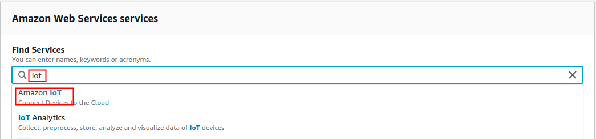

- **** `Manage->thing`, then click `Create`

  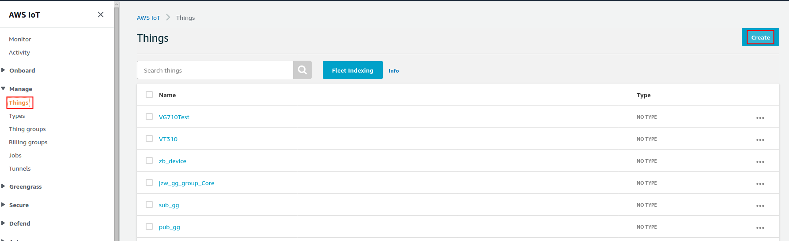

- Click `Create a single thing`

  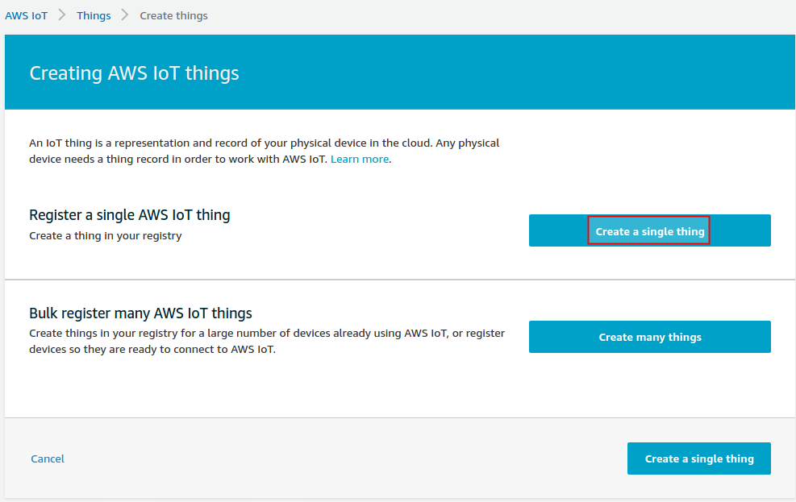

- Input name of thing, then click `Next`

  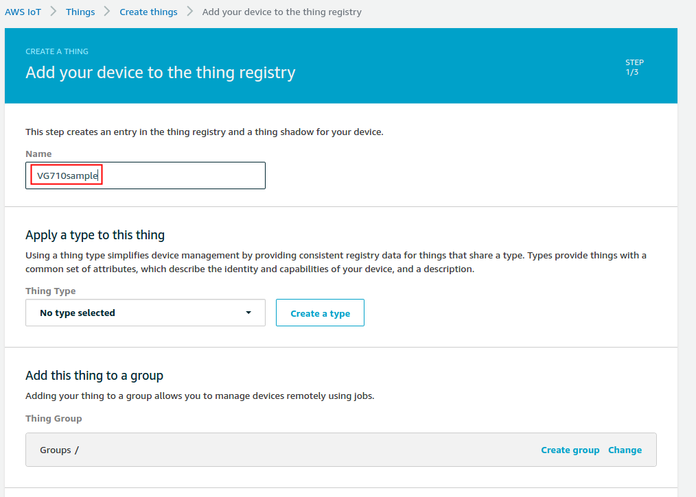

  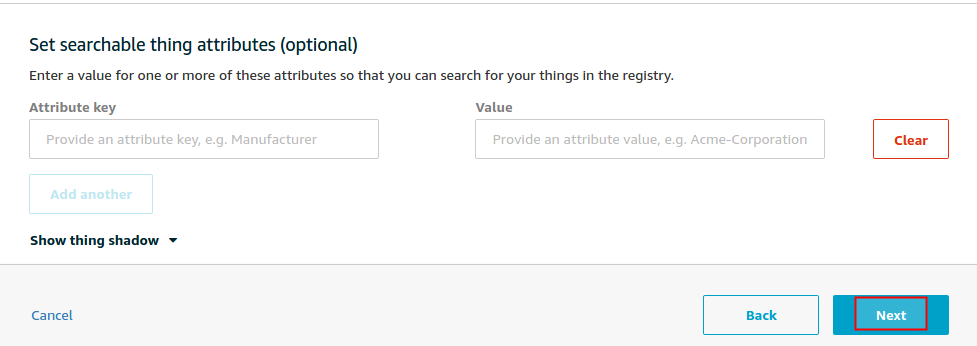
  
- Click `Create thing without certificate`

  


### 1.2 create certificate

- Enter `Secure->Certificate`, then click `Create`

  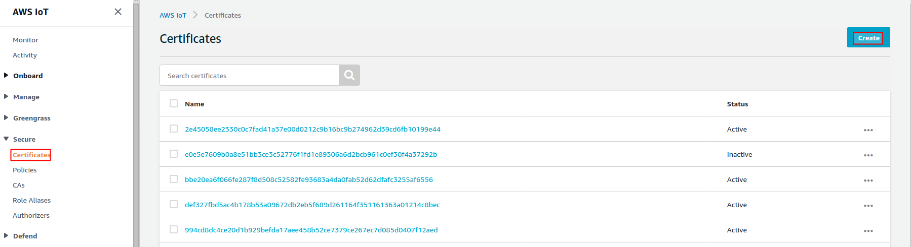

- click `Create certificate`

  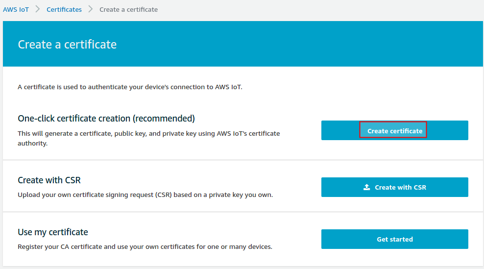

- Download certificate and key, click `Activate`, then click `Done`

  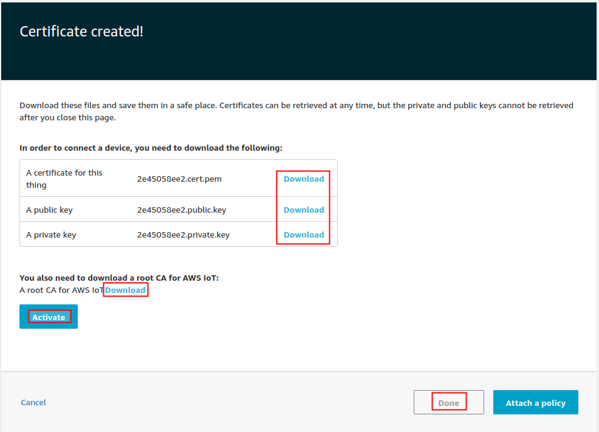

  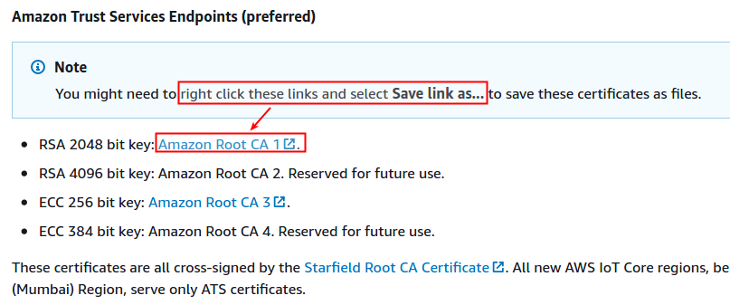

### 1.3 create policy

- Enter `Secure->Policies`, then click `Create`

  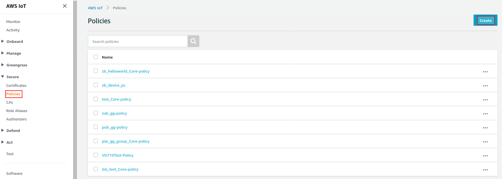

- Set the policy rules as below, click `Create` to create policies.

  Please refer to [AWS IoT Core policies](https://docs.aws.amazon.com/iot/latest/developerguide/iot-policies.html?icmpid=docs_iot_console) for more details.

  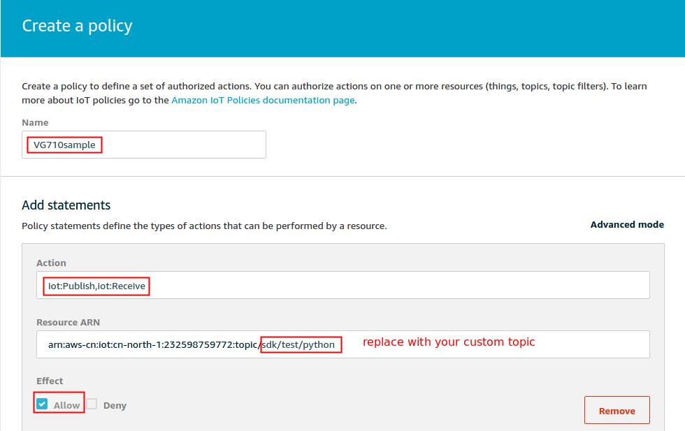
  
  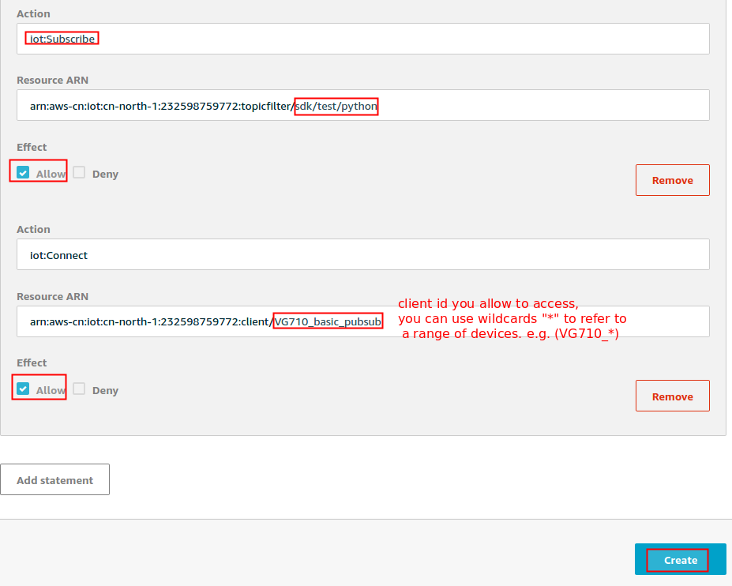

### 1.4 Attach thing and policies to certificate

- Enter `Secure->Certificates`, click the certificates you created earlier

  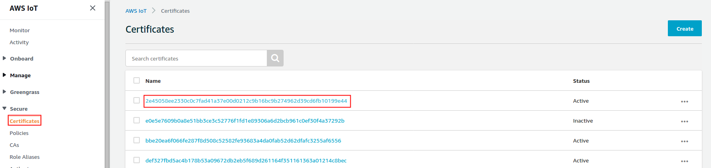

- Click `Policies`, then click `Attach policy`, choose the policy you created earlier, finally click `Attach`

  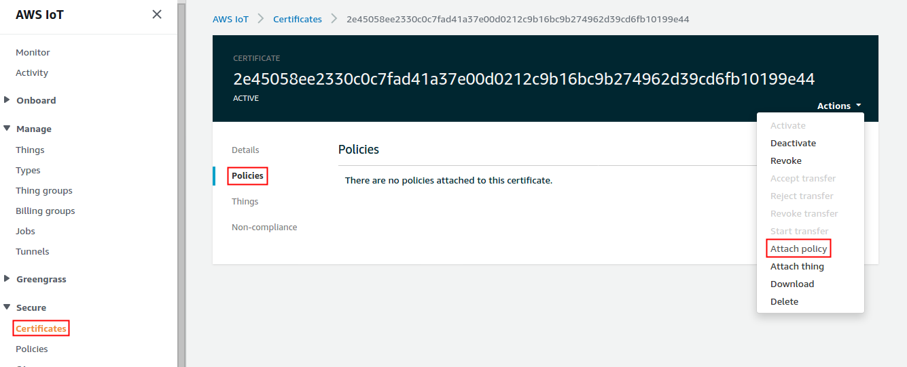

  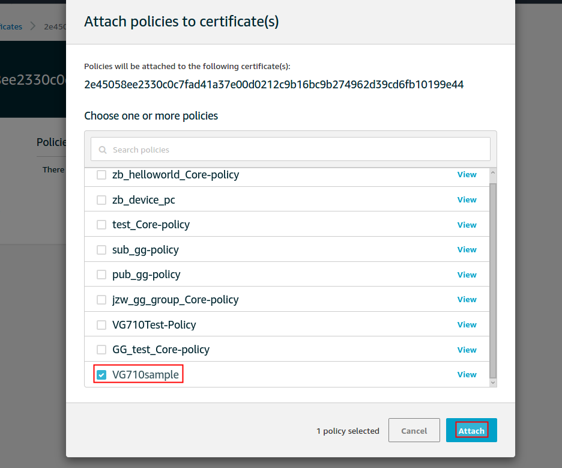

- Click `Things`, then click `Attach thing`, choose the thing you created earlier, finally click `Attach`

  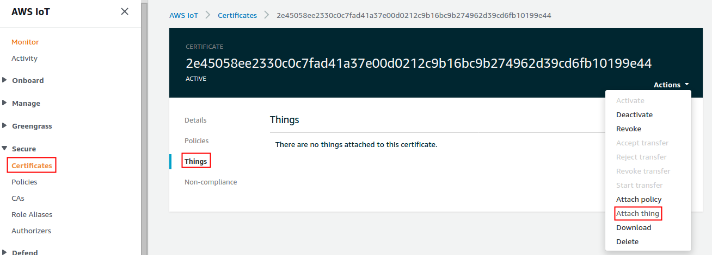

  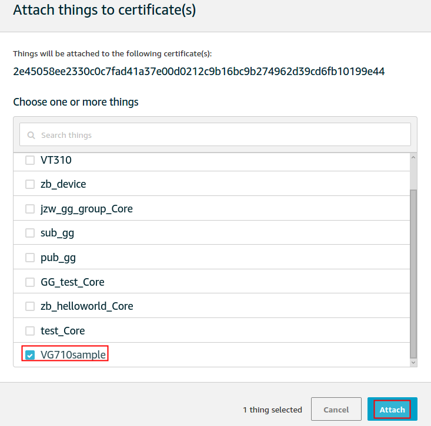
  
<div style="page-break-after: always;"></div>
## 2. Publish and subscribe test

We provide a python APP (`AWS_pubsub_demo`) to demonstrate publish and subscribe functions, please refer to ***VG710-Python-APP-Development-Guide.pdf*** to set up python APP development environment, then import all certificate and key to src/cert directory of `AWS_pubsub_demo` APP, then package it.

**AWS_pubsub_demo tree view**:

```
.
├── config.yaml
├── setup.py
├── src
│   ├── cert
│   │   ├── 5dd65b0ab3-certificate.pem.crt
│   │   ├── 5dd65b0ab3-private.pem.key
│   │   ├── 5dd65b0ab3-public.pem.key
│   │   └── AmazonRootCA1.pem
│   ├── parse_config.py
│   └── pubsub.py
└── .vscode
    └── sftp.json

3 directories, 9 files
```

**APP demo configuration instructions**:

- Endpoint

  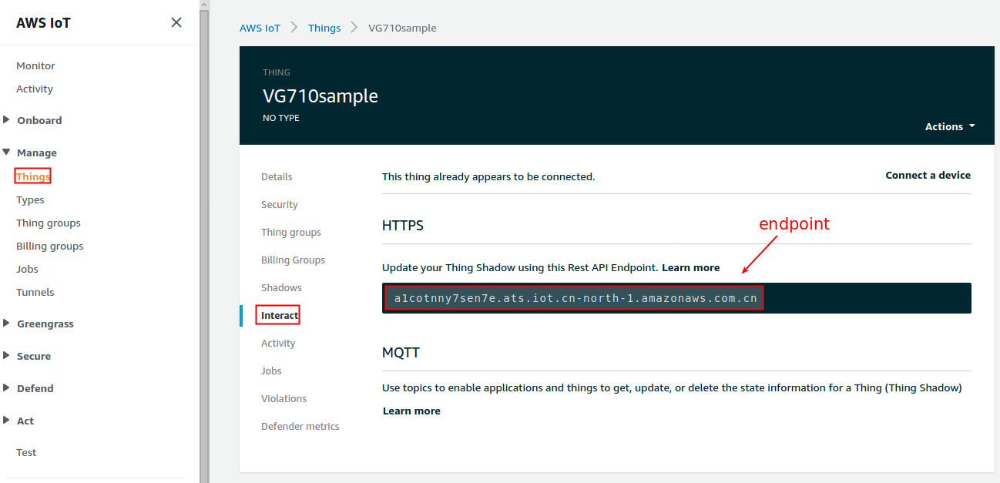

- Allow client id and topic according to policy

  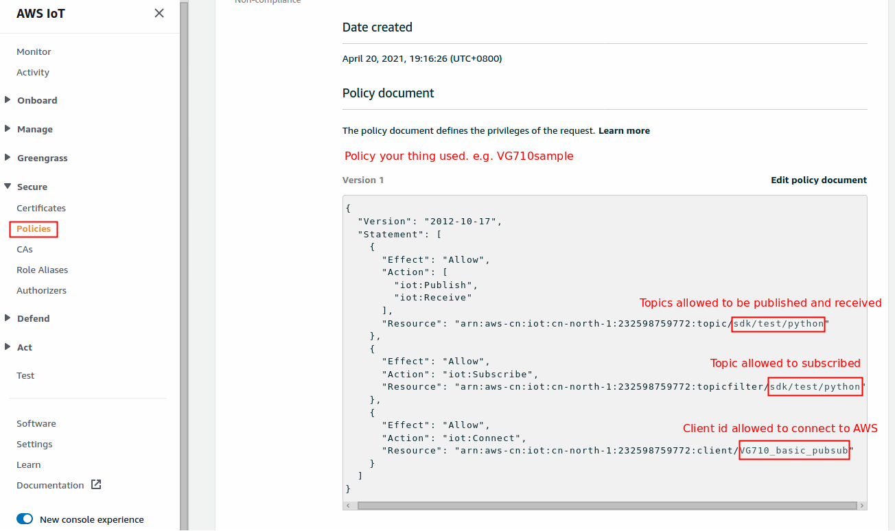

If you see the following log, the test is successful!

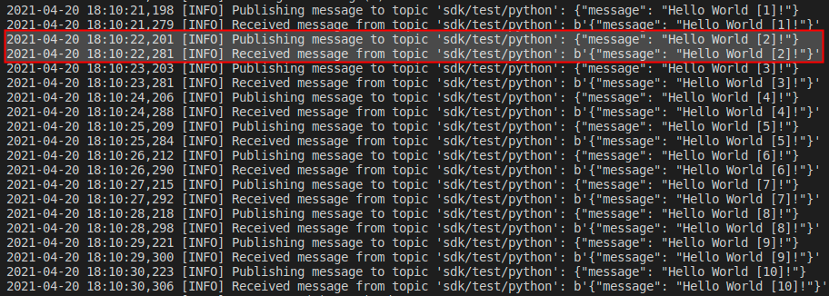

