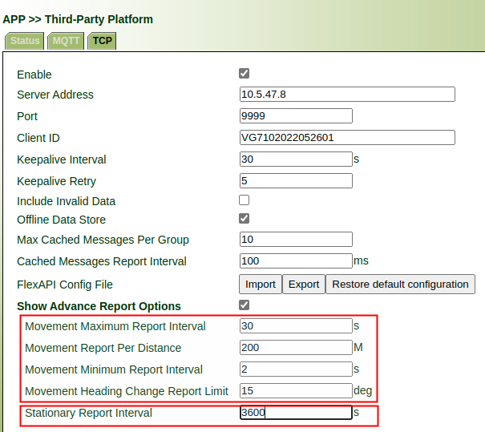
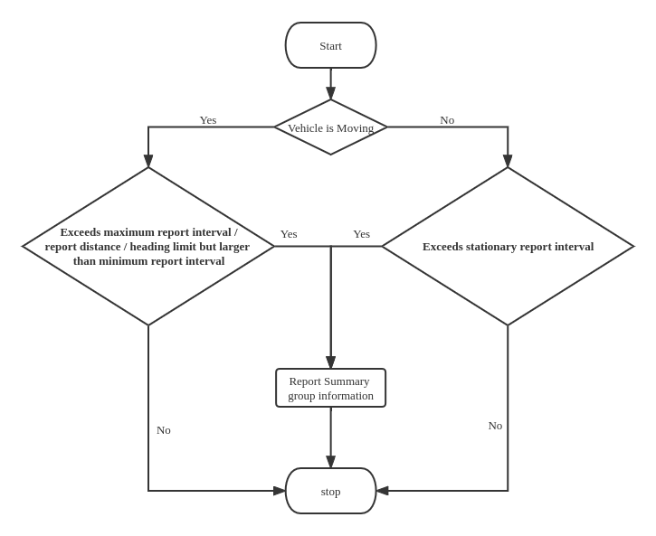

# Reporting configuration instructions

## 1. Configurion

We support advanced reporting function for summary group, the configuration page is as follows:

- **Movement Maximum Report Interval**: The maximum interval between two report when vehicle is moving
- **Movement Report Per Distance**: Report when vehicle travels the specified distance. If you don't want to use the setting , you can set it to 0 to turn it off.
- **Movement Minimum Report Interval**: The Minimum interval between two report when vehicle is moving. If you don't want to use the setting , you can set it to 0 to turn it off.
- **Movement Heading Change Report Limit**: Report when heading change reaches the limit. If you don't want to use the setting , you can set it to 0 to turn it off.
- **Stationary Heading Change Report Limit**: Reporting interval when the vehicle is stationary.

## 2. Reporting detection process

Reporting detection process is as follows:

