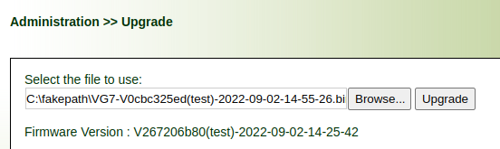
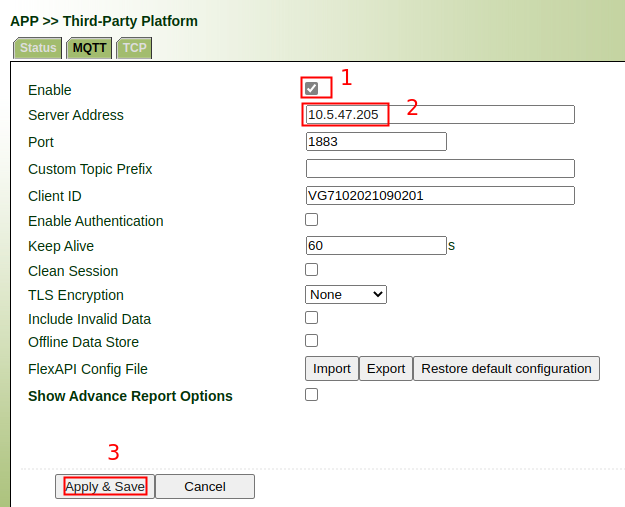
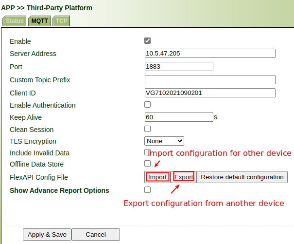
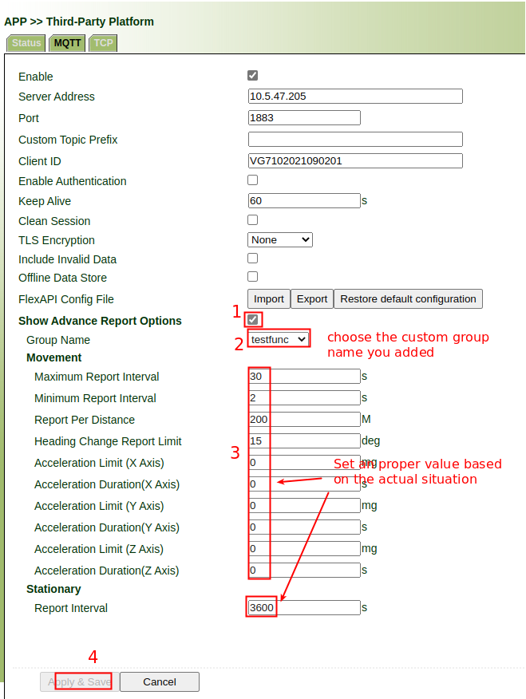

# User Guide For Atlas Labs Requirements

## 1. Upgrade Firmware

Please refer to below picture to upgrade test firmware first.

## 2. Enable Third-Party Platform

Please refer to the below picture to enable **Third-Party Platform**.

## 3. Add Custom Group

Please refer to section 4.1.1 of ***FlexAPI_Reference_for_3rd_party_platform_v1.0.8.pdf***  to add custom group as your needs.

If you have already added a group as in the previous step, you can reuse the configuration on another device using the import/export function as below picture

## 4. Enable Advance Report for custom group

Please refer to the below picture to enable Advance Report for custom group.

Explanation for advance settings:

- Group Name

Name of the group whose advanced reporting function is enabled

- Movement

  These conditions apply when the vehicle is in motion

  - Maximum Report Interval

  Maximum interval between two reports

  - Minimum Report Interval

  Minimum interval between two reports

  - Report Per Distance

  Report when the vehicle travels beyond the set distance. Set it to 0 to disable this condition.

  - Heading Change Report Limit

  Report when heading change exceeds set distance.  Set it to 0 to disable this condition.

  - Acceleration Limit (X Axis)
  - Acceleration Duration(X Axis)

  Reported when the X axis acceleration exceeds the set value and continues to exceed the set time.  Set it to 0 to disable this condition.

  - Acceleration Limit (Y Axis)
  - Acceleration Duration(Y Axis)

  Reported when the Y axis acceleration exceeds the set value and continues to exceed the set time. Set it to 0 to disable this condition.

  - Acceleration Limit (Z Axis)
  - Acceleration Duration(Z Axis)

  Reported when the Z axis acceleration exceeds the set value and continues to exceed the set time.  Set it to 0 to disable this condition.

- Movement

  - Report Interval

   Iinterval between two reports