# Using ALSA in Docker Container

## 1. Pull Base Image

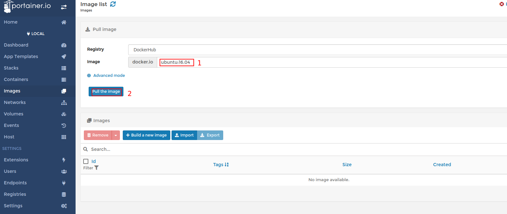

## 2. Create ALSA base Image

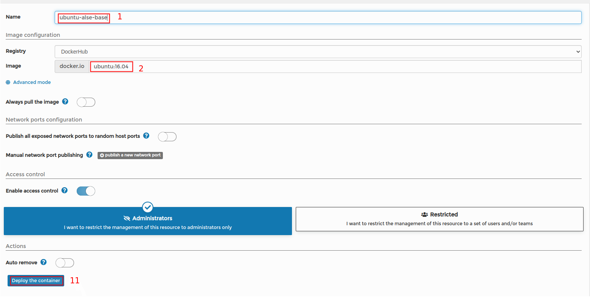

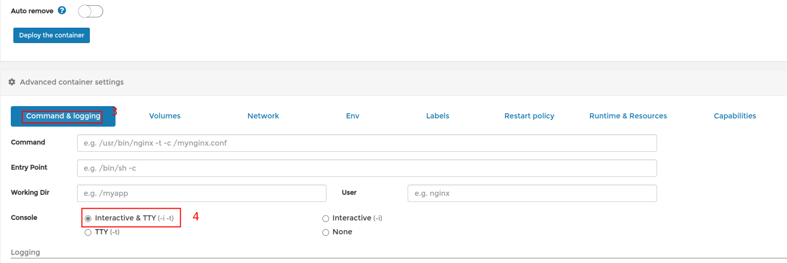

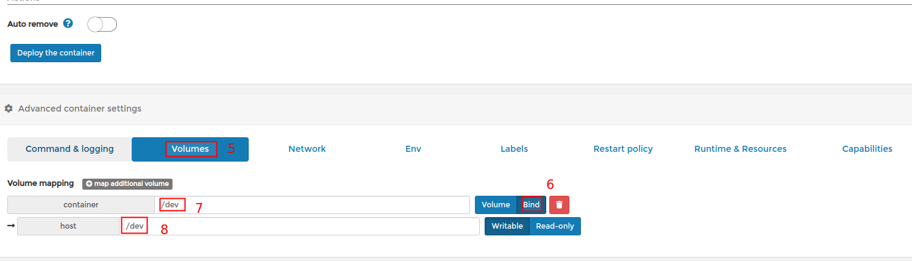


## 3. ALSA Settings In Container

Enter into Container as below picture

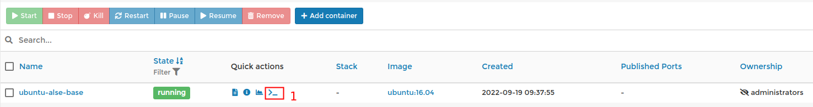

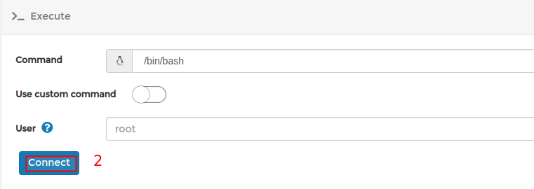

Next, enter the command in the following window

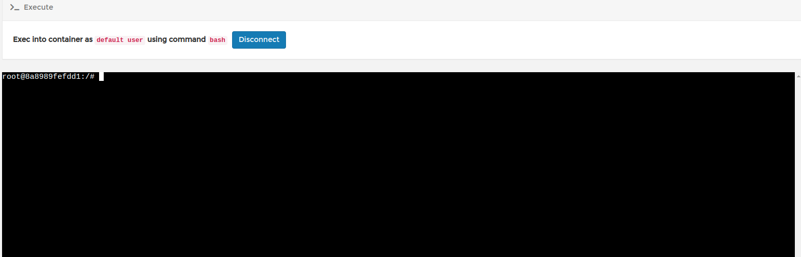

```sh
# replace package source(optional)
sed -i -e 's|ports.ubuntu.com|mirrors.tuna.tsinghua.edu.cn|g' /etc/apt/sources.list
# update apt database
apt update
# install alse and tftp packages
apt install alsa-base tftp
```

Finally, use tftp to download test audio file

**Note:** You need to setup a tftp server 

```sh
tftp 10.5.47.8
tftp> get yesterday_once_more.wav
Received 42799386 bytes in 44.8 seconds
tftp> quit
```

## 4. ALSA Test

Check playback hardware devices

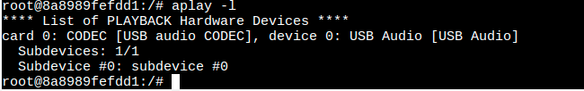

Check capture hardware devices

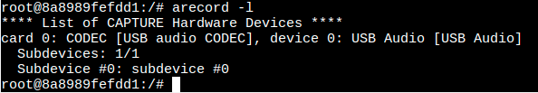

Please refer to VG814 Specifications (Road Transport) V2.3.1.pdf  to connect cables.

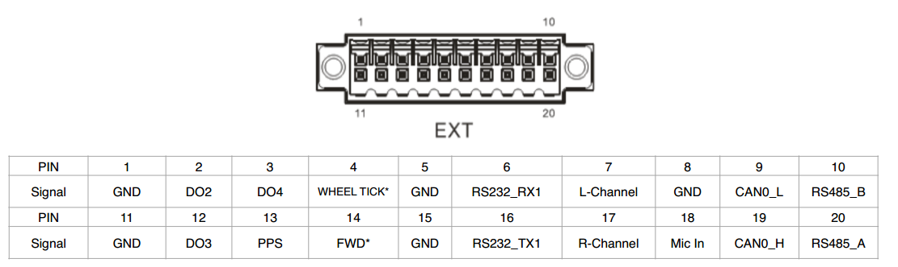

Test play

```sh
aplay -Dhw:0,0 yesterday_once_more.wav
```

Test capture and play(capture then play)

```sh
arecord -Dhw:0,0 -f cd -r 44100 -c 1 -t wav  | aplay -Dhw:0,0
```

## 5. Save Container to Image

You can follow the steps below to create audio base image.

- remove audio file and disconect

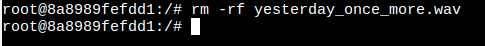

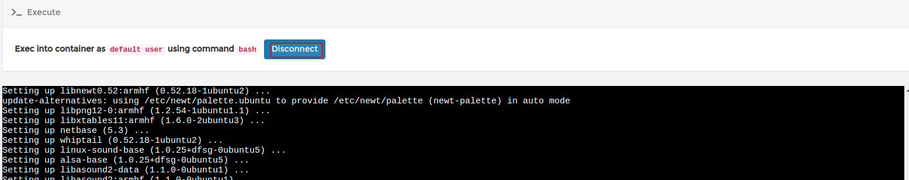

- create image

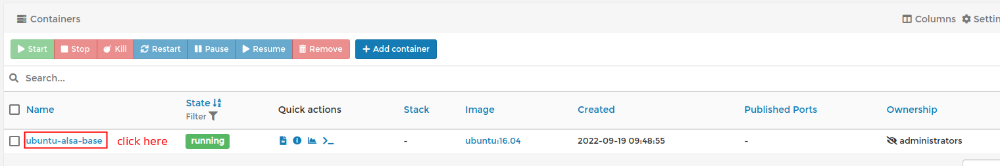

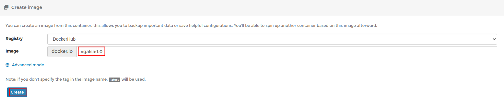

Then we can export image as below picture

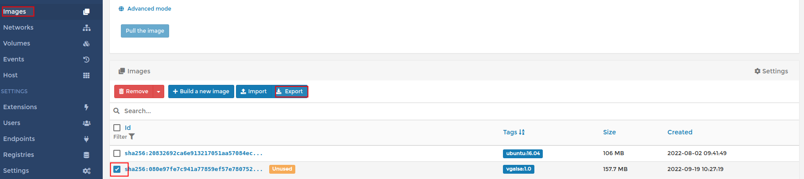