# VG Docker SDK Install and Usage Guide

## 1. Device Login

Using a PC to connect to the network port of the VG device, and log in to the device as shown in the following figure

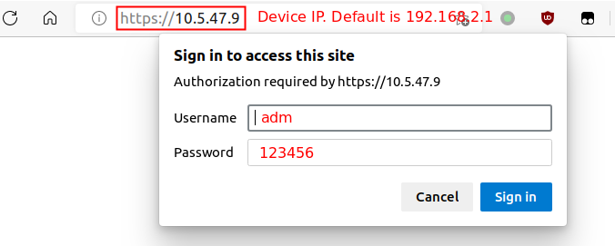

## 2. Docker SDK Install

Docker SDK integrates docker runtime and docker image manager required to run docker images. Docker SDK must be installed before using Docker.

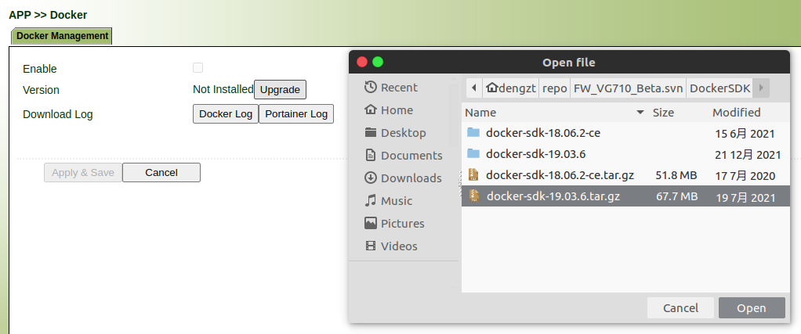

After the installation is complete

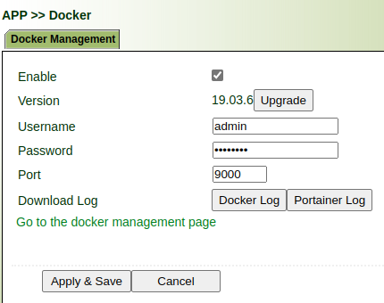

## 3. Enable Docker

Enable Docker as below picture.

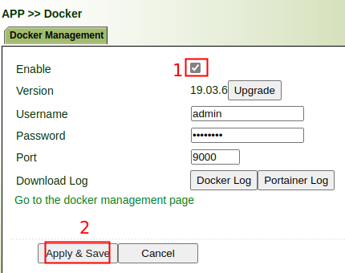

## 4. Using Portainer to Manage Docker Image and Container

### 4.1 Login Portainer

As below picture, click the link to jump to the portainer login page

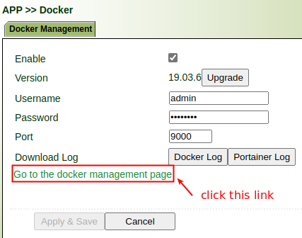

If you encounter the following problems, please do as shown below

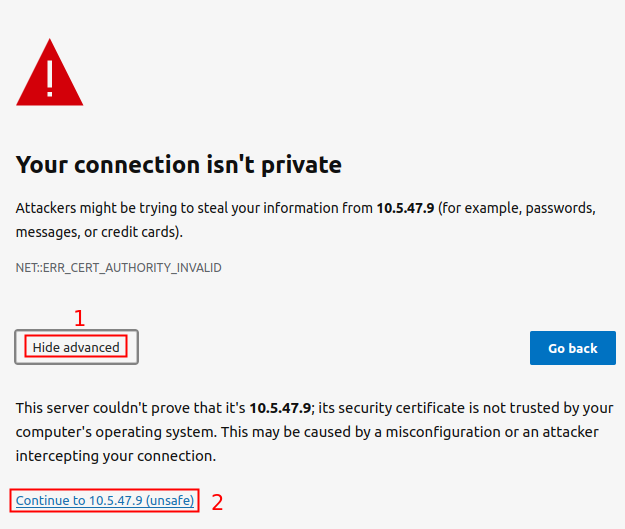

Input username and password(default is `admin/12345678`)

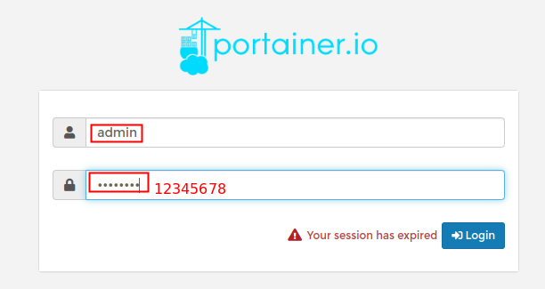

Choose `local` enviroment

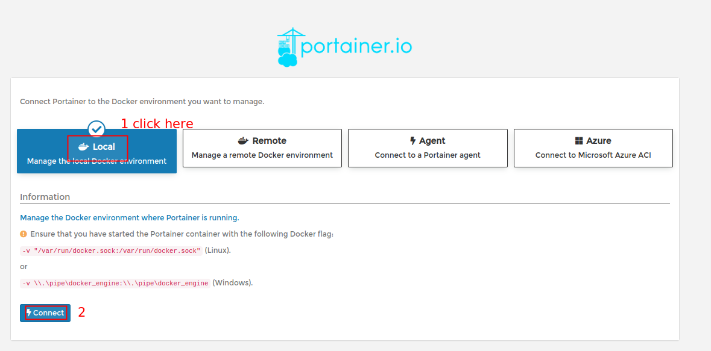

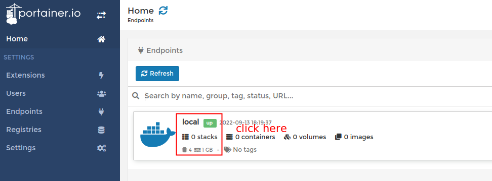

### 4.2 Pull Docker Image

#### 4.2.1 Import Docker Image Locally

**NOTE**： Docker image should be in `armv7` architecture.

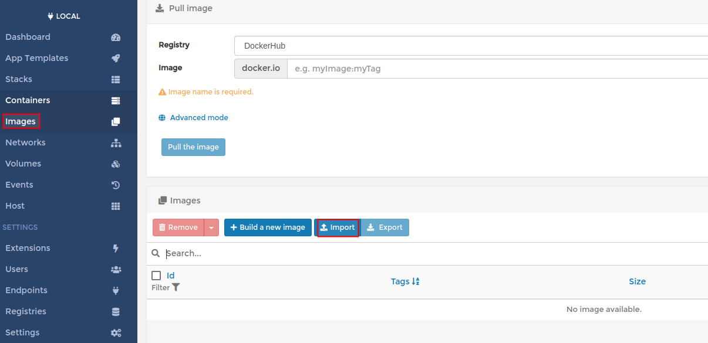

#### 4.2.2 Pull Docker Image via registry

Pull Docker image as below picture (`nginx:latest` is as an example)

**NOTE** : If image name does not contains tag, the tag is latest.

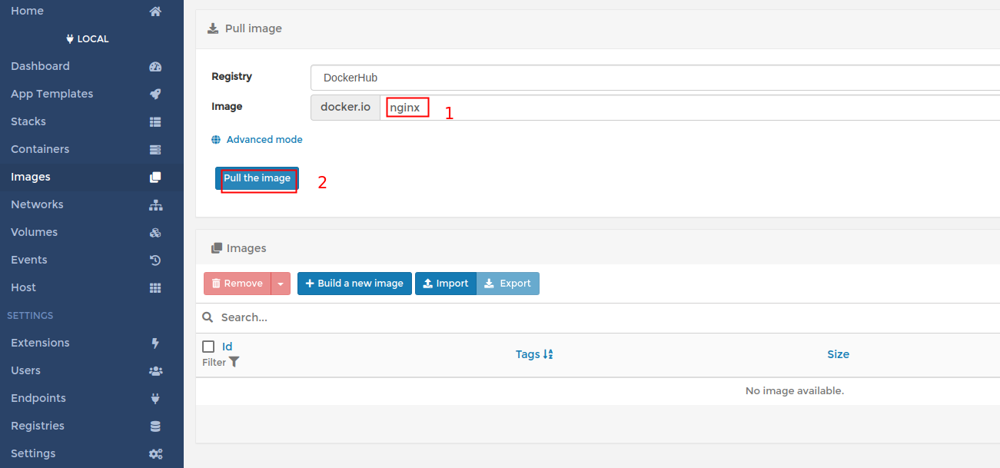

After the pull is successful, the picture is as follows

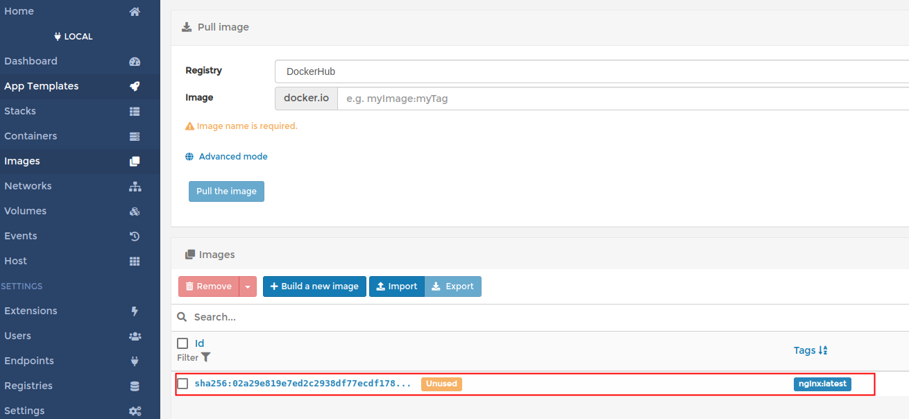

### 4.3 Create Docker Contaner

enter `Containers` page，choose `Add container`

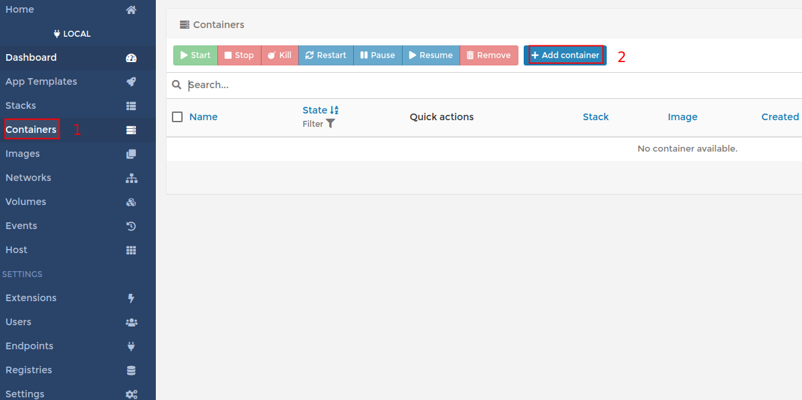

Create Docker image as below picture（nginx-example is an example）

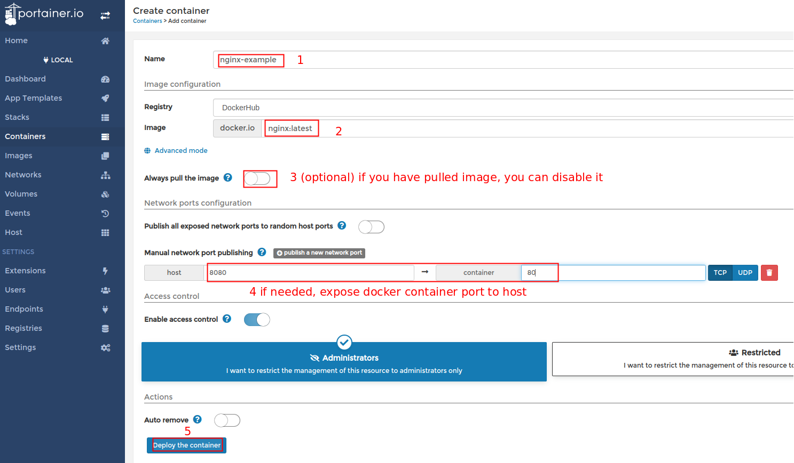

After the creation is successful, try to access in the browser as below picture.

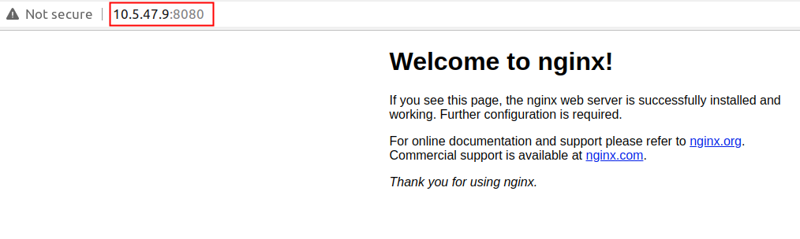