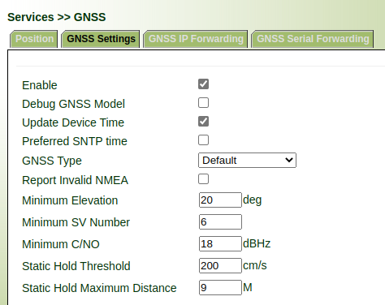

# VG GNSS Static Hold Mode

# 1. Introduction

Static Hold Mode allows the navigation algorithms to decrease the noise in the position output
when the velocity is below a pre-defined `Static Hold Threshold`. This reduces the position wander
caused by environmental factors such as multi-path and improves position accuracy especially in
stationary applications. 

If the speed drops below the defined `Static Hold Threshold`, the Static Hold Mode will be
activated. Once Static Hold Mode has been entered, the position output is kept static and the
velocity is set to zero until there is evidence of movement again. Such evidence can be velocity,
acceleration, changes of the valid flag (e.g. position accuracy estimate exceeding the Position
Accuracy Mask), position displacement, etc.

If the estimated position is farther away from the static hold position(`staticHoldMaxDist`) than
this threshold, static mode will be quit.

# 2. Setting

Set  `Static Hold Threshold` and `Static Hold Maximum Distance` according to your actual requirements. At the same time, `Minimum Elevation`, `Minimum SV Numver` and `Minimum C/NO` can also be adjusted properly to improve the positioning accuracy. Following configuration is for your reference.

- Minimum Elevation

Only elevation of satellite larger than the minimum elevation will be used in navigation algorithm.

- Minimum SV Numver

Minimum number of satellites required by the navigation algorithm to solve a valid location.

- Minimum C/NO

Only C/NO of satellite larger than the minimum C/NO will be used in navigation algorithm.

- Static Hold Threshold

GNSS module `Static Hold Mode` will be activated when velocity is lower than `Static Hold Threshold`

- Static Hold Maximum Distance

GNSS module `Static Hold Mode` will be quit when delta of position is greater than `Static Hold Maximum Distance`