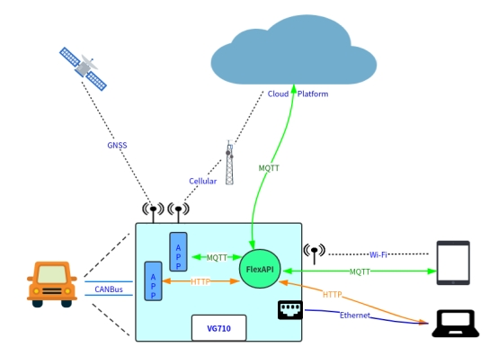
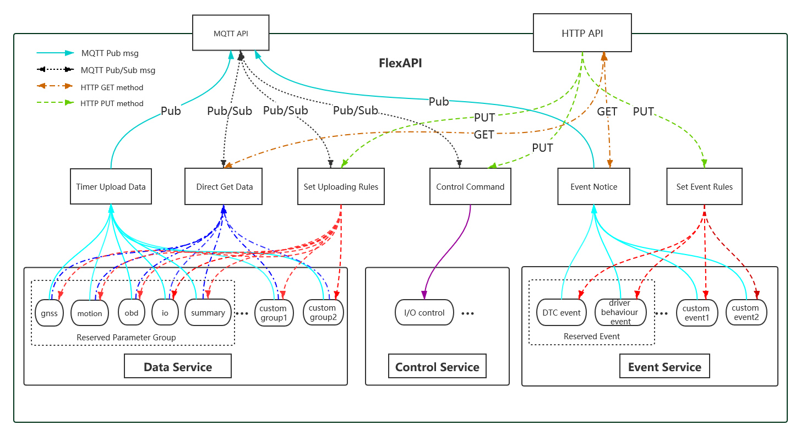
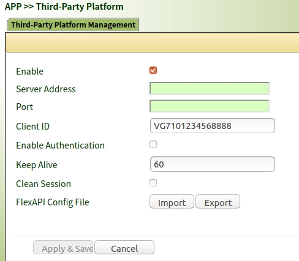
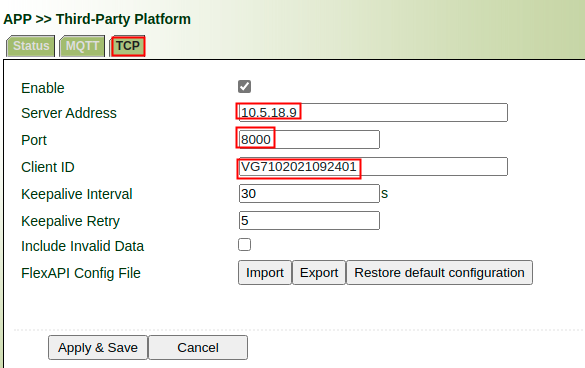
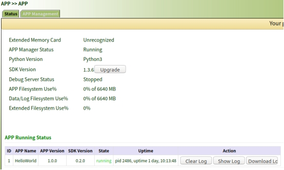
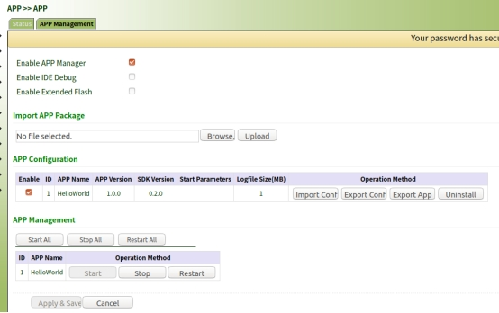
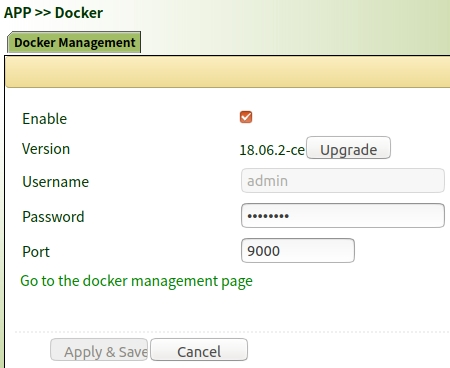
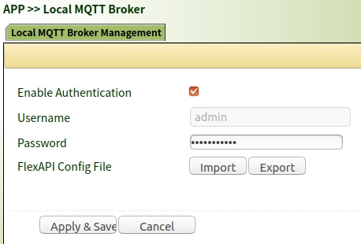

# VG710 & FlexAPI Overview

## 1. Introduction

We introduced FlexAPI for the fast evolving IoT applications, which call for easy integration, openness, flexibility, extensibility and programmability. It was introduced not long after we built our first vehicle gateway VG710.

IoT is used intensively all over the world. Smart things and even legacy devices are increasingly connected to the cloud to make the world more digitalized and our lives easier. 
Besides, edge computing is a rising power by combining computing, networking, storage and anlatics close to where data originates, which features fast response, low latency, local intelligence and even cost reduction. 
Cloud & edge computing come together will form smarter solutions and a better world.

The following figure shows how our powerful VG710 vehicle gateway and its flexible FlexAPI can simplify your application integration.

 

In the above figure, our VG710 at the central part physically connects to the vehicle, GNSS satellites, cellular base station, cloud platform, Wi-Fi equipped tablet and Ethernet equipped industrial PC. Live data such as GNSS sentences and CANBus OBD-II/J1939/FMS data are received and parsed, to become part of service data of smart solutions. At the same time, only a minimum of necessary service data streams flow from FlexAPI to cloud platform, local C/C++/Python/Docker APPs and other smart devices within local network.

## 2. VG710 overview

An ideal solution needs a holistic approach.

Our VG710 vehicle gateway has the following advantages:

- **Specially designed all in one solution**

  In a single box it integrates:
  
  - Cellular 5G/LTE-Cat6
  
  - Wi-Fi 5
  
  - Gigabit Ethernet
  
  - GNSS with Dead reckoning capability
  
  - Serial interfaces
  
  - 3D-accelerator
  
  - CANBus
  
  - IOs
  
- **Powerful networking ability**

  High speed cellular networking to stay always connected.

  High speed Wi-Fi for seamless wireless experience.

  High speed Gigabit Ethernet for stable onboard backbone IP network.

  More than 20 years of networking experience around the world.

- **Edge computing ready** 

  Processing power: 

  - ARM Cortex A7 Quad-Core 717Mhz

  - RAM: up to 1GB

  - EMMC storage: 8GB or larger

  - C/C++, Python & Docker programmable

- **Vehicle condition aware**

  Supports real-time GNSS location, motion detection, IO monitoring and OBD-II/J1939/FMS data gathering to know exactly what’s going on.

- **Proven embedded firmware**

  Modular design, stable, efficient, high availability and auto fault recovery.

- **Easy application integration**

   Cloud platform integration for data anlatics? Edge computing for local intelligence? Solution integration? Use FlexAPI.
   
   Just define what you want, your style, how to report them, and then data starts to flow as you expected. No programming is needed.

## 3. FlexAPI overview

An ideal solution further needs flexible software for application integration. Here comes the FlexAPI, which provides unified data and control services.

FlexAPI is designed to be flexible and easy for application integration. It’s network oriented and programming language independent.

For Cloud platform integration, FlexAPI supports MQTT and acts as MQTT client. It's ready to use.

For Edge computing, you can write your own C/C++, python or docker APPs and deploy them on VG710. You can even use FlexAPI from other smart devices within local network. You also have the freedom to use MQTT, HTTP, or TCP/UDP per your choice. By using FlexAPI your integration work is cut to the least.

The following outlines the options to use FlexAPI:

1. Cloud platform integration.

2. Run C/C++  APPs inside VG710 gateway. Best for runtime efficiency.

3. Run python APPs inside VG710 gateway. Best for development efficiency.

4. Run docker APPs inside VG710 gateway. To make use of virtualization technology and proven docker images from registry at the edge.

5. Access FlexAPI from other smart devices within local network for solution integration.

The following figure illustrates FlexAPI in MQTT form.

 

## 4. FlexAPI Use Cases

### 4.1 Cloud platform integration

### 4.1.1 Use the MQTT protocol

You first need to setup your MQTT broker and make it accessible.

Configure your MQTT broker settings which includes its address, port and authentication.

Client ID needs to be unique so that your platform could distinguish multiple VG710 gateways.

Check WebUI: **APP >> Third-Party Platform**

 

### 4.1.2 Use the TCP protocol

Check WebUI: **APP >> Third-Party Platform** , then choose **TCP** tab.

Basically, you need to provide IP address and port of TCP server, client ID(Usually the device serial number).

### 4.2 Run python APPs inside VG710 gateway

You first need to install python SDK.

After that you can use VS Code IDE to connect to VG710, edit and pack your APPs.

Then you can import, configure and start your APPs.

Check WebUI: **APP >>** **APP**

 

 

### 4.3 Run docker APPs inside VG710 gateway

You first need to install Docker SDK.

On docker management page, you can import or pull your Docker images to create docker APPs.

Check WebUI: **APP >> Docker**

 

### 4.4 Access FlexAPI within local network

Examples include tablet connected to VG710 Wi-Fi or industrial PC connected to VG710 Ethernet.

You first need to enable the Local MQTT Broker and set your password for authentication.

Check WebUI: **APP >> Local MQTT Broker**

 

## 5. Reference documents

For 3rd party platform integration:

***FlexAPI_Reference_for_3rd_party_platform_v1.0.8.pdf***

***FlexAPI_Reference_for_3rd_party_platform_TCP_version_v1.0.2.pdf***

For LAN Edge computing application:

***FlexAPI_Reference_for_LAN_application_v1.0.8.pdf***

***FlexAPI_Reference_for_LAN_application_REST_API_Version_v1.0.5.pdf***
