# VG710 13844 固件升级操作手册

## 1. 确认升级所需文件

- VG710 固件：VG7-V1.0.0.r13844.bin
- VG710 设备配置文件：running-config(3540).cnf

## 2. 升级固件

固件升级步骤如下图所示：

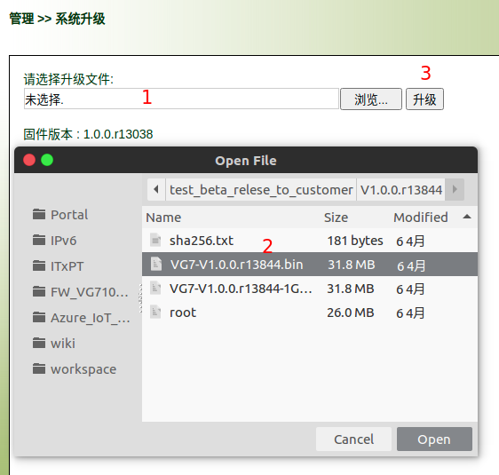

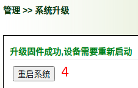

## 3. 导入定制的配置文件

配置文件导入步骤如下图所示：

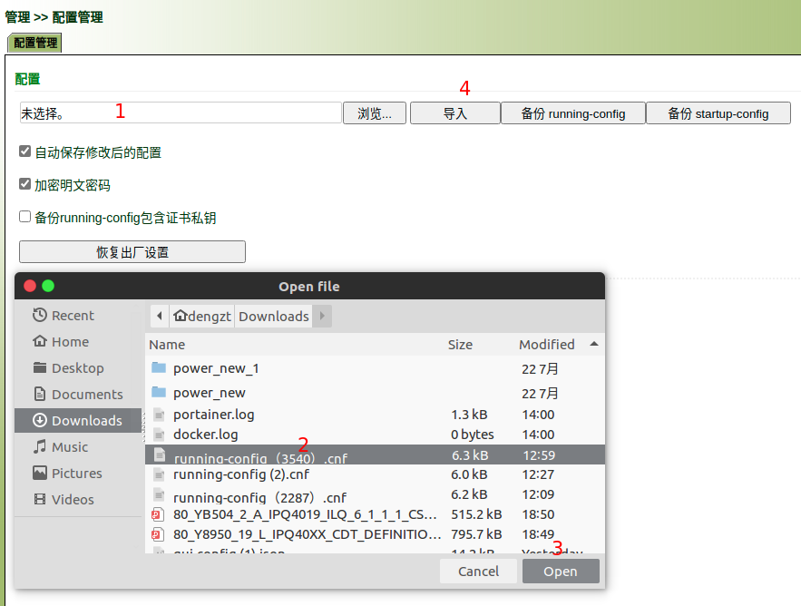

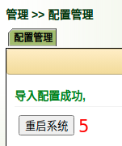

## 4. 检查配置

### 4.1 设备IP配置

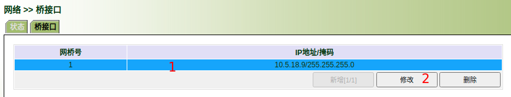

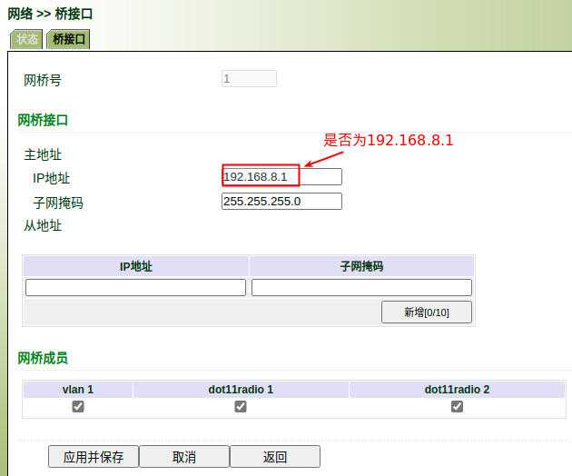

### 4.2 GNSS 开启500ms上报间隔

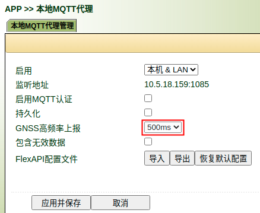

### 4.3 拨号口流量统计

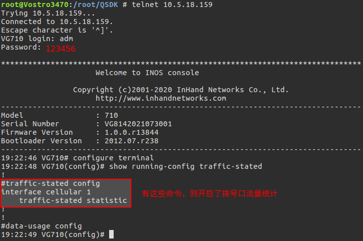

### 4.4 检测Docker容器是否启动

检查容器是否在运行：

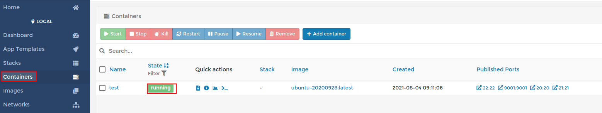

检查容器中服务是否在运行：

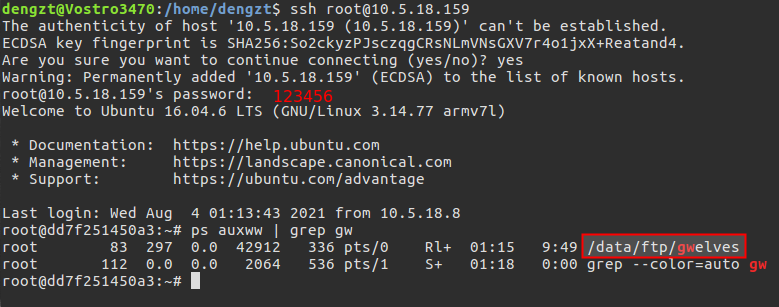

### 4.5 SNTP与GNSS时间使用优先级（可选）

如果定制的配置文件中开启优先使用SNTP服务器获取的时间， 则需要做如下检查

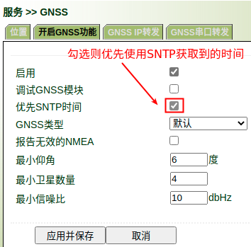

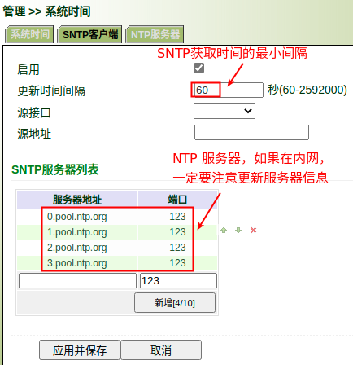

