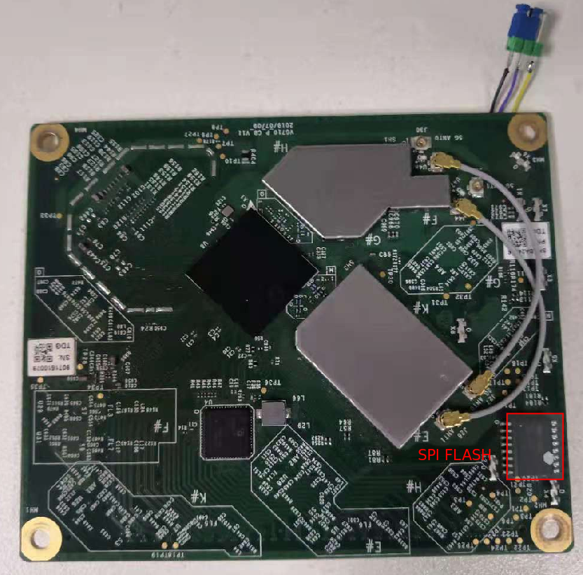
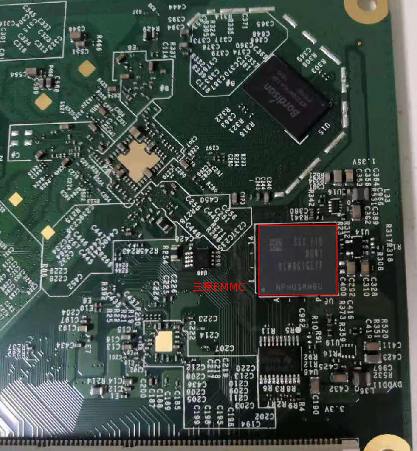
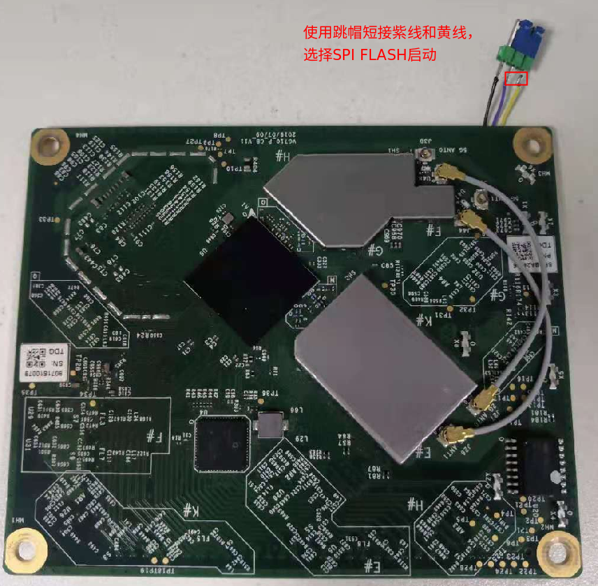
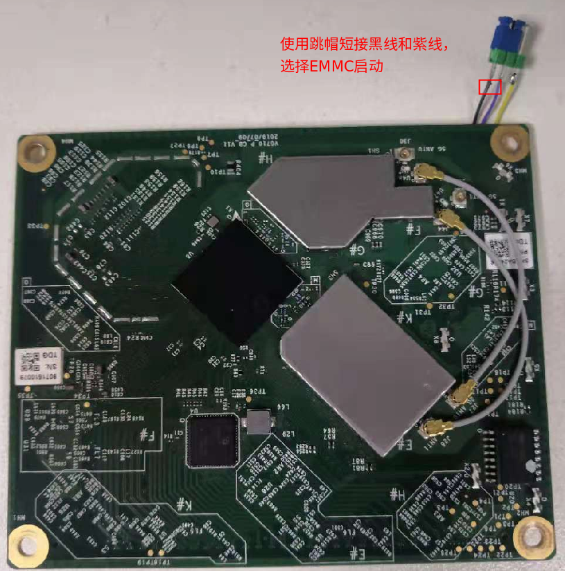
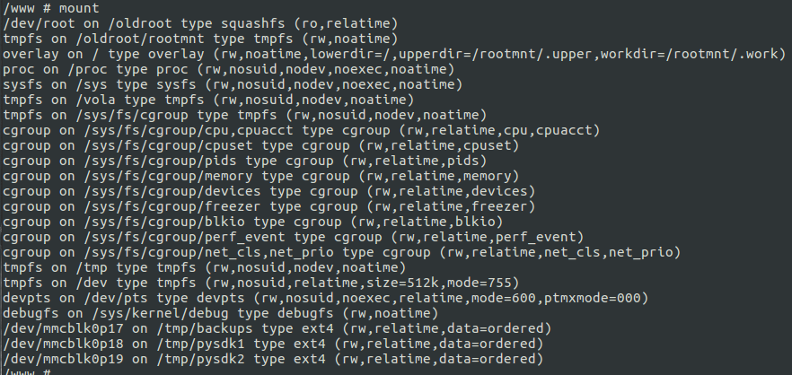

# VG710 EMMC 问题验证测试

**注意**： 请使用带有SPI FLASH和三星EMMC的核心板测试验证





- 如下图， 使用SPI FLASH启动， 按enter 进入uboot



```sh
set ipaddr 10.5.18.9 #设备IP
set serverip 10.5.18.8 #TFTP 服务器IP
save
reset

#按enter重新进入uboot
tftpboot VG7-V1.0.1.r30021.bin
mmc write 84000000 0 2C21
reset
```

- 如下图， 使用EMMC启动， 按q + enter 进入uboot



```sh
set ipaddr 10.5.18.9 #设备IP
set serverip 10.5.18.8 #TFTP 服务器IP
save
reset

#按q+enter重新进入uboot
tftpboot VG9-uboot-2012.07.r501-nowatchdog.bin
mmc write 84000000 1a22 3c9
reset

#按q+enter重新进入uboot
tftpboot root; bootm

#使用mount查看 /dev/mmcblk0p21 分区是否被挂载

```

- 如下图， /dev/mmcblk0p21 没有被正常挂载



- 断电， 重新按q+enter再此进入uboot

```sh
tftpboot VG7-V1.0.1.r30026.bin
mmc write 84000000 0 421
reset

#按q+enter重新进入uboot
tftpboot root; bootm

#使用mount查看 /dev/mmcblk0p21 分区是否被挂载
```

- 如下图， /dev/mmcblk0p21 被正常挂载

