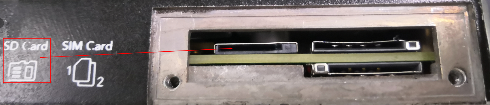
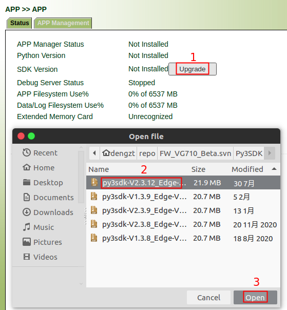
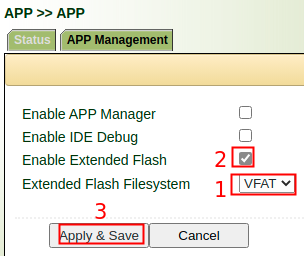
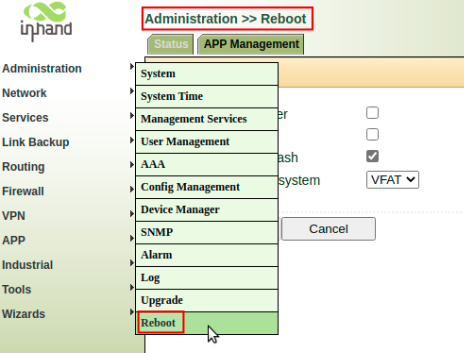

# VG710 SD card Usage

## 1. Introduction

If you have additional storage requirements (such as storing files or generated logs required by Python APP ) , VG710 can provides you with storage extension by supporting SD Card. This document describes how to use this function.

## 2. Format SD Card(Optional)

If the file system format of your SD card is not **VFAT (FAT32)** and **EXT4**, you need to format your SD card first. When you use EXT4 format, please pay attention to permission issues. We recommend that you use **VFAT (FAT32)** for the file system of your SD card. 

Linux users you can use are as follows:

| Linux User Name | User ID(uid) | Note                                            |
| --------------- | ------------ | ----------------------------------------------- |
| pyapp           | 600          | account of the installed PythonAPP              |
| pyuser          | 660          | account of you develop or debug APP through ssh |

## 3. Install SD Card

The SD card installation is shown in the figure below:

## 4. Enable Extended Flash

- Install Python SDK

- Enable Extended Flash

- reboot device (VG710 does not support dynamic detection SD card)

- Check if the SD card is successfully mounted 

Finally, the SD card is successfully mounted in the **/mnt/sd** directory