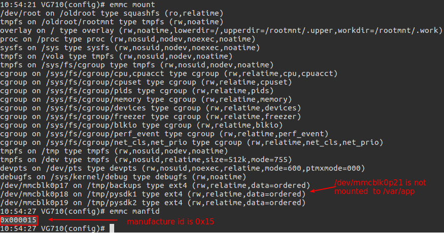
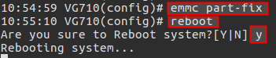
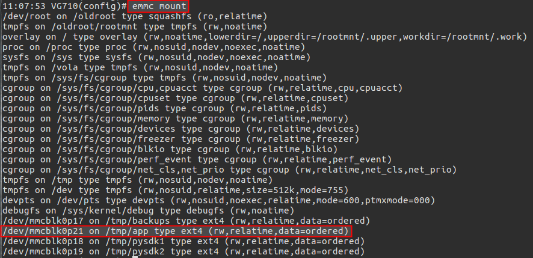
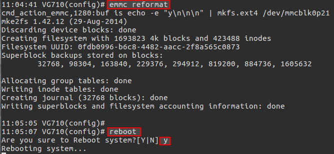

# VG710  existing device partition table repair

## 1. Enter configuration view 

## 2. Check whether the partition table needs to be repaired 

- Enter the configuration view as step 1 
- Using the following command to if the partition needed to repaired. If the result is as shown in the figure below, you need to repair the partition table 

## 3. Repair partition table 

- Enter the configuration view as step 1 
- Repair the partition table as follows, and then restart the device 

## 4. Check whether the partition is mounted normally 

- Enter the configuration view as step 1

- As in step 2, use the `emmc mount` command to check whether the partition is mounted normally, as shown in the figure below. 

If it is not mounted normally as above , please follow step 5 to reformat the partition 

## 5. Reformat partition

**NOTE**: Reformat or erase all partition data, please backup the required data before operation !

- Enter the configuration view as step 1

- Reformat the partition, then restart the device 

- Follow step 4 to recheck if the partition is mounted normally, if it is not mounted normally, please contact our technical support staff.