# VG710 Firmware Migration 

If the current firmware version of your device is less than 30000, and you want to upgrade to a new firmware with a version number greater than 30000, you should follow the steps below to upgrade.

## 1. Upgrade device firmware

- Upload Firmware

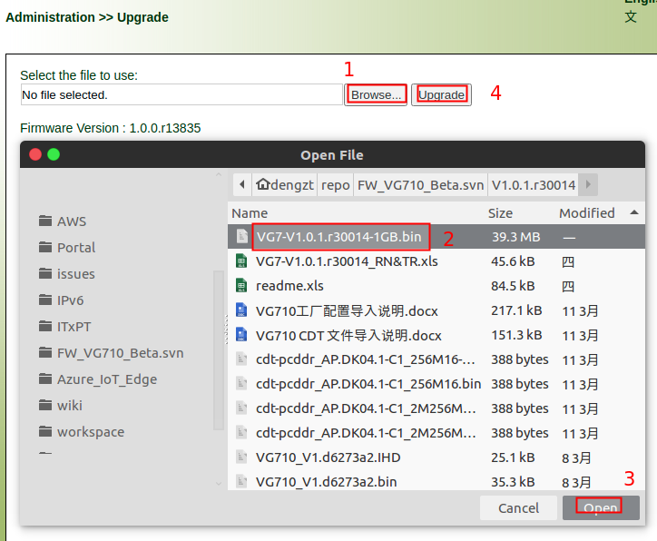

- Do not upgrade the device, go directly to [Upgrade power board firmware](#2-upgrade-power-board-firmware) (this will speed up the entire upgrade process)

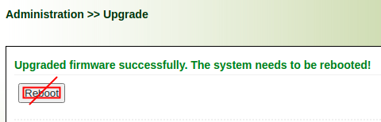

## 2. Upgrade power board firmware

Please refer to `Upgrade VG710 power board firmware.pdf`  to upgrade power board firmware.

## 3. Restore FlexAPI configuration to default.

### 3.1 Third-Party Platform(MQTT)

If you enabled `Third-Party Platform(MQTT)`, please restore its configuration to default as below.

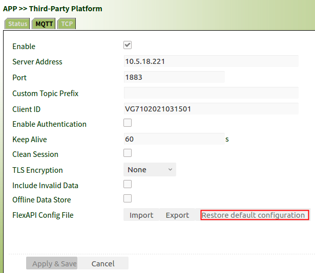

### 3.2 Third-Party Platform(TCP)

If you enabled `Third-Party Platform(TCP)`, please restore its configuration to default as below.

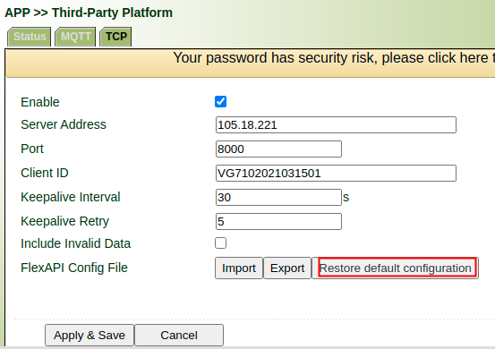

### 3.3 Local MQTT Broker

If you enabled `Local MQTT Broker`, please restore its configuration to default as below.

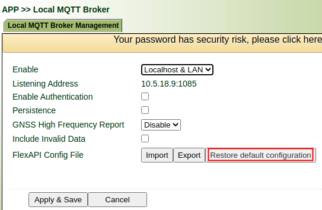

### 3.4 REST API

If you enabled `REST API`, please restore its configuration to default as below.

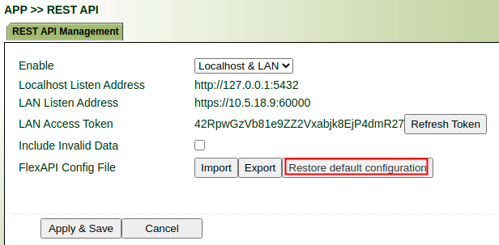

## 4. Restore device configuration to default

- Please follow [Python SDK and APP compatibility](#5-python-sdk-and-app-compatibility) to check if you need to upgrade the Python SDK first
- Please follow [Docker SDK compatibility](#6-docker-sdk-compatibility) to check if you need to upgrade the Docker SDK first

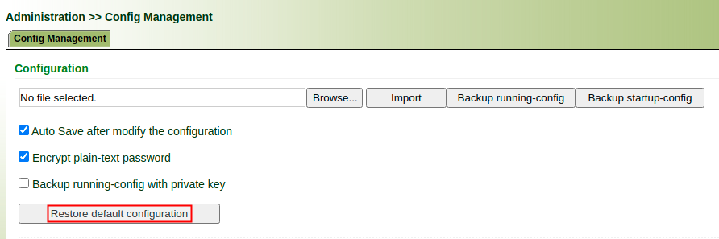

## 5. Python SDK and APP compatibility

Since the toolchain used by VG710 firmware version 30000 or higher has changed,  if you use the Python SDK from a firmware below 30000 and then want to upgrade to a firmware above 30000, you need to reinstall the Python SDK. Please refer to [Reinstall Python SDK (optional)](#7-reinstall-python-sdk-optional) to reinstall docker SDK.

Compatibility of the Python SDK and APP with the VG710 firmware is described below: 

- Python SDK

| Python SDK Version | Device Firmware Version        |
| ------------------ | ------------------------------ |
| 1.x.x              | 1.0.0.r***ver***(ver < 30000)  |
| 2.x.x              | 1.0.0.r***ver***(ver >= 30000) |

- Python APP migration

If you want to migrate an APP from Python SDK 1.x.x to Python 2.x.x, see the following case:

**Case 1:** Python APP is implemented in pure python, the above python APP can be run directly. 

**Case 2:** Python APP has a dependency on the C library (added by yourself), you need to rebuild it under the corresponding version of the Python SDK.

## 6. Docker SDK compatibility

If you use the Docker SDK on a version with a firmware version number less than 30000, after upgrading to a version with a firmware version number greater than 30000, the Docker SDK needs to be reinstalled before it can be used. Please refer to [Reinstall Docker SDK (Optional)](#8-reinstall-docker-sdk-optional) to reinstall docker SDK

## 7. Reinstall Python SDK (optional)

### 7.1 Uninstall Python SDK

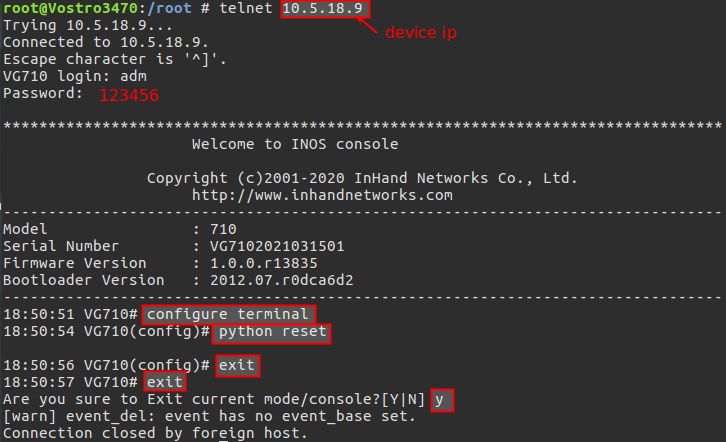

### 7.2 Install Python SDK

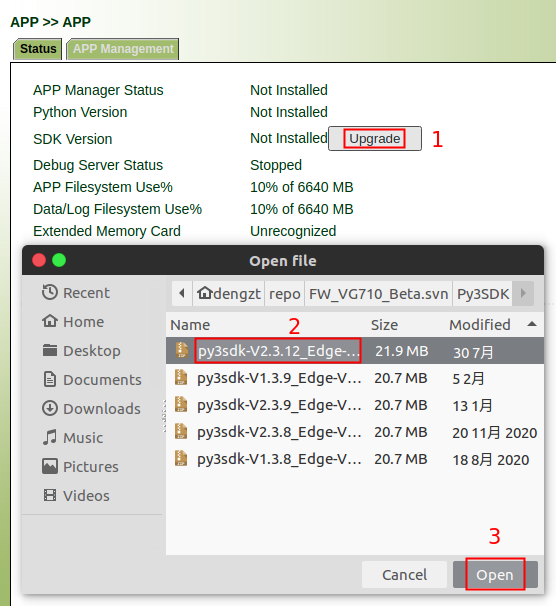

## 8. Reinstall Docker SDK (Optional)

### 8.1 Uninstall Docker SDK

**Note**: If you did not  find `Remove Docker SDK` option, please upgrade to version `V1.0.0.r13835` first. 

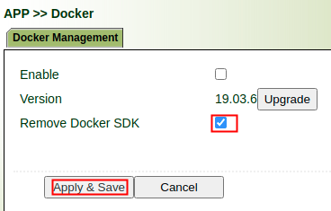

### 8.2 Install Docker SDK

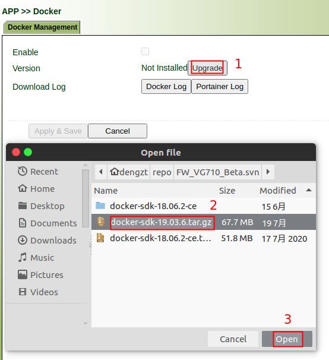