# VG710 Python APP Development Guide
## 1. Introduction
This document briefly explains how to develop and deploy Python APPs based on VG710 **Python SDK** and **Visual Studio Code** IDE.

**Python** at its core is an interpreted, object-oriented, high-level programming language with dynamic semantics. So it's simple and easy to learn. 

Python also comes with extensive standard libraries, numerous third-party modules(PyPI), which made its reputation for productive development in lots of areas.

By reusing proven standard libraries and third-party modules, you can accomplish more complicated tasks with less code and less development and debugging time.

VG710 has thus embedded up to date Python 3.7.x support for users to extend its ability and achieve their goals easily. 

---

Programming an embedded system was once a tedious low level task: setup cross-compiling development enthronement, coding with C/C++, cross-compiling and building firmware, erasing and reprogramming flash memory...

Users need a decent experience to program and deploy an embedded system. After all, customizable is necessary, and made it easy is even more important.

The awesome **Visual Studio Code** IDE has made it easy for you to program your VG710 device.

By using Visual Studio Code IDE and its powerful remote development plug-ins, you import, edit, debug and package your APPs all within it. It just makes life much more easier than ever before.

Since Visual Studio Code IDE is cross-platform and runs everywhere, you can download and install it on your Windows PC, MAC, or even Ubuntu desktop.
With Python & SFTP plug-ins, you could easily code in python, and establish connection to VG710 to debug and package your APPs.

---

After you have packaged your APPs, your could redistribute and deploy them via VG710 WebUI or Device Manager. 
At this deployment stage, all you need is the packaged APPs and your favorite web browser to access VG710 WebUI or our **Device Manager**.

During your development process, we recommend you first deploy via VG710 WebUI to make sure your APPs work as expected.
Once you have the confidence that your APPs are OK for mass deployment, you could use our Device Manager to import and deploy them on lots of VG710 devices.

<div style="page-break-after: always;"></div>
## 2. Overview

The remaining document is divided into several topics, you can easily read your interested topics.

**Install Python SDK**

Our Python SDK provides a Python environment and necessary Python libraries to run your Python APPs.

This SDK should be installed on VG710 so you can debug, package and run your APPs. 

You can refer to [3.2 Install Python SDK](#32-install-python-sdk) for more details.

**Install IDE**

We use **Visual Studio Code** with some necessary plug-ins as our IDE. You should install it on your PC. 

Using it, you can easily import, edit, debug and package your APPs. 

You can refer to [3.4 Install IDE](#34-install-ide) and [3.5 Install IDE plug-ins](#35-install-ide-plug-ins) for more details.

**APP Development**

We provide a sample APP to guide you to understand the steps needed to develop your APPs.

By using VS Code IDE, you can:

- Import your APP,  please refer to  [4.1 Import HelloWorld](#41-import-helloworld)  

- Configure your APP,  please refer to  [4.2 Configure HelloWorld](#42-configure-helloworld) 

- Turn on IDE debugging, please refer to  [3.3 Enable APP Manager & IDE debug](#33-enable-app-manager-and-ide-debug)  

- Debug your APP, please refer to  [4.3 Debug HelloWorld](#43-debug-helloworld) (This step requires connection to VG710)

**APP Packaging**

After you have developed your APP and completed its debugging, you need to package it for further deployment.

By using VS Code IDE, you can:

- Package your APP, please refer to [4.4 Package HelloWorld](#44-package-helloworld) (This step requires connection to VG710)

**APP Deployment**

After you have packaged your APP,  you can deploy it on your VG710 gateways. 

From VG710 WebUI or our Device Manager, you can install your packaged APPs  on your VG710 gateways, run them and check their logs and status.

You can refer to [5. APP management](#5-app-management) for more details.

<div style="page-break-after: always;"></div>
## 3. Setup the development environment
### 3.1 Access VG710 WebUI
-  Step 1: Connect to VG710 through Ethernet cable or Wi-Fi (see the SSID and key on the nameplate).
-  Step 2: Enter the default device IP address 192.168.2.1 in the address bar of the web browser to open the login page.
-  Step 3: Enter the default username adm and password 123456 to go to the web interface
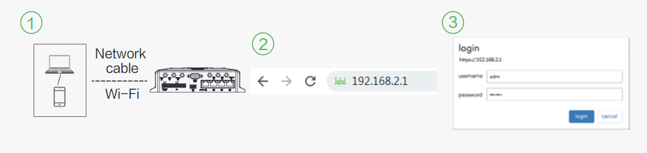
### 3.2 Install Python SDK
- Step 1: Switch to APP Status page
- Step 2: Click **Upgrade** button, choose Python SDK package you downloaded.
- Step 3: Click **OK** to confirm the operation, then wait for the upgrading process to complete

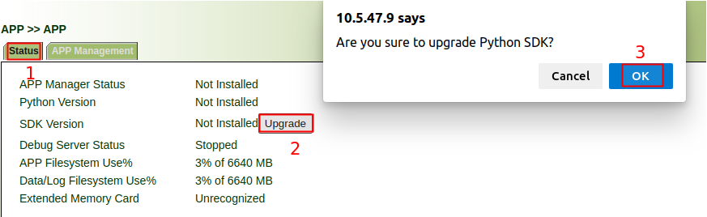

### 3.3 Enable APP Manager and IDE debug

APP manager is used to run and manage your APPs. 

IDE debug is needed at development stage to synchronize files with VG710 to debug and package your APPs.

Steps are as  follows:

- Step 1: switch to APP Management page
- Step 2: check the check-box of **Enable IDE Debug**
- Step 3: check the check-box of **Enable APP Manager**
- Step 4: click **Apply&Save** and wait for the operation to complete

**Note**: IDE Debug will be disabled after each reboot, so you need to re-enable it for your development.

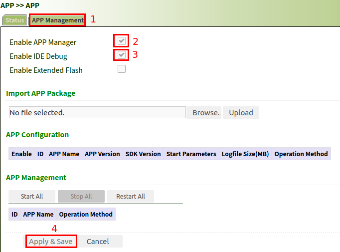
### 3.4 Install IDE
We use **Visual Studio Code** editor as IDE to develop python APP.
Users need to access [code.visualstudio.com](https://code.visualstudio.com/) to download and install this editor.
For details, refer to [VScode Setup](https://code.visualstudio.com/docs/setup).
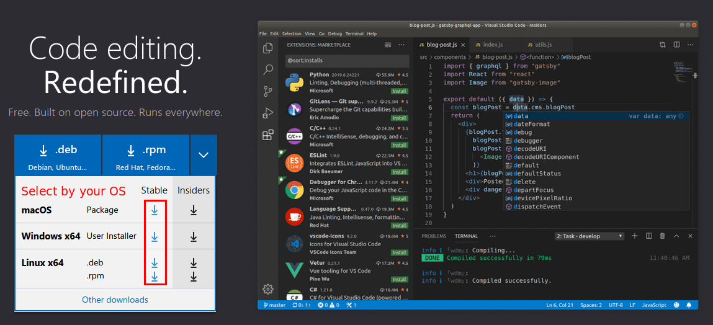

### 3.5 Install IDE plug-ins
For better and efficient APP development, you need to install **python** and **sftp** plug-ins. Steps are as follows:
- Browse for extensions

You can browse and install extensions from within VS Code.
Bring up the Extensions view by clicking on the Extensions icon in the Activity Bar on the side of VS Code or the **View: Extensions** command(`Ctrl+Shift+X`).

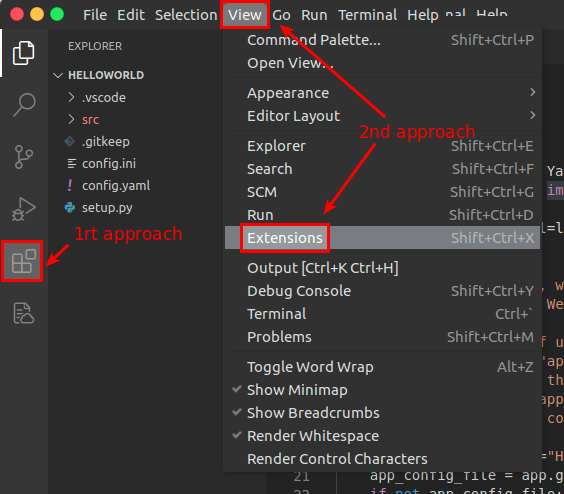
- Search for an extension

You can clear the Search box at the top of the Extensions view and type in the name of the extension, tool, or programming language you're looking for.
For example, typing 'python' will bring up a list of Python language extensions:

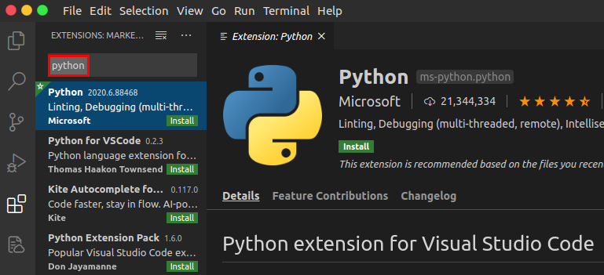

- Install an extension

To install an extension, click the **Install** button. Once the installation is complete, the **Install** button will change to the **Manage gear** button.

Examples of plug-in installation required for APP development are as follows:

Install **python** plug-in


Install **sftp** plug-in

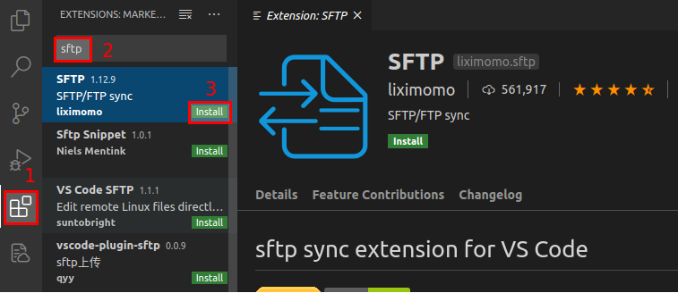

<div style="page-break-after: always;"></div>
## 4. HelloWorld example
We provide a template project **HelloWorld** to demonstrate how to develop an APP based on our Python SDK.
### 4.1 Import HelloWorld
- Open **File:  Open Folder**(`Ctrl+K Ctrl+O`) command to import **HelloWorld** project.

This project includes a complete development framework. its directory structure is as follows:
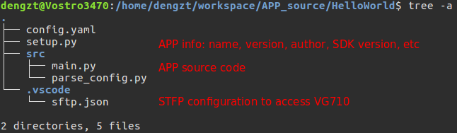

### 4.2 Configure HelloWorld
- In HelloWorld/setup.py, you need to set APP's name, version, author and so on. These information are used to package APP.
```python
...
    from setuptools import setup, find_packages
    setup(name='HelloWorld',  #APP name
        sdk_version='0.2.0',  #SDK version
        version='1.0.0',      #APP version
        author='Inhand',      #APP author
...
```
- In HelloWorld/src/main.py, you also need to set APP's name, which must be the same as name in setup.py.

```python
...
    app = APPConfig(name="HelloWorld")   #APP name
    app_config_file = app.get_app_cfg_file()
...
```
- In HelloWorld/.vscode/sftp.json, you need to configure host, username, password and remotePath to synchronize with VG710.
```json
{
    "name": "Debug Server",
    "host": "10.5.16.197",  # VG710 IP address
    "protocol": "sftp",
    "port": 222,            # SFTP port
    "username": "pyuser",   # SFTP username, the default is pyuser, please do not change
    "password":"VG7101234568888",  # SFTP password, it is the serial number of VG710
    "remotePath": "/var/app/HelloWorld",  # APP install path in VG710
    "uploadOnSave": true,
    "ignore":[
        ".vscode",
        ".git",
        ".DS_Store"
    ]
}
```
### 4.3 Debug HelloWorld
In the VS Code menu bar, open **View:  Command Palette**(`Shift+Ctrl+P`) command.

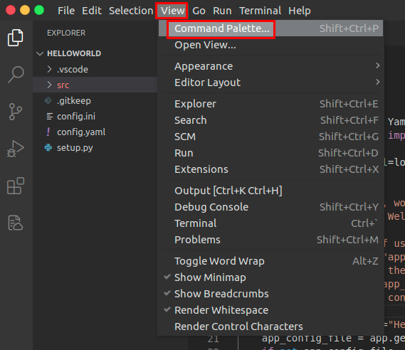

Then type ***SFTP:Open SSH in Terminal*** in the pop-up box.

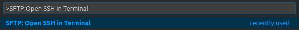

Press `enter`, then the drop-down list will prompt the following information:


After confirming that it is correct, press `enter`, and then follow the steps below on the VS Code **Terminal** window:
- Step 1: When connecting for the first time, the "Terminal" will prompt you whether you want to continue to connect, enter "yes" and press `enter` to continue;
- Step 2: Then the “Terminal” window will prompt you to enter the password, the password is the serial number of your VG710 device;
- Step 3:  After entering the password, press `enter`. Once the "Terminal" prompts the following information, it means that VS Code has successfully established an SFTP connection with your VG710.

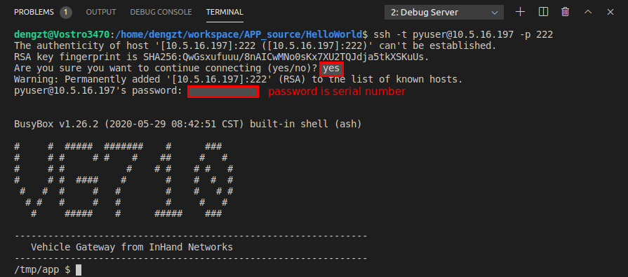

**FAQ 1**:  Why do i encounter ssh connection refused?

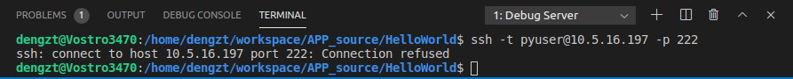

Please ensure you have enabled **Enable IDE Debug** as [3.3 Enable APP Manager & IDE debug](#33-enable-app-manager-and-ide-debug). 

**FAQ 2**: Why do i encounter "WARNING: REMOTE HOST IDENTIFICATION HAS CHANGED"?

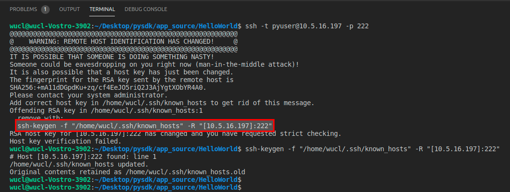

The above warning means the fingerprint of VG710 has changed. Solution is to use the **ssh-keygen** utility to delete the fingerprint from your **known_hosts** file as below picture shows, then repeat steps 1-3 above to login again.

After completing code modification, right click the mouse in the blank area of "EXPLORER" on the left side of VS Code, select **Sync Local->Remote** to synchronize the code to VG710. As shown below:

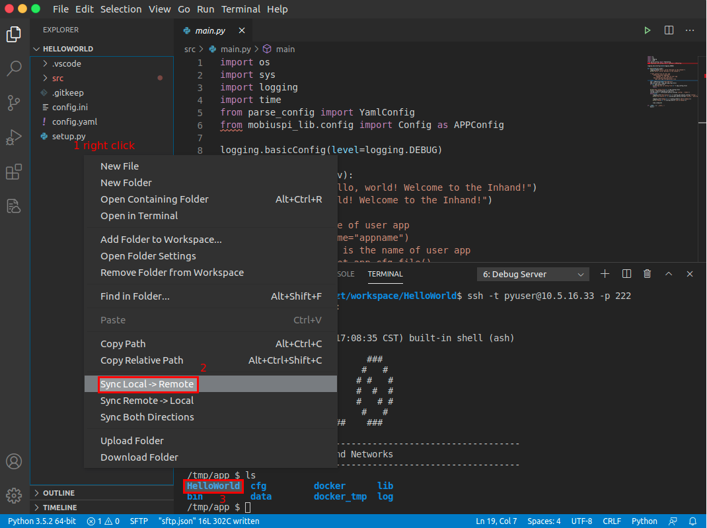

- Step 4: change to APP source directory to run your APP.

```sh
tmp/app # cd HelloWorld/src/
tmp/app/HelloWorld/src # python3 main.py
```
Press `Ctrl+C` to terminate the debugger.

### 4.4 Package HelloWorld
After APP has been successfully developed, you can package it for deployment on other VG710 devices.
Since the entire packaging process need to be completed in VG710, please excute the following commands in the terminal:

```sh
/tmp/app/HelloWorld $ cd ..               # Return to APP top directory
/tmp/app $ build_py_app.sh HelloWorld     # Perform APP packaging
build APP:HelloWorld pkg!
build APP:HelloWorld pkg finished!        # Finish packaging
```
After successfully packaging,  right click the mouse in the blank area of "EXPLORER" on the left side and select **Sync Remote->Local** to synchronize the code to local computer. After successfully transferred, a * .tar.gz file will be added to the build directory, steps as show below:

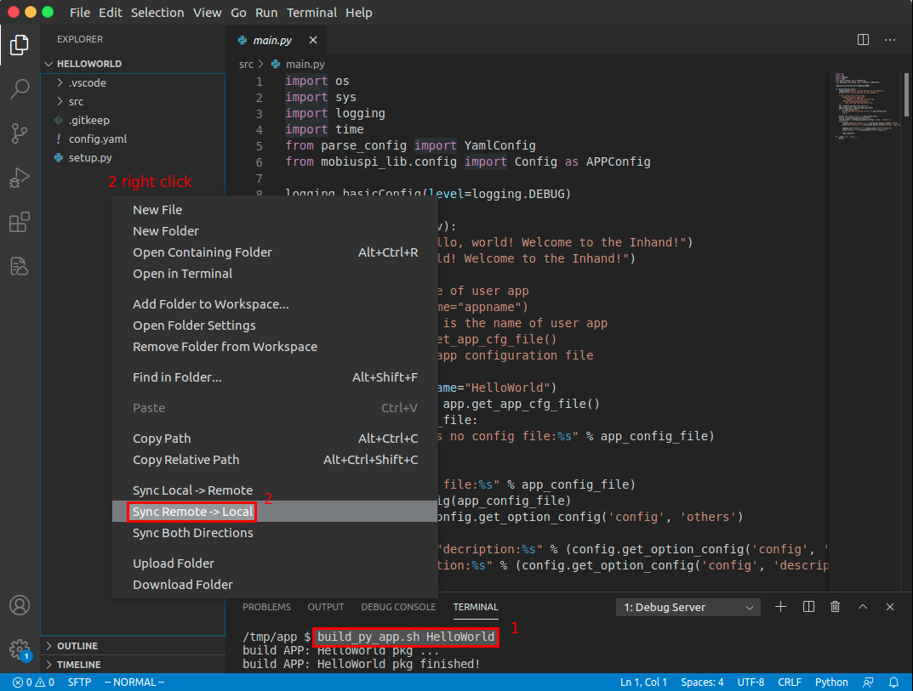

Project tree is as follows:
```sh
.
├── build
│   └── HelloWorld-V1.0.0.tar.gz
├── config.yaml
├── HelloWorld.info
├── setup.py
├── src
│   ├── main.py
│   ├── parse_config.py
│   └── __pycache__
│       └── parse_config.cpython-37.pyc
└── .vscode
    └── sftp.json

4 directories, 8 files

```
As above, the HelloWorld-V1.0.0.tar.gz package can be used to deploy on other VG710 devices.

<div style="page-break-after: always;"></div>
## 5. Use pip tool to install Python package

You can install some Python packages through the pip tool, but it is important to note that the packages you install must be found and available in the Python Package Index (PyPi).

### 5.1 Establish an SFTP connection with VG710

Refer to section [4.3](#43-Debug-HelloWorld) to establish an SFTP connection with VG710,  and ensure VG710 can connect to the Internet.

### 5.2 Install Python package

Use the `pip` command followed by `--user` to install the Python package you need.

**Example**:  install azure-iot-device package.

- Step 1: Gets the corresponding pip command.

  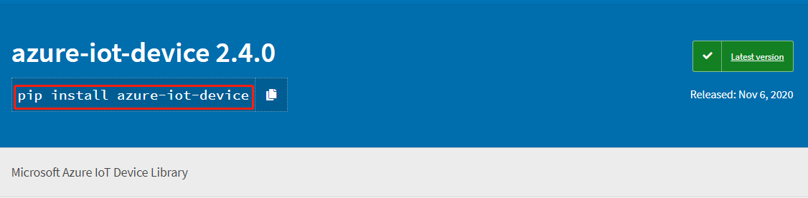

- Step 2: Execute the following command in the terminal:

  ```
  pip install azure-iot-device --user
  ```

  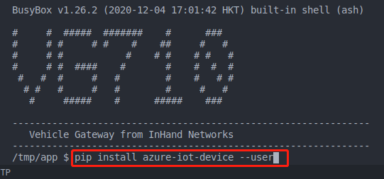

- Step 3: Wait for the download and complete the installation.

  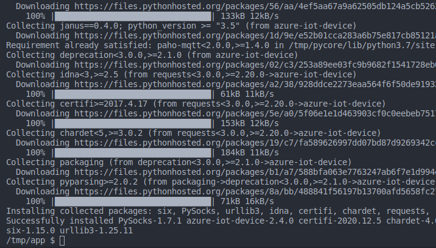
  
<div style="page-break-after: always;"></div>
## 6. APP management
After you have packaged your APP, your could deploy it via VG710 WebUI.
### 6.1 Import APP
Go to WebUI **APP Management** to import your APP package. Steps are as follows:
- Step 1: switch to APP Management
- Step 2: choose the python APP package(e.g. HelloWorld-V1.0.0.tar.gz)
- Step 3: click **Upload** to finish import

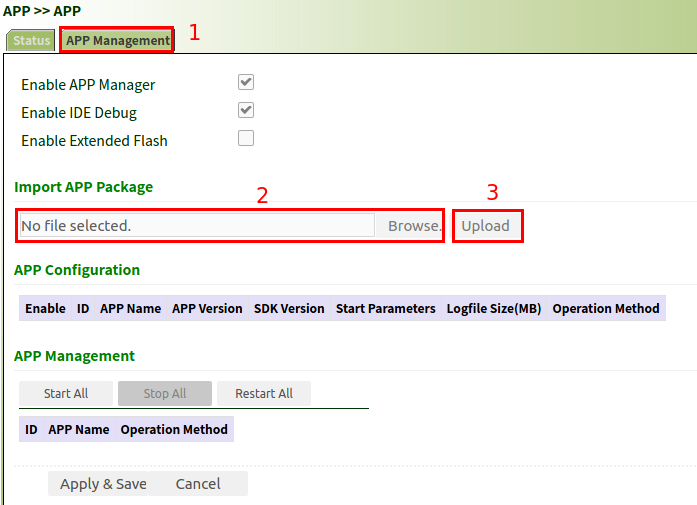

The result of successful import is as follows:


### 6.2 Run APP
Go to **APP Management** to run your imported APP.
- Step 1: check the **Enable** check-box
- Step 2: click **Apply&Save** , then wait for operation to complete


### 6.3 Manage APP
In Operation area, you can do the following operation:
- import APP configuration
- export APP configuration
- export APP
- uninstall APP

In Management area, you can start, stop or restart your APP.

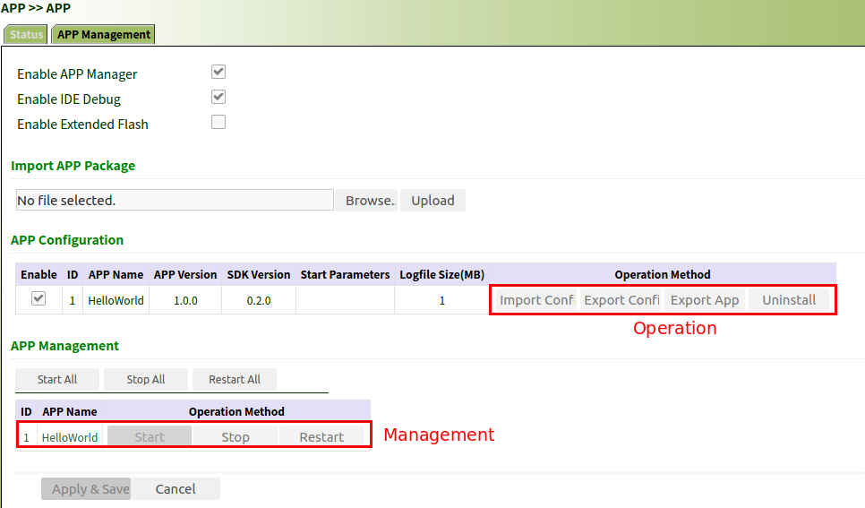

### 6.4 Check APP status
In Status area, you can find APP status, process id and uptime.
In Action area, you can check APP's log.


