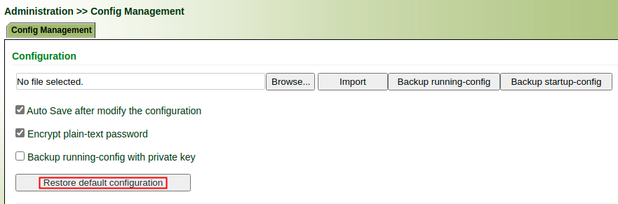
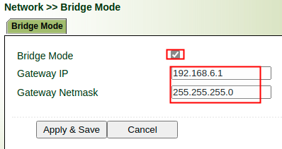
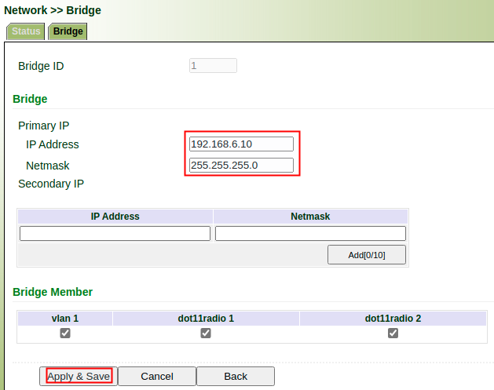
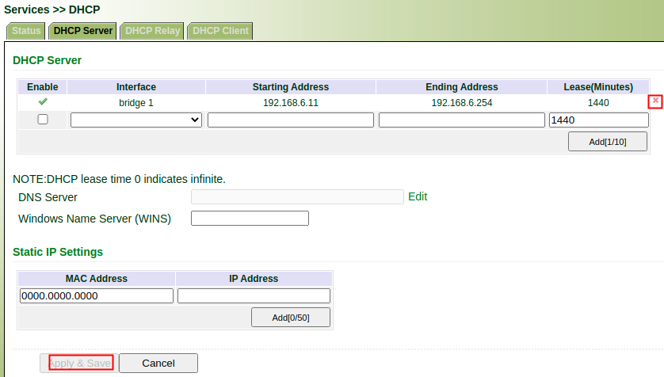
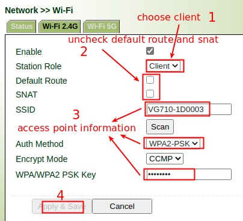

# WiFi Bridge Mode Setup Guide

## 1. Reset Configuration to Default

Restore device to default configuration, and reboot the device

## 2. Enable Bridge Mode

Enable Bridge Mode, configure Wi-Fi AP's address and netmask.

 

## 3. Set Bridge Interface IP

Set Bridge interface IP, this IP should be in the same segment of Wi-Fi AP.

## 4. Disable DHCP Server

Disable DHCP Server of bridge interface.

## 5. Connect to Desired AP

Configure connection information of Desired AP.

