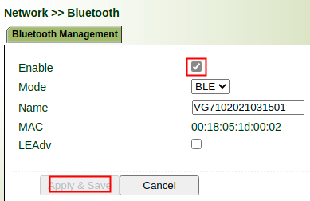
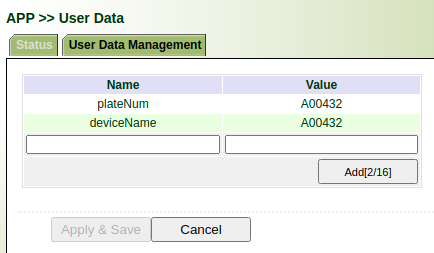
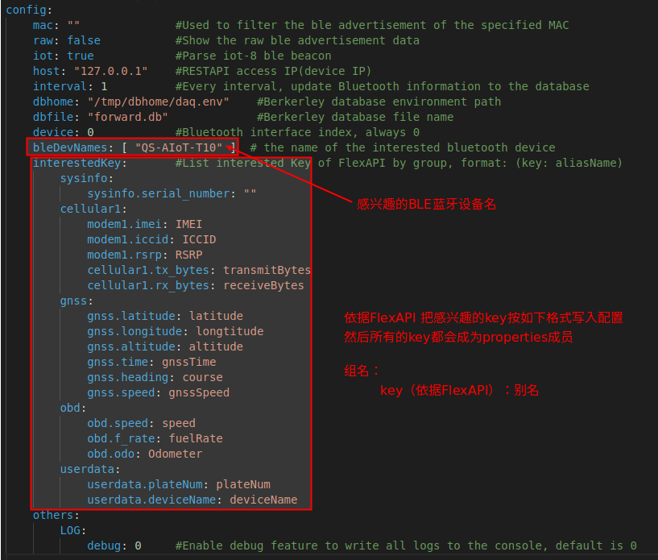
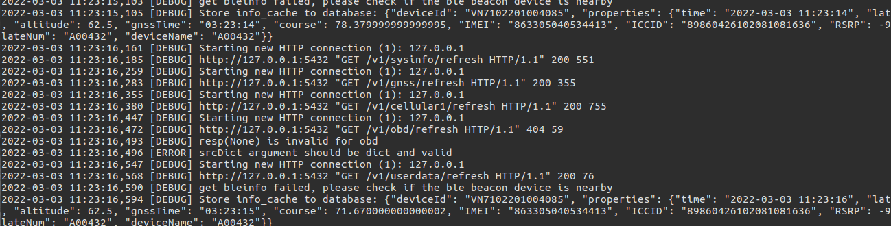
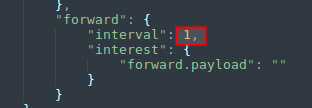

# ble_adv Python APP 使用说明

## 1. 升级提供的测试固件

测试固件为：VG7-V6ed89c758(test)-2022-07-19-12-18-19.bin

**注意**：如果设备当前固件版本号小于30000， 请联系我们以协助升级!

## 2. 升级提供的Python SDK

请参考文档：VG710-Python-APP-Development-Guide.pdf 3.2节安装 Python SDK 2.3.16（文件名：ppy3sdk-V2.3.16_Edge-VG7.zip）

**注意**：如果设备已经安装Python SDK， 请先参考文档 Remove Python SDK and APPs.pdf 移除

## 3. 开启设备蓝牙

按下图所示，开启蓝牙



## 4. 导入APP包

源码为：ble_adv.zip

APP包为：ble_adv-V1.0.11.tar.gz

APP使用和开发，请参考文档：VG710-Python-APP-Development-Guide.pdf 6.1节

## 5. 用户自定义数据配置

FlexAPI支持用户可以自定义数据（userdata 组），具体信息请参考 `FlexAPI_Reference_for_3rd_party_platform_v1.0.8.pdf`的`3.1.7`节和`3.2.8`节，也可以通过Web页面配置，如下图：



## 6. APP 配置说明

Python demo APP先关配置如下图：



## 7. APP运行效果

参考文档 VG710-Python-APP-Development-Guide.pdf 6.6节， 选择 `show log`, 运行结果如下：



## 8. 第三方平台配置

- 开启第三方平台


- 配置forwar组上报间隔为1s

**导出**：


**修改**：



**导入**：


从第三方平台连接的服务器上收到的数据如下：

```json
{
  "deviceId": "00000000",
  "properties": {
    "time": "2022-03-03 11:07:58",
    "latitude": 30.5879895,
    "longtitude": 104.05299317,
    "altitude": 454.3,
    "gnssTime": "03:07:58",
    "course": 32.6,
    "IMEI": "",
    "ICCID": "",
    "RSRP": "",
    "transmitBytes": "",
    "receiveBytes": "",
    "plateNum": "A00432",
    "deviceName": "A00432",
    "beacon": [
      {
        "ble_name": "jx-beacon",
        "ble_mac": "ff:ff:ff:00:00:07",
        "ble_rssi": -45,
        "ble_macf_id": "00000000",
        "ble_macf_data": "0102030405"
      },
      {
        "ble_name": "jx-beacon",
        "ble_mac": "ff:ff:ff:00:00:04",
        "ble_rssi": -50,
        "ble_macf_id": "00000000",
        "ble_macf_data": "0102030405"
      }
    ]
  }
}
```


## 9. 相关原理和参考说明

对于Python APP， 我们每收到一个BLE beacon, 解析后我们存在全局变量中， 每个几秒(具体值依赖设置)我们把对应的值（key为forwar.payload)存入数据库。

对于第三方平台，我们会读取上面数据库的内容上报平台， 上报topic为`v1/${SN}/forward/info` (如第七点所示）.

**GNSS**信息获取参考：

**RESTAPI**:FlexAPI_Reference_for_LAN_application_REST_API_Version_v1.0.4.pdf  `3.2.3`节


