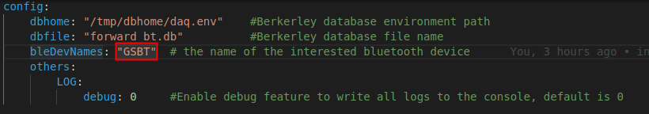
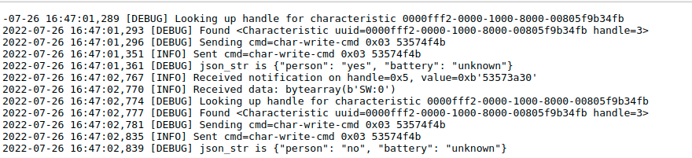
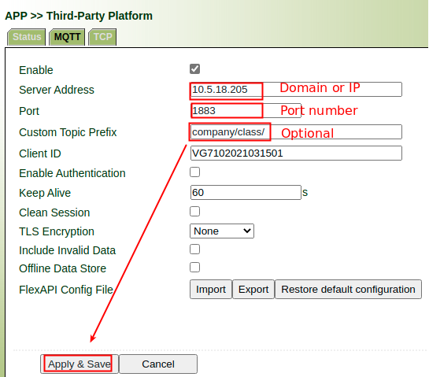
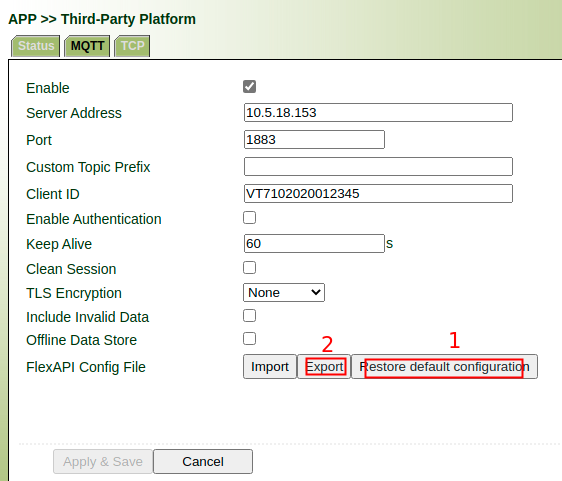
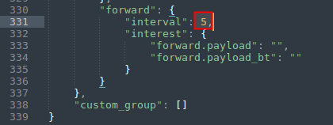
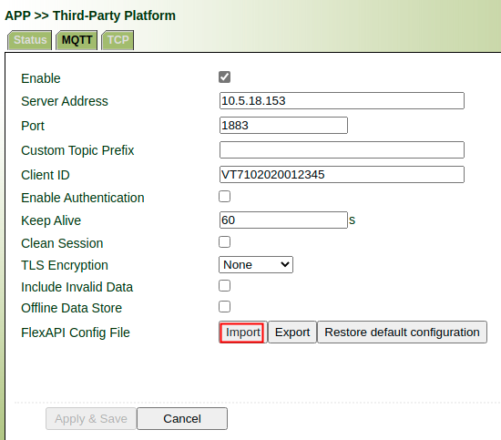

# ble_weigh Python APP 使用说明

## 1. 升级提供的测试固件

测试固件为：VG7-V6d74c6a5b(test)-2022-07-26-15-25-43.bin

**注意**：如果设备当前固件版本号小于30000， 请联系我们以协助升级!

## 2. 升级提供的Python SDK

请参考文档：VG710-Python-APP-Development-Guide.pdf 3.2节安装 Python SDK 2.3.16（文件名：ppy3sdk-V2.3.16_Edge-VG7.zip）

**注意**：如果设备已经安装Python SDK， 请先参考文档 Remove Python SDK and APPs.pdf 移除

## 3. 导入APP包

源码为：ble_weigh.zip

APP包为：ble_adv-V1.0.3.tar.gz

APP使用和开发，请参考文档：VG710-Python-APP-Development-Guide.pdf 6.1节

## 4. APP 配置说明

Python demo APP先关配置如下图：



## 5. APP运行效果

参考文档 VG710-Python-APP-Development-Guide.pdf 6.6节， 选择 `show log`, 运行结果如下：



## 6. 第三方平台配置

- 开启第三方平台



- 配置forwar组上报间隔为1s

**导出**：



**修改**：



**导入**：



从第三方平台连接的服务器上收到的数据如下：

```json
{
  "forward.payload_bt": {
    "person": "no",
    "battery": "unknown"
  }
}
```


