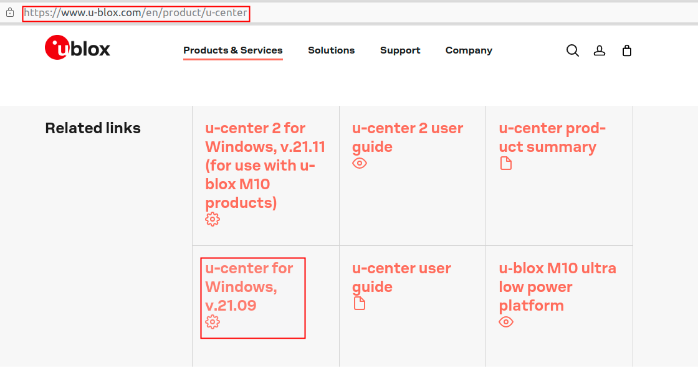
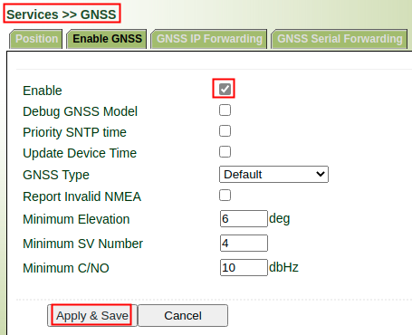
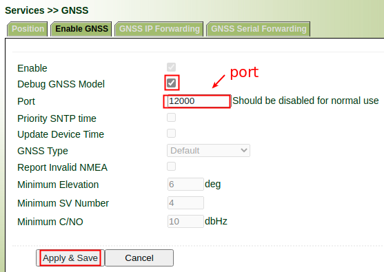
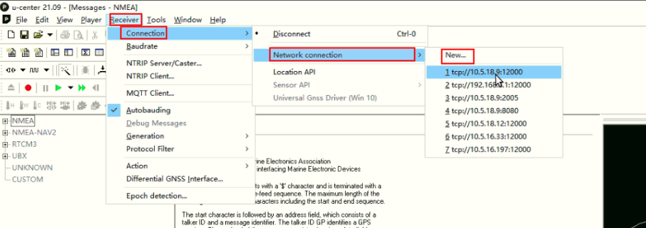
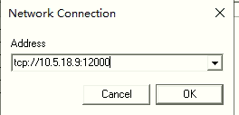
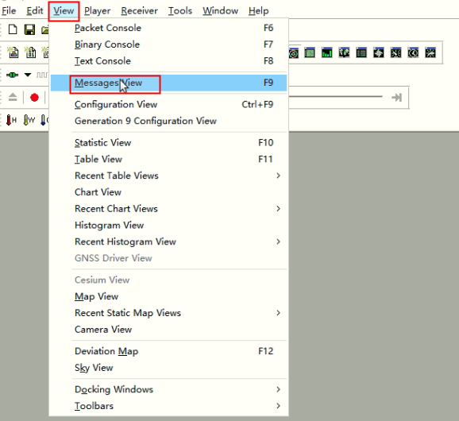
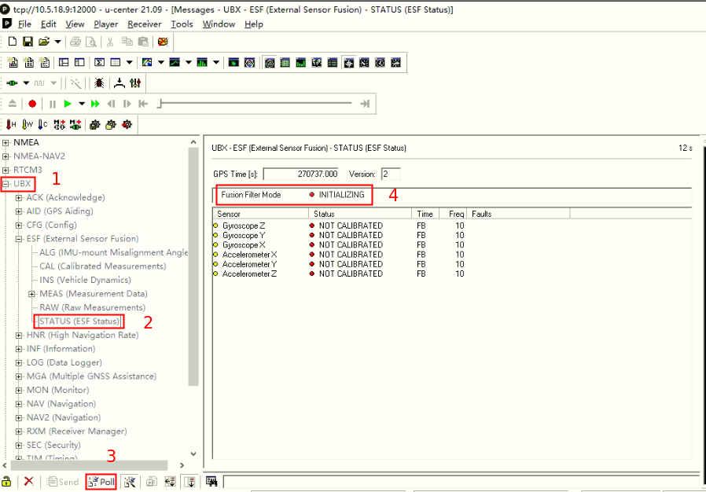
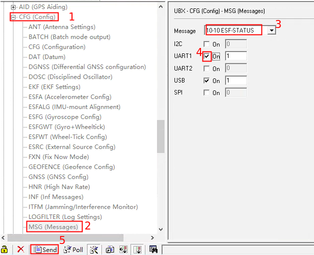
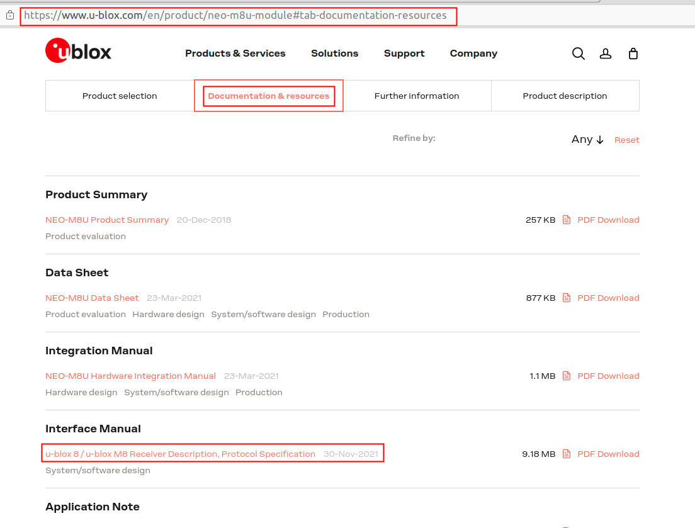

# u-blox GNSS UDR Fusion Mode Check

## 1.  Download u-center software

Please download and install u-center software as below:

## 2. Enable GNSS debug mode

### 2.1 Enable GNSS

### 2.2 Enable GNSS debug mode

GNSS program will forward GNSS data to `ip:port` via TCP when you enable GNSS debug.

- `ip` is the device ip
- `port` is defined as below

## 3.  Setup debug environment

### 3.1 Connect to device

### 3.2 Check Fusion Filter Mode

**Method 1**: poll query

**Method 2**: Report periodically

If you set as the picture below, you can check `Fusion Filter Mode` as Method 1 described without poll action

### 3.2 Calibration for UDR

If mode is not `FUSION`, you should refer to **section 29.3.2** of `u-blox8-M8_ReceiverDescrProtSpec_UBX-13003221.pdf` to perform fast initialization and calibration.

You can get `u-blox8-M8_ReceiverDescrProtSpec_UBX-13003221.pdf` as below:

If you have done the calibration as described above, please follow [3.2 Check Fusion Filter Mode](#32-check-fusion-filter-mode) to check `Fusion Filter Mode` again.