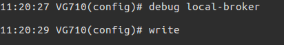
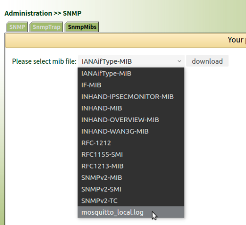

# 导出Local MQTT Broker 日志

## 1. 开启Local MQTT Broker 日志



## 2. 导出日志文件

telnet 登录设备， 然后做如下操作

```sh
# cd /var/run/mosquitto_local/
# ls
mosquitto_local.log
# cp mosquitto_local.log /etc/snmp/mibs/
```

在如下图WebUI下载日志文件

